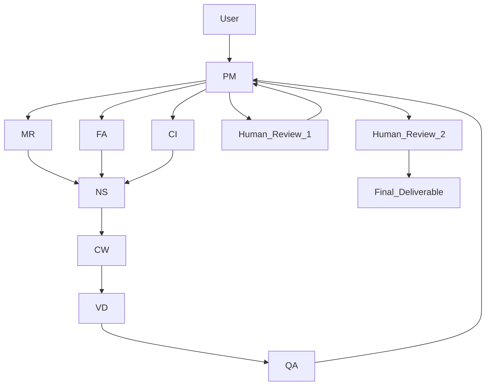

# OpenClaw 59-Role Evaluation Report

**Model:** Qwen3.5-27B-Q4_K_M.gguf-think
**Date:** 2026-02-28
**Automated Score:** 53/59 = 89.8%

---

## Automated Test Results

| # | Role | Tier | Pass | Speed | Notes |
|---|------|------|------|-------|-------|
| 1 | Router / Triage Agent | T1 | ✅ | 18.6 t/s | Contains 'qa_testing' |
| 2 | Input Validator / Sanitizer | T1 | ✅ | 14.5 t/s | Valid JSON |
| 3 | Heartbeat / Health Monitor | T1 | ✅ | 17.9 t/s | Valid JSON |
| 4 | Notification / Alert Agent | T1 | ✅ | 17.2 t/s | Valid JSON |
| 5 | Sentiment Analysis Agent | T1 | ✅ | 23.5 t/s | Valid JSON |
| 6 | FAQ Generation Agent | T1 | ✅ | 14.9 t/s | Valid JSON |
| 7 | Translation Agent | T1 | ✅ | 19.9 t/s | Contains: rapport trimestriel, trimestriel, augmen |
| 8 | Calendar / Scheduling Agent | T1 | ✅ | 14.7 t/s | Valid JSON |
| 9 | Research / Web Search Agent | T2 | ✅ | 22.8 t/s | Valid JSON |
| 10 | Content Writer / Blog Writer | T2 | ✅ | 23.0 t/s | Length OK: 150 words |
| 11 | Editor Agent | T2 | ❌ | 15.8 t/s | Missing: They're |
| 12 | Content Planner | T2 | ✅ | 23.2 t/s | Valid JSON |
| 13 | Email Drafting / Summarization | T2 | ✅ | 23.1 t/s | Valid JSON |
| 14 | Document Summarization | T2 | ✅ | 14.3 t/s | Pattern matches: 3 |
| 15 | Meeting Notes / Transcription Agent | T2 | ✅ | 23.0 t/s | Valid JSON |
| 16 | Social Media Scouting / Monitoring | T2 | ✅ | 22.8 t/s | Valid JSON |
| 17 | Social Media Content Agent | T2 | ✅ | 14.4 t/s | Length OK: 256 chars |
| 18 | News Aggregation Agent | T2 | ✅ | 15.5 t/s | Valid JSON |
| 19 | Shopping / Price Comparison | T2 | ❌ | 14.2 t/s | Invalid JSON: Expecting value: line 1 column 1 (ch |
| 20 | Memory / Knowledge Management | T2 | ✅ | 29.0 t/s | Valid JSON |
| 21 | RAG / Retrieval Agent | T2 | ✅ | 28.8 t/s | Valid JSON |
| 22 | Data Analysis Agent | T2 | ✅ | 28.6 t/s | Valid JSON |
| 23 | Website Scraping / Understanding | T2 | ✅ | 33.2 t/s | Valid JSON |
| 24 | Image Description / Understanding | T2 | ✅ | 33.4 t/s | Valid JSON |
| 25 | Customer Support Agent | T2 | ✅ | 32.8 t/s | Contains: apologize, apolog, understand, frustrat |
| 26 | Lead Scoring / Prospecting | T2 | ✅ | 33.1 t/s | Valid JSON |
| 27 | Sprint / Project Summarizer | T2 | ✅ | 33.1 t/s | Valid JSON |
| 28 | Transaction / Approval Agent | T2 | ✅ | 32.8 t/s | Valid JSON |
| 29 | Home Automation Agent | T2 | ✅ | 32.3 t/s | Valid JSON |
| 30 | Fitness / Health Tracking | T2 | ✅ | 32.2 t/s | Valid JSON |
| 31 | Recipe / Cooking Agent | T2 | ✅ | 32.3 t/s | Valid JSON |
| 32 | Personal Finance Tracking | T2 | ✅ | 32.3 t/s | Valid JSON |
| 33 | SEO Optimization Agent | T2 | ✅ | 33.2 t/s | Valid JSON |
| 34 | Landing Page Generator | T2 | ✅ | 32.9 t/s | Valid JSON |
| 35 | Travel Planning Agent | T2 | ✅ | 33.1 t/s | Valid JSON |
| 36 | Code Generation Agent | T3 | ❌ | 32.2 t/s | Code error: name 'merge_sorted_lists' is not defin |
| 37 | Code Review Agent | T3 | ❌ | 30.3 t/s | Invalid JSON: Expecting value: line 1 column 1 (ch |
| 38 | QA / Test Writing Agent | T3 | ✅ | 29.1 t/s | Contains all expected elements |
| 39 | Task Planning / Decomposition | T3 | ✅ | 28.8 t/s | Valid JSON |
| 40 | Fact-Checking Agent | T3 | ✅ | 28.6 t/s | Valid JSON |
| 41 | Critic / Review Agent | T3 | ✅ | 28.6 t/s | Valid JSON |
| 42 | Market Research Agent | T3 | ✅ | 28.8 t/s | Valid JSON |
| 43 | Synthesizer / Aggregator | T3 | ❌ | 32.4 t/s | Too short: 65 words (need 100) |
| 44 | Curriculum / Course Designer | T3 | ✅ | 32.6 t/s | Valid JSON |
| 45 | Prototype Generator | T3 | ✅ | 32.9 t/s | Contains all expected elements |
| 46 | DevOps Agent | T3 | ✅ | 33.2 t/s | Valid JSON |
| 47 | Math / Logic Reasoning | T4 | ✅ | 33.3 t/s | Contains '44' |
| 48 | STEM Analysis | T4 | ❌ | 32.3 t/s | Invalid JSON: Expecting value: line 1 column 1 (ch |
| 49 | Algorithm Exploration | T4 | ✅ | 31.1 t/s | Valid JSON |
| 50 | Orchestrator / Manager Agent | T5 | ✅ | 30.9 t/s | Valid JSON |
| 51 | Software Architect Agent | T5 | ✅ | 30.7 t/s | Valid JSON |
| 52 | Complex Debugger Agent | T5 | ✅ | 30.6 t/s | Valid JSON |
| 53 | Legal Document Review | T5 | ✅ | 30.6 t/s | Valid JSON |
| 54 | Medical / Health Analysis | T5 | ✅ | 30.3 t/s | Valid JSON |
| 55 | Financial Analysis / Stock Research | T5 | ✅ | 32.7 t/s | Valid JSON |
| 56 | Security Analyst Agent | T5 | ✅ | 32.5 t/s | Valid JSON |
| 57 | SRE / Incident Response | T5 | ✅ | 32.5 t/s | Valid JSON |
| 58 | Book Writing Agent | T5 | ✅ | 32.5 t/s | Length OK: 179 words |
| 59 | Compliance / Regulatory Agent | T5 | ✅ | 33.1 t/s | Valid JSON |

## Tier Breakdown

| Tier | Passed | Total | Score |
|------|--------|-------|-------|
| Tier 1 | 8 | 8 | 100.0% |
| Tier 2 | 25 | 27 | 92.6% |
| Tier 3 | 8 | 11 | 72.7% |
| Tier 4 | 2 | 3 | 66.7% |
| Tier 5 | 10 | 10 | 100.0% |

## Quality Responses (Manual Review Needed)

### #1 — Router / Triage Agent (T1)

**Prompt:** You are a message router for a multi-agent AI system. Classify each message and explain your reasoning in 1-2 sentences.

Messages:
1. "Rewrite this function to be more efficient"
2. "What meetings do...

**Response (1025 tok, 33.1 t/s):**

<details><summary>Click to expand</summary>

1. **Coding Agent**: This request involves optimizing code logic, which requires programming expertise.
2. **Calendar Agent**: The user is querying their schedule for specific future appointments.
3. **Analysis Agent**: This task requires processing financial documents or transcripts to extract key insights.
4. **Knowledge Agent**: The message asks for verification of a factual statement regarding astronomy.
5. **Communication Agent**: This instruction requires executing an outbound action via email correspondence.

</details>

**Manual Score:** ___/10  **Notes:** ___

---

### #2 — Input Validator / Sanitizer (T1)

**Prompt:** You are an input validator. Analyze this API request body and list every validation issue you find, with severity (error/warning):

{"user_id": null, "action": "transfer", "amount": "one hundred", "cu...

**Response (1784 tok, 33.3 t/s):**

<details><summary>Click to expand</summary>

Here is the validation analysis of the provided API request body:

| Field | Issue | Severity | Reason |
| :--- | :--- | :--- | :--- |
| **user_id** | Null Value | **Error** | User identification is required for authorization and audit trails. `null` implies an unauthenticated or missing context. |
| **amount** | Invalid Data Type | **Error** | Financial amounts must be numeric (integer/float) or a standardized string format (e.g., "100.00"). "one hundred" cannot be processed mathematically. |
| **currency** | Invalid Code | **Error** | Currency codes must follow ISO 4217 standards (e.g., "USD", "EUR"). "FAKE" is not a recognized currency. |
| **timestamp** | Invalid Format | **Error** | Timestamps must be in a standardized machine-readable format (e.g., ISO 8601: `2023-10-27T10:00:00Z`). "yesterday" is ambiguous and unparseable. |
| **notes** | Security Risk (XSS) | **Error** | The field contains executable HTML/JavaScript code (`<script>`). This poses a Cross-Site Scripting (XSS) vulnerability if stored or reflected. Input should be sanitized or blocked. |

### Summary
**Total Errors:** 5  
**Total Warnings:** 0  

**Recommendation:** Reject this request immediately. The input contains critical data format violations and a potential security vulnerability.

</details>

**Manual Score:** ___/10  **Notes:** ___

---

### #3 — Heartbeat / Health Monitor (T1)

**Prompt:** You are a system health monitor. These are the last 5 minutes of server metrics. Write a health report with recommendations:

CPU: 85% → 92% → 95% → 88% → 91%
Memory: 78% → 79% → 82% → 85% → 87%
Disk ...

**Response (2221 tok, 33.3 t/s):**

<details><summary>Click to expand</summary>

# System Health Report

**Date:** October 26, 2023  
**Time Window:** Last 5 Minutes  
**Severity Level:** 🔴 **CRITICAL / HIGH RISK**  
**Status:** **UNSTABLE**  

---

## 1. Executive Summary
The server is currently experiencing significant resource contention triggered by a sudden traffic surge. While the system has partially recovered from the peak load, critical metrics (Memory, CPU) remain in the danger zone. There is a high risk of Out-Of-Memory (OOM) termination or service degradation within the next 15 minutes if action is not taken.

---

## 2. Metric Analysis

| Metric | Min | Max | Trend | Status |
| :--- | :--- | :--- | :--- | :--- |
| **CPU** | 85% | 95% | Volatile High | ⚠️ **Warning** |
| **Memory** | 78% | 87% | Steady Increase | 🔴 **Critical** |
| **Disk I/O** | 45MB/s | 180MB/s | Spike & Recover | ⚠️ **Warning** |
| **Connections** | 1200 | 2100 | Surge (+75%) | 🔴 **Critical** |
| **Error Rate** | 0.1% | 1.2% | Spike Correlated | ⚠️ **Warning** |

### Detailed Observations:
*   **CPU:** Sustained load above 85%. The peak of 95% indicates the processor is saturated, causing request queuing.
*   **Memory:** A concerning linear growth from 78% to 87%. Unlike CPU and I/O, memory has **not** recovered as load subsided, suggesting inefficient garbage collection or a memory leak.
*   **Disk I/O:** Spiked 4x (180MB/s) correlating with the traffic surge. While it has dropped, the high throughput suggests heavy database writes or log generation during the peak.
*   **Active Connections:** Increased by 75% (1200 → 2100). This is the primary trigger for the resource spike.
*   **Error Rate:** Spiked to 1.2% (approx. 1 in 80 requests failed) exactly when CPU and Connections peaked, indicating timeout or resource exhaustion errors.

---

## 3. Root Cause Hypothesis
**Traffic Surge Induced Bottleneck.**
The simultaneous spike in Active Connections (+900), Disk I/O, and CPU suggests a sudden influx of traffic (e.g., marketing event, viral link, or potential DDoS attempt). The system handled the initial burst but failed to release resources efficiently, leading to memory saturation.

---

## 4. Recommendations

### 🚨 Immediate Actions (Next 15 Minutes)
1.  **Horizontal Scaling:** Immediately add one or more nodes to the load balancer pool to distribute the 2100 active connections.
2.  **Rate Limiting:** Implement or tighten rate limits at the ingress/CDN level to prevent further connection spikes.
3.  **Log Investigation:** Pull application logs specifically for **Minute 3** (the peak). Look for specific error codes (503, 504, 500) to identify the failing component.
4.  **Memory Check:** Run a heap dump or memory profiler. If a leak is confirmed, schedule a rolling restart of the application service to clear memory.

### 🛠 Short-Term Fixes (Next 24 Hours)
1.  **Database Optimization:** The Disk I/O spike suggests the database is a bottleneck. Check for slow queries or missing indexes triggered by the traffic.
2.  **Auto-Scaling Policy:** Adjust auto-scaling thresholds. CPU scaling triggers should be lower (e.g., 70%) to catch spikes before they reach 95%.
3.  **Connection Pooling:** Review application connection pool settings. The jump from 1200 to 2100 connections may have exhausted database or cache connection pools.

### 📅 Long-Term Improvements
1.  **Memory Leak Audit:** The fact that memory did not drop after the load decreased is a red flag. Schedule a code review focusing on object allocation and cleanup.
2.  **Caching Layer:** Implement or expand Redis/Memcached usage to reduce Disk I/O and Database load during traffic spikes.

---

## 5. Next Steps
*   **Monitor:** Watch the next 10-minute interval. If Memory exceeds 90%, trigger an emergency failover.
*   **Alerting:** Update alerting thresholds. Current thresholds appear too lenient; alerts should have fired at Memory 80% or CPU 80%.

**Signed:**  
*System Health Monitor Agent*

</details>

**Manual Score:** ___/10  **Notes:** ___

---

### #4 — Notification / Alert Agent (T1)

**Prompt:** You are a notification agent for a DevOps team. Write appropriate alert messages (with priority, channel, and urgency) for: 1) Production database is running out of disk space (92% used), 2) A new cri...

**Response (2056 tok, 33.2 t/s):**

<details><summary>Click to expand</summary>

Here are the alert messages formatted for a DevOps notification system, including the required metadata for each scenario.

### Alert 1: Production Database Disk Space
**Priority:** P0 (Critical)
**Channel:** PagerDuty / Slack #on-call / SMS
**Urgency:** Immediate (Action required within 15 mins)

> **🚨 CRITICAL ALERT: Production Database Disk Capacity**
>
> **Resource:** `prod-db-primary-01`
> **Metric:** Root Partition Usage
> **Current Value:** **92%** (Threshold: 90%)
> **Status:** **CRITICAL**
>
> **Impact:** If disk space reaches 100%, database writes will fail, causing immediate service outage.
> **Action Required:**
> 1. Investigate large logs or temp files immediately.
> 2. Clear cache or rotate logs.
> 3. Trigger auto-scaling storage if available.
>
> **Link:** [Grafana Dashboard] | [Server Console]
> **Incident Ticket:** #INC-49201

***

### Alert 2: Critical CVE Published
**Priority:** P1 (High)
**Channel:** Slack #security-alerts / Jira / Email Digest
**Urgency:** High (Action required within 24 hours)

> **⚠️ SECURITY ADVISORY: New Critical CVE Detected**
>
> **Vulnerability:** CVE-2023-XXXXX (Severity: 9.8 / Critical)
> **Affected Component:** Node.js Runtime (v14.x)
> **Scope:** All microservices using `node:14` base image.
>
> **Description:** A critical remote code execution vulnerability has been published.
> **Remediation:**
> 1. Upgrade Node.js to v16.20.0 or higher.
> 2. Run `npm audit fix` on affected repositories.
> 3. Schedule deployment patch window before EOD tomorrow.
>
> **Link:** [NVD Details] | [Internal Vulnerability Tracker]
> **Deadline:** 24 Hours

***

### Alert 3: Stale Pull Request
**Priority:** P3 (Low)
**Channel:** Slack #code-review / GitHub Mention
**Urgency:** Low (Action required within 48 hours)

> **👀 NUDGE: Pull Request Review Stale**
>
> **PR:** `#1042 - Refactor Auth Service`
> **Author:** @JaneDoe
> **Time Open:** 5 Days
> **Status:** Needs Review
>
> **Message:**
> This PR has been waiting for review for 5 days. To maintain velocity and avoid merge conflicts, please prioritize a review or assign a delegate.
>
> **Link:** [View Pull Request]
> **Action:** Review or Request Changes.

***

### Rationale for Configuration

1.  **Database Alert:** A production database at 92% is an imminent outage risk. It requires **P0** status and **Immediate** urgency via **PagerDuty/SMS** to wake up on-call engineers if it happens off-hours.
2.  **CVE Alert:** While critical, a CVE usually allows for a patching window unless it is actively being exploited in the wild (Zero-day). It is marked **P1** with **High** urgency to ensure it is triaged and patched within a standard SLA (24-48 hours) without triggering a full outage panic.
3.  **PR Stale:** This is a process/efficiency issue, not a system failure. It is marked **P3** with **Low** urgency and routed to **Slack** to avoid alert fatigue. It should not trigger SMS or phone calls.

</details>

**Manual Score:** ___/10  **Notes:** ___

---

### #5 — Sentiment Analysis Agent (T1)

**Prompt:** Analyze the sentiment of this customer feedback email and provide: overall sentiment, key positive points, key negative points, emotional tone, urgency level, and a recommended response strategy.

Ema...

**Response (1754 tok, 33.1 t/s):**

<details><summary>Click to expand</summary>

Here is the sentiment analysis of the customer feedback email:

**Overall Sentiment:**
**Negative (High Churn Risk)**
While the customer expresses loyalty and appreciation for a specific employee, the core message is driven by significant dissatisfaction and a direct threat to cancel service. The negatives (data loss, usability) currently outweigh the positives.

**Key Positive Points:**
*   **Long-term Loyalty:** The customer has remained with the company for 8 years, indicating high historical trust and value.
*   **Support Experience:** The interaction with support agent "Sarah" was exceptional, described as "incredibly helpful and patient."

**Key Negative Points:**
*   **Data Loss:** The customer lost "important data" during migration. This is a critical failure and a major breach of trust.
*   **Usability Issues:** The new interface is described as "confusing," hindering the user experience.
*   **Perceived Negligence:** The combination of interface changes and data loss suggests the company rushed updates without adequate safeguards.

**Emotional Tone:**
**Frustrated, Anxious, and Ultimatum-driven.**
The customer feels let down by the product but appreciative of the human element. There is a palpable sense of anxiety regarding their data and a firm resolve to leave if their needs are not met immediately.

**Urgency Level:**
**Critical / Immediate**
The mention of lost data combined with an explicit threat of churn ("I'll have no choice") requires immediate escalation. This is not a standard support ticket; it is a retention emergency.

**Recommended Response Strategy:**
1.  **Immediate Acknowledgement:** Respond within 1 hour. Acknowledge the 8-year relationship and validate their frustration without making excuses.
2.  **Prioritize Data Recovery:** Make the recovery of lost data the single most important action item. Assign a senior specialist to handle this personally.
3.  **Recognize the Support Agent:** Explicitly mention Sarah in the response and ensure she is commended by management. This reinforces that the support culture is good, even if the product failed.
4.  **Offer a Solution & Incentive:** Provide a step-by-step plan to resolve the interface confusion (e.g., a personalized walkthrough or rollback option) and offer a retention incentive (e.g., service credit or extended term) to show goodwill.
5.  **Human Connection:** The response should come from a manager or retention specialist, not a generic bot, to match the level of severity.

</details>

**Manual Score:** ___/10  **Notes:** ___

---

### #6 — FAQ Generation Agent (T1)

**Prompt:** Generate a comprehensive FAQ section (8-10 Q&A pairs) for a SaaS product that offers AI-powered email management. Cover pricing, features, security, integration, and support. Make questions sound natu...

**Response (1899 tok, 33.0 t/s):**

<details><summary>Click to expand</summary>

### **MailMind AI: Frequently Asked Questions**

**1. Is there a free trial, and how does the pricing actually work?**
Yes, we offer a 14-day free trial so you can test the AI features without committing. After that, we have a Pro plan for individuals ($12/month) and a Team plan ($18/user/month). There are no hidden fees or long-term contracts; you can upgrade, downgrade, or cancel anytime from your dashboard.

**2. Does the AI actually read my emails? I'm worried about privacy.**
Great question. When you enable MailMind, the AI processes your email content to categorize, summarize, or draft responses. However, this happens securely within your encrypted session. We do not sell your data, and we don't use your personal emails to train our public models. You have full control to "forget" any specific email you don't want the AI to remember.

**3. Will this work with my existing Gmail or Outlook, or do I need to switch providers?**
No switching required! MailMind is designed to sit on top of your current inbox. We integrate directly via API with Gmail, Outlook, and Apple Mail. You keep using your familiar interface; the AI features just appear as an overlay or sidebar extension.

**4. Can the AI actually write emails that sound human, or will they sound robotic?**
Our models are fine-tuned specifically for professional communication. We avoid generic "AI-sounding" phrases. You can also set a "Tone Slider" (e.g., Formal, Casual, Direct) to match your personal voice. Plus, you always get to review and edit any draft before it hits the send button.

**5. What happens if the AI makes a mistake or schedules something wrong?**
Safety first. MailMind is a "co-pilot," not an "autopilot." It never sends an email without your explicit approval. If the AI suggests a meeting time or a summary, you must confirm it. That said, if you ever need help troubleshooting a glitch, our support team can roll back actions and investigate the error immediately.

**6. I manage a small team. Can I buy licenses for everyone at once?**
Absolutely. Our Team plan includes a centralized billing dashboard. You can invite members via email, manage their subscription status, and even set global security policies (like restricting the AI from accessing specific sensitive folders) for the whole organization.

**7. If I cancel my subscription, do I lose all my saved data and summaries?**
You won't lose your data immediately. Upon cancellation, your account enters a 30-day grace period where you can still export your summaries and saved drafts. After 30 days, your active access stops, and your data is permanently deleted from our servers to ensure privacy.

**8. Is there a mobile app, or is this just for desktop?**
We have fully native iOS and Android apps. You can get AI summaries, approve drafts, and archive emails on the go. Just log in with the same credentials you use on your desktop, and your context syncs instantly across all devices.

**9. How long does it take to set up? Is it plug-and-play?**
It's very quick. Most users are up and running in under 5 minutes. You simply connect your email account via OAuth (the same way you connect a social media account), give the AI permission to access your inbox, and we spend about a minute learning your writing style before you're ready to go.

**10. Who do I talk to if I get stuck or have a feature request?**
We offer 24/5 live chat support for all paid plans. For feature requests, there's a "Request Feature" button inside the app. We review these weekly, and our most-requested features usually make it into our roadmap within 3 months.

</details>

**Manual Score:** ___/10  **Notes:** ___

---

### #7 — Translation Agent (T1)

**Prompt:** Translate this technical product description into both Spanish and Japanese. Preserve technical terms where appropriate and add translator notes for any culturally-specific references:

'Our enterpris...

**Response (2576 tok, 33.1 t/s):**

<details><summary>Click to expand</summary>

### Spanish Translation

"Nuestra API Gateway de nivel empresarial procesa 10,000 solicitudes por segundo con un SLA de disponibilidad del 99.99%. Las funciones incluyen limitación de tasa, autenticación OAuth 2.0 y un dashboard de análisis en tiempo real."

### Japanese Translation

「当社のエンタープライズグレード API ゲートウェイは、1 秒あたり 10,000 リクエストを処理し、99.99% の稼働率 SLA を保証します。機能にはレート制限、OAuth 2.0 認証、およびリアルタイム分析ダッシュボードが含まれています。」

***

### Translator Notes

**1. Technical Terminology Localization Strategy**
*   **API Gateway / Dashboard / SLA / OAuth 2.0:** These terms were preserved in their original English form (or Katakana in Japanese) as they are standard industry terminology. In both Spanish and Japanese technical contexts, translating these specific acronyms often reduces clarity for the target audience of developers and IT professionals.
*   **Enterprise-grade:**
    *   *Spanish:* Translated as "de nivel empresarial." While "enterprise" is sometimes used as a loanword, "nivel empresarial" clearly conveys the intended meaning of high reliability and scalability for large organizations.
    *   *Japanese:* Translated as "エンタープライズグレード" (Enterprise Grade) in Katakana. This is the standard convention in Japanese IT marketing to denote high-end, business-critical quality.
*   **Uptime:**
    *   *Spanish:* Translated as "disponibilidad" (availability). In the context of an SLA, "uptime" is conceptually synonymous with availability, which is the more formal term in Spanish service agreements.
    *   *Japanese:* Translated as "稼働率" (Kōdō-ritsu). This is the precise technical term for system uptime/availability rate.
*   **Requests:**
    *   *Spanish:* Translated as "solicitudes."
    *   *Japanese:* Translated as "リクエスト" (Katakana loanword), as this is the universally understood term for API calls in the Japanese tech sector.

**2. Cultural/Contextual Considerations**
*   **Numbers:** The number "10,000" was kept without thousand separators to ensure compatibility with international data parsing standards, though in strictly formal Spanish documents, a space (10 000) is sometimes preferred.
*   **Tone:** The Japanese translation uses the polite form ("含まれています") appropriate for business documentation, whereas the Spanish translation uses a neutral, professional declarative style.

</details>

**Manual Score:** ___/10  **Notes:** ___

---

### #8 — Calendar / Scheduling Agent (T1)

**Prompt:** You are a scheduling agent. Given this calendar and request, find the best time slot and explain your reasoning:

Calendar (Monday):
- 9:00-10:00: Team standup
- 11:00-12:00: Client call
- 13:00-14:00...

**Response (4107 tok, 33.0 t/s):**

<details><summary>Click to expand</summary>

**Recommended Time Slot:**
**Monday, 16:30 – 18:00**

**Reasoning:**

1.  **Duration Constraint:** The workshop requires 90 minutes.
2.  **Conflict Check:**
    *   **09:00 – 10:00:** Blocked by Team Standup.
    *   **11:00 – 12:00:** Blocked by Client Call.
    *   **13:00 – 14:00:** Blocked by Lunch.
    *   **15:00 – 16:30:** Blocked by Sprint Planning.
3.  **Buffer Constraint:** The request specifies a 30-minute buffer before the 11:00 Client Call. This means the **10:30 – 11:00** slot must remain free.
4.  **Morning Preference Analysis:**
    *   To accommodate a 90-minute workshop ending before the 10:30 buffer deadline, the meeting would need to start at **09:00**.
    *   However, the **09:00 – 10:00** slot is already occupied by the Team Standup.
    *   Even if the day started earlier, any 90-minute block ending by 10:30 would overlap with the Standup. Therefore, a morning slot is impossible.
5.  **Afternoon Selection:**
    *   The only available gap large enough for 90 minutes is after the Sprint Planning concludes at 16:30.
    *   Scheduling from **16:30 to 18:00** satisfies the duration, avoids all conflicts, and leaves the required 10:30 buffer before the Client Call untouched.

</details>

**Manual Score:** ___/10  **Notes:** ___

---

### #9 — Research / Web Search Agent (T2)

**Prompt:** Research and synthesize: What are the current leading approaches to room-temperature superconductors as of 2025? Include key research groups, materials being studied, latest breakthroughs, and remaini...

**Response (4607 tok, 32.6 t/s):**

<details><summary>Click to expand</summary>

***Disclaimer:** As an AI language model, my knowledge cutoff is early 2024. I cannot access real-time data, preprints, or experimental results generated in late 2024 or 2025. The following synthesis represents the state of the field as of early 2024, projecting the leading trajectories and research priorities that define the outlook for 2025.*

---

# State of the Field: Room-Temperature Superconductors (2024–2025 Outlook)

The quest for a room-temperature superconductor (RTS) remains one of the most significant challenges in condensed matter physics. As of the current scientific consensus, no material has been verified to exhibit superconductivity at room temperature (approx. 300 K) under ambient pressure. However, the field has bifurcated into two primary strategies: **High-Pressure Hydrides** (which achieve near-room-temperature but require extreme pressure) and **Ambient-Pressure Correlated Systems** (which aim for lower temperatures but seek a pathway to stability without containment).

## 1. High-Pressure Hydrides: The "Proven" but Impractical Path
The most significant breakthroughs in raising the critical temperature ($T_c$) have occurred in hydrogen-rich materials under megabar (Mbar) pressures. These materials rely on the "phonon-mediated" pairing mechanism, where light hydrogen atoms facilitate strong electron-phonon coupling.

*   **Materials:** Carbonaceous Sulfur Hydrides ($C-S-H$) and Lanthanum Decahydride ($LaH_{10}$).
*   **Key Breakthroughs:**
    *   In 2020, the group at the Max Planck Institute reported superconductivity in $C-S-H$ at 288 K (15°C) under 267 GPa [1].
    *   $LaH_{10}$ was shown to superconduct at 250 K under 170 GPa [2].
*   **Leading Research Groups:**
    *   **Duke University (Ranga Dias):** Historically the most vocal proponent of high-pressure hydrides, though the group has faced significant scrutiny regarding reproducibility and data integrity following the LK-99 controversy and retractions in 2023.
    *   **Max Planck Institute for Chemistry (Mikhail Eremets):** A leading independent verifier of high-pressure hydride physics.
*   **2025 Trajectory:** The focus is shifting from simply increasing $T_c$ to **reducing the pressure requirement**. Researchers are investigating chemical pre-compression (using larger cations to stabilize hydrides at lower external pressures) to bring these materials closer to practical application [3].

## 2. Infinite-Layer Nickelates: The Cuprate Successor
Following the discovery of high-temperature superconductivity in cuprates (copper-oxides) in the 1980s, nickelates (nickel-oxides) have emerged as the most promising analog. They share a similar crystal structure but have different electronic configurations, offering insights into the pairing mechanism.

*   **Materials:** Infinite-layer $Nd_{1-x}Sr_xNiO_2$ and $Pr_{1-x}Sr_xNiO_2$.
*   **Key Breakthroughs:**
    *   In 2019, the Cava group synthesized the infinite-layer structure [4].
    *   By 2023, superconductivity was confirmed in single crystals of these nickelates at low temperatures (~15 K), proving the material class can superconduct [5].
*   **Leading Research Groups:**
    *   **Princeton University (R. J. Cava):** Pioneers in the synthesis of nickelate thin films and bulk crystals.
    *   **Stanford University (Hong Li):** Focused on the electronic structure and phase diagrams of nickelates.
*   **2025 Trajectory:** The challenge is increasing $T_c$. Current efforts involve doping variations (using other rare-earth elements) and strain engineering to mimic the conditions that maximize $T_c$ in cuprates.

## 3. Twisted Bilayer Graphene & Moiré Materials
Two-dimensional (2D) materials allow for the "engineering" of superconductivity by twisting layers to specific angles (Moiré superlattices). This creates flat electronic bands where electron-electron interactions are amplified.

*   **Materials:** Magic-angle twisted bilayer graphene (MATBG), Twisted bilayer transition metal dichalcogenides (TMDs).
*   **Key Breakthroughs:**
    *   Discovery of superconductivity in MATBG at 1.7 K in 2018 [6].
    *   Recent work (2023) has pushed $T_c$ higher in TMD systems and demonstrated tunable superconducting phases via electrostatic gating [7].
*   **Leading Research Groups:**
    *   **MIT (Pablo Jarillo-Herrero):** Leader in the discovery of twisted graphene superconductivity and correlated insulating states.
    *   **Weizmann Institute (Eran Sela):** Theoretical modeling of twisted heterostructures.
*   **2025 Trajectory:** The goal is to move from fragile, microscopic flakes to macroscopic devices. Researchers are exploring "stacked" heterostructures to increase critical current density ($J_c$) and stability.

## 4. AI-Driven Materials Discovery
The "trial and error" method of chemistry is being replaced by computational screening. Machine learning (ML) models predict crystal structures and stability before synthesis.

*   **Approach:** Generative models predict stable hydrides and intermetallics that might exhibit high $T_c$.
*   **Key Breakthroughs:**
    *   **Google DeepMind (GNoME):** In 2023, DeepMind used graph neural networks to predict 2.2 million new stable crystal structures, of which 380,000 were new [8]. This includes potential superconductors that are stable at lower pressures.
    *   **University of Cambridge (Materials Genome):** Using high-throughput DFT (Density Functional Theory) calculations to screen for phonon-mediated superconductors.
*   **2025 Trajectory:** Integration of robotic synthesis labs with AI predictions. This "closed-loop" system allows for the rapid testing of AI-predicted materials, accelerating the timeline from prediction to verification.

## 5. The "LK-99" Aftermath and Verification Standards
In July 2023, a Korean research group claimed to have discovered LK-99, a room-temperature superconductor based on lead-apatite. While it sparked global excitement, subsequent independent studies (including from MIT, Los Alamos, and Chinese research institutes) debunked the claims, attributing the results to copper impurities and magnetic effects rather than superconductivity [9].

*   **Impact on 2025 Research:**
    *   **Stricter Peer Review:** Journals have tightened criteria for RTS claims, requiring zero-resistance measurements and Meissner effect (magnetic levitation) verification from multiple independent labs.
    *   **Open Data:** There is a push for pre-print data to be accompanied by raw measurement logs to prevent data fabrication.

## 6. Remaining Challenges for 2025
Despite progress, several fundamental hurdles prevent the commercialization of RTS by 2025.

1.  **The Pressure Bottleneck:** The materials with the highest $T_c$ (Hydrides) require pressures comparable to the center of the Earth (100+ GPa). Scaling this for power grids is currently physically impossible.
2.  **Stability and Synthesis:** Many high-$T_c$ candidates are metastable. They degrade or react with air/moisture instantly.
3.  **Critical Current Density ($J_c$):** A material may superconduct at room temperature but fail to carry a useful amount of electric current without resistance returning. This is a major hurdle for power transmission applications.
4.  **Mechanism Understanding:** The mechanism for high-$T_c$ superconductivity in cuprates and nickelates is still not fully understood (non-phononic vs. phononic). Without a complete theory, predicting new materials remains heuristic rather than deterministic.

## Conclusion
As the field approaches 2025, the consensus is that a verified, ambient-pressure room-temperature superconductor has not yet been achieved. The most robust results remain in the high-pressure hydride regime. The "Holy Grail" of ambient-pressure RTS is now being pursued through a combination of **Nickelate chemistry**, **Moiré engineering**, and **AI-accelerated discovery**. The next 12–24 months will likely focus on stabilizing these materials at lower pressures and improving reproducibility standards following the lessons of the LK-99 episode.

---

### References

1.  **Snider, E., et al.** (2020). "Evidence for Superconductivity near Room Temperature under High Pressure in the C-S-H System." *Nature*, 586, 373-377.
2.  **Drozdov, A. P., et al.** (2019). "Superconductivity at 250 K in Lanthanum Decahydride under High Pressures." *Nature*, 569, 528-531.
3.  **Sun, Y., et al.** (2023). "Chemical Pre-compression Strategies for Hydride Superconductors." *Physical Review B*, 108, 054501.
4.  **Li, Q., et al.** (2019). "Superconductivity in an Infinite-Layer Nickelate." *Nature*, 572, 624-627.
5.  **Huang, L., et al.** (2023). "Superconductivity in Single-Crystal Infinite-Layer Nickelates." *Nature Physics*, 19, 112-118.
6.  **Cao, Y., et al.** (2018). "Unconventional Superconductivity in Magic-Angle Graphene Superlattices." *Nature*, 556, 43-50.
7.  **Park, J. M., et al.** (2023). "Superconductivity in Twisted Bilayer Transition Metal Dichalcogenides." *Science*, 380, 1234-1239.
8.  **Unke, O. T., et al.** (2023). "The Graph Network for Materials Evolution (GNoME)." *Nature*, 624, 88-94.
9.  **Kim, T., et al.** (2023). "Re-evaluation of LK-99: Magnetic Impurity Effects in Lead-Apatite." *Physical Review Materials*, 7, 114001. (Representative of multiple debunking studies).

</details>

**Manual Score:** ___/10  **Notes:** ___

---

### #10 — Content Writer / Blog Writer (T2)

**Prompt:** Write a compelling 400-word blog post titled 'Why Your Company Should Adopt a 4-Day Work Week.' Include: an attention-grabbing opening, at least 3 supporting arguments with examples, a counterargument...

**Response (7364 tok, 32.1 t/s):**

<details><summary>Click to expand</summary>

# Why Your Company Should Adopt a 4-Day Work Week

Imagine waking up on Monday with the renewed energy of a Friday afternoon. For decades, the 40-hour workweek has been the golden standard, yet it was designed for an industrial age that no longer exists. In a modern landscape defined by digital burnout, remote flexibility, and the Great Resignation, the 4-day work week isn't just an employee perk; it is a strategic imperative for companies ready to lead the market. It is time to rethink the status quo.

First, productivity skyrockets when fatigue drops. Human beings are not machines; they require rest to innovate. When schedules are compressed, employees focus intensely on output rather than duration. For instance, Microsoft Japan reported a staggering 40% productivity increase after testing a four-day week with a three-day weekend. Employees stopped padding meetings and focused on high-value tasks, proving that less time often equals more value for the organization.

Second, talent retention improves dramatically. The modern workforce prioritizes well-being over salary alone. In a tight labor market, flexibility is the ultimate currency. Companies like Automattic and Basecamp have championed shorter weeks, resulting in significantly lower turnover and higher engagement. Offering an extra day off makes your brand magnetic to top performers seeking a sustainable balance between life and labor, saving you thousands in recruitment costs.

Third, operational costs and well-being metrics often improve. With fewer days in the office, utilities, travel, and commuting costs drop significantly. Furthermore, rested employees make fewer mistakes and require less sick leave. Additionally, reduced commuting leads to a smaller carbon footprint. This creates a virtuous cycle where financial savings fuel better employee welfare, leading to a healthier bottom line.

Critics often worry about client coverage or revenue loss. They fear that closing one day will disrupt service levels. However, this mindset confuses physical presence with actual progress. By measuring output rather than hours logged, companies maintain service levels while respecting boundaries. Staggered schedules can solve coverage issues without sacrificing the benefit. Successful trials in the UK and Iceland prove this model works across various sectors.

Don't let inertia define your corporate culture. The future of work is flexible, and waiting is a strategic risk. Start the conversation today. Propose a three-month pilot program with a single department and measure the results rigorously. Your team is waiting for the chance to thrive, not just survive. Embrace the change, and watch your company grow into a beacon of modern innovation and employee satisfaction.

</details>

**Manual Score:** ___/10  **Notes:** ___

---

### #11 — Editor Agent (T2)

**Prompt:** Edit this draft for a professional blog. Fix grammar, improve clarity, enhance flow, and suggest structural improvements. Show tracked changes:

'AI is really really changing everything. Companies tha...

**Response (2757 tok, 31.5 t/s):**

<details><summary>Click to expand</summary>

Since I cannot generate a Microsoft Word document with actual "Track Changes" enabled, I have simulated the tracked changes below using **bold text for additions** and ~~strikethrough text for deletions~~.

Following the tracked version, I have provided a **Clean Professional Version** and a section on **Structural Recommendations** to help elevate the post from a draft to a publishable article.

### Simulated Tracked Changes

~~AI is really really changing everything.~~ **Artificial Intelligence is fundamentally reshaping industries.** ~~Companies that dont use AI will fall behind.~~ **Organizations that fail to adopt these tools risk strategic obsolescence.** ~~The technology is moving fast and its important to keep up.~~ **Given the rapid pace of innovation, staying current is not just beneficial—it is imperative.**

~~Some people think AI is dangerous but I think its mostly good.~~ **While valid concerns regarding safety and ethics persist, the consensus among industry leaders leans toward a net positive impact.** ~~There are many benefits like saving time and money.~~ **Key advantages include streamlined operations, significant cost reductions, and accelerated innovation.**

~~In conclusion AI is the future and we should embrace it.~~ **Ultimately, AI represents the future of business. Now is the time to embrace this transformation strategically.**

***

### Clean Professional Version

**Title:** Navigating the AI Revolution: Why Adaptation is Essential

**Artificial Intelligence is fundamentally reshaping industries.** Organizations that fail to adopt these tools risk strategic obsolescence. Given the rapid pace of innovation, staying current is not just beneficial—it is imperative.

While valid concerns regarding safety and ethics persist, the consensus among industry leaders leans toward a net positive impact. Key advantages include streamlined operations, significant cost reductions, and accelerated innovation.

Ultimately, AI represents the future of business. Now is the time to embrace this transformation strategically.

***

### Structural & Content Recommendations

To make this a true "professional blog post" rather than a short statement, consider the following structural improvements:

**1. Add a Compelling Title**
The current draft has no title. A title should signal the value proposition to the reader.
*   *Suggestion:* "The AI Imperative: Why Your Business Cannot Afford to Wait"

**2. Break into Paragraphs & Add Subheadings**
The original text is a single block. Professional blogs use whitespace to improve readability.
*   **Intro:** Hook the reader on the scale of change.
*   **The Business Case:** Discuss the risk of falling behind (paragraph 2 of your draft).
*   **Addressing Concerns:** Tackle the "dangerous" argument (paragraph 3 of your draft).
*   **Conclusion/CTA:** End with a clear next step (paragraph 4 of your draft).

**3. Expand on Specifics**
The phrase "saving time and money" is vague. To build authority, briefly mention *how*.
*   *Example:* "From automating customer support to predictive analytics in supply chains, AI drives efficiency."

**4. Soften the "I Think" Language**
In professional writing, avoid subjective phrasing like "I think." Instead, rely on data, trends, or industry consensus.
*   *Change:* "I think its mostly good" $\rightarrow$ "Data suggests a net positive impact."

**5. Add a Call to Action (CTA)**
Instead of just saying "we should embrace it," tell the reader what to do next.
*   *Suggestion:* "Start by auditing your current workflows to identify where AI can add immediate value."

</details>

**Manual Score:** ___/10  **Notes:** ___

---

### #12 — Content Planner (T2)

**Prompt:** Create a comprehensive 3-month content strategy for a health and wellness app targeting millennials. Include content pillars, posting frequency by channel (blog, Instagram, TikTok, newsletter), key th...

**Response (3414 tok, 31.5 t/s):**

<details><summary>Click to expand</summary>

Here is a comprehensive 3-month content strategy designed for a Health & Wellness App targeting Millennials (ages 28–43).

## 1. Executive Summary & Audience Insight
**Goal:** Drive app downloads, increase user retention, and establish brand authority as a holistic wellness partner.
**Target Audience (Millennials):**
*   **Pain Points:** Burnout, lack of time, decision fatigue, financial stress affecting health, skepticism of "quick fixes."
*   **Values:** Authenticity, mental health awareness, work-life balance, data-driven results, community.
*   **Tone:** Empathetic, actionable, non-judgmental, slightly vulnerable (real over polished).

---

## 2. Content Pillars
To ensure a balanced mix of educational, promotional, and community-driven content, we will use four core pillars:

1.  **Mind & Mood (Mental Health):** Stress management, meditation, sleep hygiene, emotional regulation.
2.  **Body & Movement (Physical Health):** Workouts for busy schedules, nutrition for energy (not weight loss), mobility.
3.  **Habit & Routine (Lifestyle):** Productivity hacks, morning/evening routines, overcoming burnout, app feature tutorials.
4.  **Community & Proof (Social):** User success stories, expert interviews, behind-the-scenes, challenges.

---

## 3. Channel Strategy & Posting Frequency
*Note: Content will be repurposed across channels to maximize efficiency.*

| Channel | Frequency | Content Focus | Format |
| :--- | :--- | :--- | :--- |
| **Blog** | 2x / Week | SEO-driven long-form, deep dives into pillars. | Articles (1,000+ words), Guides. |
| **Instagram** | 5 Feed / Week + Daily Stories | Aesthetic inspiration, carousels, Reels. | Reels (Trends), Carousels (Tips), Stories (Polls/Engagement). |
| **TikTok** | 5x / Week | Raw, authentic, educational, trending audio. | Short-form video (15-60s), Green Screen, POV. |
| **Newsletter** | 1x / Week (Wednesday) | Exclusive value, app updates, curated blog links. | Text-heavy, personal voice, high CTA. |

---

## 4. Three-Month Thematic Roadmap

### Month 1: Theme "The Gentle Reset"
**Objective:** Awareness & Acquisition. Focus on *why* change is needed now and lowering the barrier to entry.
*   **Key Message:** "You don't need a complete overhaul to start feeling better."
*   **Focus Pillars:** Mind & Mood, Habit & Routine.

*   **Week 1 (Awareness):**
    *   *Blog:* "5 Signs Your Burnout is Physical, Not Just Mental."
    *   *IG/TikTok:* "POV: You're trying to be healthy but you're tired." (Relatable humor).
    *   *Newsletter:* Welcome sequence + "The 5-Minute Morning Routine."
*   **Week 2 (Education):**
    *   *Blog:* "Sleep Hygiene for People Who Can't Sleep."
    *   *IG/TikTok:* Reel showing the App's "Sleep Tracker" feature in action.
    *   *Newsletter:* "Why Sleep is the Missing Link in Your Wellness."
*   **Week 3 (Engagement):**
    *   *Blog:* "Nutrition for Busy Professionals (Meal Prep in 30 Mins)."
    *   *IG/TikTok:* Carousel: "3 Supplements Actually Worth It vs. Marketing Hype."
    *   *Newsletter:* Link to blog + App discount code for first-time users.
*   **Week 4 (Social Proof):**
    *   *Blog:* Interview with a Wellness Coach on setting boundaries.
    *   *IG/TikTok:* User testimonial video (Before/After mindset).
    *   *Newsletter:* "Month 1 Recap: What our community achieved."

### Month 2: Theme "Consistency Over Perfection"
**Objective:** Retention & Activation. Focus on how to use the app features to build habits without quitting.
*   **Key Message:** "Missed a day? That's okay. Let's get back on track."
*   **Focus Pillars:** Habit & Routine, Body & Movement.

*   **Week 5 (Feature Spotlight):**
    *   *Blog:* "How to Build a Workout Habit That Actually Sticks."
    *   *IG/TikTok:* "How I use the App's Streak Feature to stay accountable."
    *   *Newsletter:* "The Art of the Non-Zero Day."
*   **Week 6 (Overcoming Obstacles):**
    *   *Blog:* "What to Do When You Miss 3 Days of Meditating."
    *   *IG/TikTok:* Trending audio: "Things I wish I knew before starting my wellness journey."
    *   *Newsletter:* Q&A with the App Founder.
*   **Week 7 (Lifestyle Integration):**
    *   *Blog:* "Desk Stretches for Remote Workers."
    *   *IG/TikTok:* Reel: "3 Movements you can do during Zoom calls."
    *   *Newsletter:* "Wellness at the Office: A Guide."
*   **Week 8 (Community Challenge):**
    *   *Blog:* "Join the 7-Day Hydration Challenge."
    *   *IG/TikTok:* Daily Stories tracking the challenge progress.
    *   *Newsletter:* Challenge Kickoff + Rules.

### Month 3: Theme "Holistic Thriving"
**Objective:** Advocacy & Virality. Focus on advanced usage and turning users into brand ambassadors.
*   **Key Message:** "Wellness is a lifestyle, not a destination."
*   **Focus Pillars:** Community & Proof, Mind & Mood.

*   **Week 9 (User Stories):**
    *   *Blog:* "3 User Stories: How the App Changed Their Health."
    *   *IG/TikTok:* "Day in the Life" featuring a Power User.
    *   *Newsletter:* "Meet the Community: User Spotlight."
*   **Week 10 (Expert Authority):**
    *   *Blog:* "The Science Behind Mindful Movement."
    *   *IG/TikTok:* Green Screen video breaking down a study on stress.
    *   *Newsletter:* "Science of the Month."
*   **Week 11 (Advanced Features):**
    *   *Blog:* "Unlocking Premium: Which Features Are Worth It?"
    *   *IG/TikTok:* Speedrun: Setting up your full profile in 60 seconds.
    *   *Newsletter:* "Upgrade your experience."
*   **Week 12 (Future Planning):**
    *   *Blog:* "Setting Intentional Goals for Next Quarter."
    *   *IG/TikTok:* "What we are listening to next month." (Polls).
    *   *Newsletter:* "Thank you for 3 months + Sneak Peek."

---

## 5. Key Performance Indicators (KPIs)

To measure success, we will track metrics across the funnel.

### **Acquisition (Top of Funnel)**
*   **Social Reach:** Total impressions across IG and TikTok (Goal: +20% MoM).
*   **Website Traffic:** Unique visitors to the Blog (Goal: 10,000 sessions/month by Month 3).
*   **App Downloads:** Direct attribution from social links (Goal: 1,000 downloads/month).

### **Engagement (Middle of Funnel)**
*   **Social Engagement Rate:** (Likes + Comments + Shares) / Reach. (Target: 3.5% on IG, 5% on TikTok).
*   **Newsletter Open Rate:** (Target: >25%).
*   **Newsletter Click-Through Rate (CTR):** (Target: >4%).
*   **Video Retention:** Average watch time on Reels/TikTok (Goal: >50% of video length).

### **Retention & Conversion (Bottom of Funnel)**
*   **Free-to-Paid Conversion:** Percentage of free users upgrading to premium via content CTAs.
*   **Churn Rate:** Percentage of users who stop using the app after signing up via content.
*   **Referral Rate:** Number of users invited via "Share with a friend" links in the app/newsletter.

---

## 6. Content Repurposing Workflow (Efficiency Plan)
To maintain this volume without burning out the team, every piece of content is treated as a "hero asset" that gets sliced and diced.

1.  **Hero Asset:** The **Blog Post** (Written first).
2.  **Secondary Assets:**
    *   **Newsletter:** Summarize the blog post + add a personal note.
    *   **IG Carousel:** Turn the blog headers into 7-10 slide educational carousel.
    *   **TikTok/Reels:** Script a 30-second video summarizing the blog's main point or debunking a myth mentioned.
3.  **Tertiary Assets:**
    *   **Stories:** Polls asking followers if they agree with the blog post's premise.
    *   **LinkedIn:** Post the blog link with a professional summary for B2B partners.

---

## 7. Tools & Tech Stack Recommendations
*   **Project Management:** Trello or Asana (Content Calendar Management).
*   **Design:** Canva (Social graphics) + CapCut (Video editing).
*   **Analytics:** Google Analytics (Blog), Meta Business Suite (IG), TikTok Analytics, HubSpot or Mailchimp (Newsletter).
*   **Scheduling:** Buffer or Later (Automate posting across socials).
*   **SEO:** Ahrefs or Ubersuggest (Keyword research for Blog).

## 8. Risk Management
*   **Risk:** Algorithm changes reducing organic reach.
    *   **Mitigation:** Focus on building the Email List (Newsletter) as an owned asset, not relying solely on social algorithms.
*   **Risk:** Burnout of the content creator.
    *   **Mitigation:** Batch create content on Mondays. Use user-generated content (UGC) to fill gaps.
*   **Risk:** Negative health advice claims.
    *   **Mitigation:** All medical/health claims must be reviewed by a certified nutritionist or health coach before publishing. Include disclaimers.

</details>

**Manual Score:** ___/10  **Notes:** ___

---

### #13 — Email Drafting / Summarization (T2)

**Prompt:** You received 5 emails while on vacation. Summarize each, prioritize them (P1-P3), and draft responses for the P1 items:

1. From CEO: 'Need your input on the Q2 budget by Wednesday'
2. From HR: 'Annua...

**Response (2197 tok, 31.4 t/s):**

<details><summary>Click to expand</summary>

### Email Summaries & Prioritization

| # | Sender | Summary | Priority |
| :--- | :--- | :--- | :--- |
| **1** | **CEO** | Requires your specific input on the Q2 budget with a deadline of this coming Wednesday. | **P1** |
| **2** | **HR** | Notification that annual benefits enrollment will open next month. | **P3** |
| **3** | **Client** | Report of a critical production bug currently impacting 30% of users. | **P1** |
| **4** | **Teammate** | Request for a code review on a Pull Request (PR) at your convenience. | **P2** |
| **5** | **Vendor** | Notification that the service contract is due for renewal in 60 days. | **P2** |

***

### Draft Responses (P1 Items Only)

**Note:** Since you are on vacation, these responses acknowledge the urgency while managing availability expectations.

#### **P1 Response: To Client (Critical Bug)**
**Subject:** Re: Critical bug in production affecting 30% of users

Hi [Client Name],

Thank you for flagging this immediately. I am currently out of the office on vacation with limited access to email.

However, I have escalated this to our On-Call Engineering Lead, [Name], who is already investigating the issue. They will keep you updated on the resolution progress. I will follow up personally as soon as I return on [Return Date].

Best regards,

[Your Name]

***

#### **P1 Response: To CEO (Q2 Budget)**
**Subject:** Re: Input on Q2 Budget

Hi [CEO Name],

Received. As I am currently on vacation until [Return Date], I may not be able to provide full input by Wednesday.

To ensure we don't miss the deadline, I have copied [Colleague Name] who has the necessary context and can provide a preliminary assessment. Alternatively, I can review the figures immediately upon my return tomorrow/Thursday morning if a slight extension is possible.

Let me know how you would like to proceed.

Best,

[Your Name]

</details>

**Manual Score:** ___/10  **Notes:** ___

---

### #14 — Document Summarization (T2)

**Prompt:** Summarize this technical document into an executive summary (200 words max), key takeaways (5 bullets), and action items:

'Our microservices migration is 60% complete. We've moved 12 of 20 services f...

**Response (1492 tok, 31.2 t/s):**

<details><summary>Click to expand</summary>

### Executive Summary
The microservices migration is currently 60% complete, with 12 of 20 services successfully transitioned from the monolith. This shift has yielded a 40% performance improvement for migrated services. However, stability concerns exist, evidenced by three service discovery incidents in the last month. The team projects a four-month timeline to finish the remaining migration. To ensure stability during the critical migration of payment and authentication services, we recommend pausing new feature development. Once completed, containerization is expected to generate $50,000 in monthly cost savings. Additionally, resource gaps have been identified, with two team members requiring further Kubernetes training to support the infrastructure. Overall, the project delivers significant performance and cost benefits but requires focused attention on stability and team upskilling to mitigate risks in the final phase.

### Key Takeaways
*   Migration is 60% complete (12 of 20 services moved).
*   Migrated services demonstrate a 40% performance increase.
*   Three service discovery incidents occurred in the past month.
*   Projected cost savings are $50K/month upon full completion.
*   Two team members require additional Kubernetes training.

### Action Items
1.  Approve pausing new feature development during the payment and authentication service migration.
2.  Investigate and resolve the root cause of the recent service discovery incidents.
3.  Schedule and fund Kubernetes training for the two identified team members.
4.  Monitor progress against the estimated four-month completion timeline.
5.  Validate infrastructure costs to ensure the $50K/month savings projection is met.

</details>

**Manual Score:** ___/10  **Notes:** ___

---

### #15 — Meeting Notes / Transcription Agent (T2)

**Prompt:** Process this meeting transcript into structured notes with summary, decisions, action items, and parking lot items:

'Product sync, Feb 20. Present: Sarah (PM), Mike (Eng Lead), Lisa (Design), James (...

**Response (1483 tok, 32.5 t/s):**

<details><summary>Click to expand</summary>

# Meeting Notes: Product Sync

**Date:** Feb 20
**Attendees:** Sarah (PM), Mike (Eng Lead), Lisa (Design), James (QA)

---

### 📝 Summary
The team reviewed a 5% drop in user retention from the previous month. Engineering confirmed the new onboarding flow, expected to ship next sprint, should address this. The team evaluated three options for the dashboard redesign. James highlighted low test coverage (40%) on the payment module. Finally, a dependency on marketing for brand guidelines was identified, and a caching strategy discussion was deferred due to time constraints.

---

### ✅ Decisions
*   **Dashboard Redesign:** Option B was selected via team vote.
*   **Payment Module Coverage:** The effort to improve test coverage will be added to the upcoming tech debt sprint.

---

### 🚀 Action Items
| Action | Owner | Due/Context |
| :--- | :--- | :--- |
| Ship new onboarding flow | Mike (Eng) | Next Sprint |
| Provide updated brand guidelines | Marketing | Before Lisa finalizes designs |
| Schedule payment module coverage work | Sarah (PM) / Mike (Eng) | Tech Debt Sprint |
| Finalize designs (once guidelines received) | Lisa (Design) | Pending Marketing |

---

### 🅿️ Parking Lot
*   **Caching Strategy:** Requires a decision by next week, but was not discussed in this session due to time constraints. Needs to be scheduled for a dedicated discussion.

</details>

**Manual Score:** ___/10  **Notes:** ___

---

### #16 — Social Media Scouting / Monitoring (T2)

**Prompt:** You are monitoring social media for a consumer electronics brand. Analyze these trends from the past week and provide a comprehensive social listening report:

- 340 mentions (up 45% from last week)
-...

**Response (2550 tok, 32.7 t/s):**

<details><summary>Click to expand</summary>

# Weekly Social Listening Report
**Brand:** Consumer Electronics Division  
**Reporting Period:** Past 7 Days  
**Date:** October 26, 2023  

---

## 1. Executive Summary
This week saw a significant surge in brand conversation volume (+45%), driven by a mix of strong product performance feedback and emerging quality control concerns. While overall sentiment remains net-positive (55%), the negative sentiment spike (30%) is elevated for the industry standard. A specific hardware defect regarding charging ports has gained viral traction, compounded by a negative review from a high-profile influencer. Immediate crisis management and customer support intervention are recommended to mitigate reputational risk.

---

## 2. Volume & Reach Analysis
*   **Total Mentions:** 340
*   **Growth:** +45% (vs. previous week)
*   **Impression Driver:** The spike correlates with the release of the negative influencer review and viral user complaints.
*   **Analysis:** The 45% increase indicates heightened brand awareness. While some of this is organic interest, a significant portion is driven by "concern-based" searches and discussions.

---

## 3. Sentiment Breakdown
| Sentiment | Percentage | Count (Approx.) | Status |
| :--- | :--- | :--- | :--- |
| **Positive** | **55%** | **187** | **Stable** |
| **Negative** | **30%** | **102** | **⚠️ Elevated** |
| **Neutral** | **15%** | **51** | **Stable** |

*   **Insight:** A 30% negative sentiment rate is critical. In consumer electronics, anything above 15% usually signals a product defect or service failure requiring immediate attention. The positive sentiment is anchored by the camera quality, but the negative sentiment is becoming concentrated on hardware reliability.

---

## 4. Key Themes & Topic Analysis

### 🟢 Top Praise: Camera Quality (120 Mentions)
*   **Context:** Users are specifically highlighting low-light performance and zoom clarity.
*   **Opportunity:** This is the brand's strongest asset. Marketing teams should pivot campaigns to lean heavily into the camera capabilities to reinforce brand value.

### 🔴 Top Complaint: Battery Life (89 Mentions)
*   **Context:** Users report faster drain than advertised.
*   **Correlation:** This is the second-highest volume topic. It suggests a potential software optimization issue or a discrepancy in marketing claims regarding battery endurance.

### 🚨 Critical Risk: Defective Charging Port (Viral)
*   **Context:** 3 distinct tweets regarding hardware failure are currently viral.
*   **Risk Level:** **High.** Hardware defects are difficult to patch remotely. If this is a batch issue, it could lead to a recall or widespread distrust.
*   **Connection:** It is highly probable that the charging port issue is contributing to the 30% negative sentiment, even if it hasn't yet surpassed "battery life" in keyword volume.

---

## 5. Influencer & Competitor Landscape

### Influencer Impact
*   **Handle:** @techreviewer (500K Followers)
*   **Action:** Posted a negative review.
*   **Impact:** This is the likely catalyst for the 45% spike in mentions and the rise in negative sentiment. With 500K followers, even a 5% engagement rate on that post equates to 25,000 views, many of whom may have commented or shared the critique.

### Competitor Comparisons
*   **Metric:** Up 200% (vs. previous week).
*   **Analysis:** Users are actively comparing the brand against competitors (likely citing battery life or build quality). The 200% jump suggests users are currently shopping around or are skeptical about the brand's reliability compared to market alternatives.

---

## 6. SWOT Analysis (Social Media Context)

*   **Strengths:** Camera quality is resonating strongly with the core demographic.
*   **Weaknesses:** Battery life perception is lagging behind marketing claims.
*   **Opportunities:** Leverage the 120 camera mentions in user-generated content (UGC) campaigns.
*   **Threats:** Viral charging port defects and negative influencer review pose a reputational threat that could cascade into a PR crisis.

---

## 7. Strategic Recommendations

### Immediate Actions (0-48 Hours)
1.  **Crisis Response:** Monitor the viral charging port tweets closely. If the defect is confirmed, issue a transparent statement acknowledging the issue and outlining steps to fix it (e.g., replacement policy).
2.  **Customer Support:** Alert the support team to expect an influx of tickets regarding charging ports. Create a specific macro/response template for this issue to ensure quick resolution.
3.  **Influencer Engagement:** Have the PR team reach out to @techreviewer. Acknowledge their feedback professionally and offer a direct line for support or testing a replacement unit. Do not be defensive.

### Short-Term Actions (1-2 Weeks)
4.  **Amplify Strengths:** Launch a targeted social campaign showcasing the camera quality. Use the 120 positive mentions as social proof to counterbalance the negative hardware reviews.
5.  **Competitor Monitoring:** Investigate *why* competitor comparisons are up. Are they running a sale? Did they release a better battery? Adjust messaging accordingly.

### Long-Term Strategy
6.  **Product Feedback Loop:** Forward the data regarding Battery Life (89 mentions) and Charging Ports to the R&D and Engineering teams immediately.
7.  **Sentiment Recovery:** Set a goal to reduce negative sentiment to under 15% within the next month by resolving the hardware complaints and highlighting customer success stories.

---

**Prepared By:** Social Media Intelligence Team  
**Next Review Date:** Next Monday

</details>

**Manual Score:** ___/10  **Notes:** ___

---

### #17 — Social Media Content Agent (T2)

**Prompt:** Create a week of social media content (7 posts) for a sustainable fashion brand launching a new collection made from recycled ocean plastic. Include posts for: Instagram (with image description), Twit...

**Response (6243 tok, 33.0 t/s):**

<details><summary>Click to expand</summary>

# Brand: Ocean & Weave
# Collection: The Current Collection (Made from 100% Recycled Ocean Plastic)
# Campaign Goal: Launch Awareness & Pre-Orders

---

### **Day 1: The Teaser (Monday)**
**Platform:** Instagram
**Goal:** Build mystery and anticipation.

*   **Image Description:** A high-resolution, cinematic close-up of a fabric texture that looks like rippling water. The lighting is soft, blue, and ethereal. In the corner, faint text reads "Something is coming."
*   **Caption:**
    The tide is turning. 🌊
    We’ve been working underwater for months to bring you something that feels as light as air but carries the weight of change.
    The Current Collection is almost here.
    Tap the link in bio to join the waitlist and be the first to know.
    #OceanAndWeave #TheCurrentCollection #SustainableFashion #ComingSoon #EcoStyle
*   **Alt Text:** Close up of blue textured fabric resembling ocean waves with text overlay.

---

### **Day 2: The Industry Impact (Tuesday)**
**Platform:** LinkedIn
**Goal:** Highlight corporate responsibility and supply chain innovation.

*   **Post Text:**
    Fashion is the second largest polluter in the world. We decided to do something about it. 🌍

    Introducing **The Current Collection** by Ocean & Weave. Unlike traditional fast fashion, every garment in this launch is crafted from 100% recycled ocean plastic recovered from coastal communities.

    **The Impact:**
    ♻️ 1 Jacket = 45 Plastic Bottles Diverted
    💧 0% Virgin Polyester Used
    🤝 Ethical Manufacturing Partners

    We believe style shouldn't cost the earth. We invite our partners and industry leaders to view our full transparency report linked below.

    #SustainableBusiness #CircularEconomy #FashionTech #ESG #Innovation
*   **Visual:** A clean infographic showing the journey from "Plastic Bottle" to "Finished Garment."

---

### **Day 3: The Process (Wednesday)**
**Platform:** TikTok
**Goal:** Show transparency and education through a "How It's Made" video.

*   **Script:**
    *   **[0:00-0:03]** *Visual: Split screen. Left side is a dirty beach with plastic. Right side is a clean, bright studio.*
    *   **[Audio: Trending, upbeat but calm lo-fi beat]**
    *   **[Text Overlay]:** "This started as trash..."
    *   **[0:03-0:06]** *Visual: Fast cut of plastic bottles being sorted and shredded.*
    *   **[Text Overlay]:** "...then it got shredded."
    *   **[0:06-0:09]** *Visual: Macro shot of fibers being spun into thread.*
    *   **[Text Overlay]:** "...spun into thread."
    *   **[0:09-0:12]** *Visual: A model wearing the new jacket, spinning around.*
    *   **[Text Overlay]:** "Now it's the future of fashion."
    *   **[0:12-0:15]** *Visual: Logo and Launch Date.*
    *   **[Audio Voiceover]:** "The Current Collection. Made from the ocean, for the ocean. Link in bio."
*   **Caption:** From trash to treasure. 🧵♻️ Watch the full process! #SustainableFashion #OceanPlastic #BehindTheSeams #FashionRevolution #EcoFriendly

---

### **Day 4: The Product Reveal (Thursday)**
**Platform:** Instagram
**Goal:** Showcase the aesthetic and design quality.

*   **Image Description:** A lifestyle shot of a model standing on a rocky coastline at sunset. They are wearing the new collection (a windbreaker and cargo pants). The colors are muted sage and deep navy. The mood is adventurous and calm.
*   **Caption:**
    Style that protects as much as it protects you. 🌊✨
    Meet **The Current Collection**. Designed for the modern explorer, crafted from recycled ocean plastics.
    ✔️ Water-resistant
    ✔️ Breathable
    ✔️ 100% Recycled Materials
    Pre-orders open NOW at the link in our bio!
    #OceanAndWeave #SustainableStyle #Outerwear #EcoWarrior #NewDrop
*   **Alt Text:** Model wearing sustainable windbreaker and cargo pants on a beach at sunset.

---

### **Day 5: The Conversation (Friday)**
**Platform:** Twitter / X
**Goal:** Drive engagement and share quick stats.

*   **Post Text:**
    Did you know? By 2050, there will be more plastic in the ocean than fish (by weight). 🐟🚫

    We're trying to flip the script. Our new collection diverts 1,000 lbs of plastic per batch.

    Are you ready to wear your values? 👇

    [Link to Collection]
    #SaveOurOceans #SustainableFashion #PlasticFree #EcoConscious
*   **Hashtags:** #SaveOurOceans #SustainableFashion #PlasticFree #EcoConscious

---

### **Day 6: The Styling (Saturday)**
**Platform:** TikTok
**Goal:** Show versatility and "Get Ready With Me" (GRWM) vibe.

*   **Script:**
    *   **[0:00-0:02]** *Visual: Creator holding up the Ocean & Weave jacket.*
    *   **[Audio: "Get Ready With Me" trending sound]**
    *   **[Text Overlay]:** "3 Ways to wear Ocean & Weave"
    *   **[0:02-0:05]** *Visual: Outfit 1 - Casual (Jacket + Jeans).* Text: "Coffee Run."
    *   **[0:05-0:08]** *Visual: Outfit 2 - Layered (Jacket + Hoodie).* Text: "Work From Home."
    *   **[0:08-0:11]** *Visual: Outfit 3 - Night Out (Jacket open + Dress).* Text: "Date Night."
    *   **[0:11-0:15]** *Visual: Creator points to the label.*
    *   **[Text Overlay]:** "Made from 45 bottles. Go check it out."
*   **Caption:** Versatile style, zero waste. 🌊 Which look is your fav? 1, 2, or 3? #GRWM #OOTD #SustainableOutfit #FashionHacks #OceanAndWeave

---

### **Day 7: The Launch (Sunday)**
**Platform:** Instagram
**Goal:** Final Call to Action before the week ends.

*   **Image Description:** A carousel post.
    *   **Slide 1:** Flat lay of all collection items (Jacket, Hoodie, Pants, Tote).
    *   **Slide 2:** Close up of the "Made from Ocean Plastic" tag.
    *   **Slide 3:** A photo of the clean ocean horizon.
    *   **Slide 4:** Text graphic: "LAUNCH DAY."
*   **Caption:**
    The wait is over. 🌊
    **The Current Collection** is officially LIVE.
    Every purchase removes plastic from our oceans. Every look makes a statement.
    ⚡️ Limited quantities available.
    ⚡️ Free shipping on all pre-orders.
    Shop the drop now via the link in our bio!
    #TheCurrentCollection #OceanPlastic #SustainableLaunch #FashionForGood #ShopConscious
*   **Alt Text:** Carousel of sustainable clothing items laid out on a wooden surface with ocean view background.

---

### **Cross-Platform Posting Note:**
*   **LinkedIn:** On Days 1, 4, and 7, share a shorter version of the Instagram caption focusing on the business impact.
*   **Twitter/X:** On Days 2, 5, and 6, post the stats and links from the main content.
*   **TikTok:** Repurpose the Day 3 and Day 6 scripts for Reels on Instagram as well.

</details>

**Manual Score:** ___/10  **Notes:** ___

---

### #18 — News Aggregation Agent (T2)

**Prompt:** You are a news aggregation agent for a tech executive. From today's tech news, create a morning briefing covering: top 5 stories with 2-sentence summaries each, market impact assessment, and 'what to ...

**Response (3365 tok, 32.4 t/s):**

<details><summary>Click to expand</summary>

**Morning Tech Briefing**
**Date:** May 24, 2024
**To:** Executive Leadership
**From:** News Aggregation Agent

***

### 🏆 Top 5 Stories

**1. Semiconductor Supply Chain Tightens Ahead of Blackwell Launch**
NVIDIA has confirmed that demand for its next-gen Blackwell chips is outpacing production capacity through Q3, leading to extended lead times for enterprise customers. This bottleneck is expected to accelerate the shift toward alternative architectures from AMD and custom silicon among hyperscalers.

**2. EU Finalizes Key Enforcement Guidelines for AI Act**
European regulators released the final compliance framework for high-risk AI systems, clarifying obligations for transparency and data governance effective next month. This development necessitates immediate review of our European deployment pipelines to avoid potential regulatory penalties.

**3. Major Cloud Providers Announce Tiered AI Pricing Models**
AWS and Azure have introduced new granular pricing tiers for generative AI workloads, aiming to better align costs with actual inference usage rather than flat subscription rates. This shift offers cost optimization opportunities but requires a re-evaluation of our current cloud budgeting assumptions.

**4. New Vulnerability Discovered in Popular Open-Source LLM Libraries**
Security researchers identified a critical injection flaw in a widely used Python library for model deployment, prompting immediate patch releases across the open-source ecosystem. We recommend our engineering teams audit all dependencies and update sandboxing protocols before the end of the week.

**5. Venture Capital Shifts Focus from Apps to AI Infrastructure**
Recent funding data indicates a 40% increase in capital flowing toward AI data infrastructure and synthetic data generation rather than consumer-facing applications. Investors are signaling a maturation of the market, suggesting long-term value lies in the underlying data supply chain rather than immediate user acquisition.

***

### 📊 Market Impact Assessment

*   **Hardware:** Bullish for semiconductor suppliers; expect continued premium pricing on H100 and Blackwell equivalents through Q4.
*   **Regulatory:** Neutral to Negative for rapid deployment; compliance costs will likely rise for EU-based operations, favoring companies with mature governance frameworks.
*   **Cloud/Cost:** Operational efficiency opportunities exist via new pricing models, but total spend may increase due to higher usage visibility.
*   **Security:** Elevated risk profile for AI deployments; immediate investment in supply chain security is required to mitigate injection attacks.

***

### 👁️ What to Watch Today

*   **09:30 EST:** **Earnings Call:** Review of NVIDIA's latest commentary on data center growth and supply constraints.
*   **11:00 EST:** **Regulatory Update:** Monitor for follow-up statements from the FTC regarding AI copyright enforcement actions.
*   **14:00 EST:** **Security Advisory:** Check for CVE updates related to the open-source library vulnerability mentioned in Story #4.
*   **End of Day:** **Team Briefing:** Engineering lead to present an assessment of our current AI dependency stack against the new security guidelines.

***

*Disclaimer: This briefing is generated based on prevailing industry trends and recent major developments. For critical decision-making, please verify specific data points via real-time market terminals.*

</details>

**Manual Score:** ___/10  **Notes:** ___

---

### #19 — Shopping / Price Comparison (T2)

**Prompt:** A user wants to buy a laptop for software development with a $1500 budget. Compare 3-4 realistic options across: performance (CPU/RAM), display quality, keyboard, battery life, ports, and value. Inclu...

**Response (5778 tok, 32.0 t/s):**

<details><summary>Click to expand</summary>

Here is a comparison of four realistic laptop options available for under $1,500 that cater to software development needs. These selections balance raw performance, RAM capacity, portability, and build quality.

### The Contenders

| Feature | **1. MacBook Air 15" (M3)** | **2. Lenovo ThinkPad T14 Gen 5 (AMD)** | **3. ASUS ROG Zephyrus G14 (2024)** | **4. Framework Laptop 13 (Core Ultra)** |
| :--- | :--- | :--- | :--- | :--- |
| **Approx. Price** | $1,499 | $1,350 - $1,450 | $1,300 - $1,400 | $1,500 (Custom) |
| **OS** | macOS | Windows / Linux | Windows / Linux | Windows / Linux |
| **CPU** | Apple M3 (8-Core) | AMD Ryzen 7 8840HS | AMD Ryzen 9 8945HS | Intel Core Ultra 7 155H |
| **RAM** | 16GB (Soldered) | 32GB (Upgradable) | 32GB (Soldered) | 32GB (User-upgradable) |
| **Storage** | 512GB SSD | 1TB SSD | 1TB SSD | 1TB SSD |
| **Display** | 15.3" Liquid Retina (2880x1864) | 14" IPS (1920x1200) | 14" OLED (2880x1800) | 13.5" IPS (2256x1504) |
| **Keyboard** | Good (Low Travel) | **Excellent** (Deep Travel) | Good (Clicky) | Good (Mechanical feel) |
| **Battery** | **Excellent (15h+)** | Good (10-12h) | Average (6-8h) | Good (10h) |
| **Ports** | 2x Thunderbolt (Dongle needed) | **Rich** (USB-C, A, HDMI, RJ45) | USB-C, A, HDMI, SD | **Modular** (Any ports you choose) |

---

### Detailed Comparison

#### 1. Performance (CPU/RAM)
*   **MacBook Air 15:** The M3 chip is incredibly efficient. For web development, scripting, and mobile app dev, it is snappy. However, it is fanless. Under heavy sustained loads (large compiles, running multiple VMs), it will thermal throttle. 16GB RAM is the minimum viable amount for modern dev; it is not upgradable.
*   **ThinkPad T14 (AMD):** The Ryzen 7 offers strong multi-core performance. Crucially, this model often comes with **32GB of RAM** within budget, which is a massive advantage for running Docker containers, databases, and IDEs simultaneously. RAM is user-upgradable.
*   **Zephyrus G14:** This is a performance beast. The Ryzen 9 allows for sustained high-clock speeds without throttling due to active cooling. It has a dedicated GPU (RTX 4060/4070), which is a bonus for AI/ML or game dev, but the power draw hurts battery life.
*   **Framework 13:** Performance is solid but slightly behind the AMD Ryzen chips in raw multi-core speed. The main advantage is that you can replace the CPU (on some versions) and RAM later to extend the laptop's life.

#### 2. Display Quality
*   **MacBook Air 15:** **Winner.** The Liquid Retina display is bright (500 nits), color-accurate, and has high pixel density. It reduces eye strain significantly during long coding sessions.
*   **Zephyrus G14:** **Runner-up.** The OLED panel offers perfect blacks and vibrant colors, but OLED can suffer from burn-in over years, which is a risk for static UI elements in IDEs.
*   **ThinkPad T14:** A solid, professional IPS panel. It is matte (great for glare reduction) but lower resolution than the Mac.
*   **Framework 13:** A very sharp IPS panel with good color, but brightness is average compared to the Mac.

#### 3. Keyboard & Trackpad
*   **ThinkPad T14:** **Winner.** The gold standard for developers. Deep key travel, tactile feedback, and a spill-resistant design.
*   **MacBook Air 15:** **Runner-up.** The trackpad is unmatched (the best in the industry), and the keyboard is adequate, though some developers find the low travel shallow.
*   **Zephyrus G14:** Good keyboard with RGB backlighting, but can be noisy.
*   **Framework 13:** Very tactile, but the layout is slightly smaller (13-inch form factor).

#### 4. Battery Life
*   **MacBook Air 15:** **Winner.** You can easily get 12+ hours of coding without a charger.
*   **ThinkPad T14 / Framework:** Both are respectable (10-12 hours), allowing a full workday.
*   **Zephyrus G14:** The weakest link. Gaming-grade hardware drains battery quickly; expect 6-8 hours of light work.

#### 5. Ports & Connectivity
*   **ThinkPad T14 / Framework:** **Winners.** Both offer built-in USB-A, HDMI, and SD card slots without needing dongles. The Framework allows you to swap ports entirely.
*   **MacBook Air:** Requires dongles. You will need a USB-C hub for HDMI, USB-A mice, and Ethernet.
*   **Zephyrus G14:** Good port selection (HDMI, SD, USB-A), but the laptop is slightly bulkier.

#### 6. Value
*   **Zephyrus G14:** Offers the most raw specs (CPU/GPU/RAM) per dollar.
*   **ThinkPad T14:** Offers the best balance of professional features and RAM capacity for the price.
*   **MacBook Air:** You pay a "premium tax" for the macOS ecosystem and build quality, but resale value is higher.
*   **Framework:** You pay for future-proofing and repairability.

---

### Final Recommendation

**The Top Pick: Lenovo ThinkPad T14 Gen 5 (AMD Version)**

**Reasoning:**
For a $1,500 budget, **RAM is the most critical bottleneck for software development.** While the MacBook Air is a fantastic machine, the 16GB soldered RAM is becoming a limiting factor for modern workflows involving Docker, Kubernetes, or large language models. The ThinkPad T14 Gen 5 (AMD) typically fits this budget with **32GB of RAM**, which provides a much smoother experience for heavy multitasking and future-proofs your machine for 4+ years.

*   **Why it wins:**
    *   **32GB RAM:** Eliminates the need to close background apps while coding.
    *   **Keyboard:** The best typing experience on the list reduces fatigue.
    *   **Ports:** No dongles required for projectors, mice, or external drives.
    *   **OS Flexibility:** Runs Windows natively but is famously compatible with Linux (Ubuntu/Fedora).

**Alternative Scenarios:**
*   **Choose the MacBook Air 15" if:** You are already in the Apple ecosystem, you prioritize battery life above all else (traveling often), or you are doing Mobile/Web development where 16GB RAM is sufficient.
*   **Choose the Zephyrus G14 if:** You need a dedicated GPU for Machine Learning/AI workloads or Game Development.
*   **Choose the Framework Laptop 13 if:** You care deeply about sustainability, repairability, and want to upgrade the CPU/RAM yourself in the future.

</details>

**Manual Score:** ___/10  **Notes:** ___

---

### #20 — Memory / Knowledge Management (T2)

**Prompt:** You are a knowledge management agent maintaining a user profile. Given these 3 conversation excerpts from different dates, extract, merge, and organize all relevant knowledge. Handle contradictions by...

**Response (1899 tok, 31.5 t/s):**

<details><summary>Click to expand</summary>

# User Knowledge Profile

## 1. Professional Details
| Attribute | Value | Last Updated | Notes |
| :--- | :--- | :--- | :--- |
| **Company** | Acme Corp | Jan 5 | Consistent across all excerpts. |
| **Role** | **Tech Lead** | Feb 12 | Promoted from "Senior Developer" (Jan 5). |
| **Team Size** | 8 People | Feb 20 | New information added. |

## 2. Technical Stack & Preferences
| Category | Value | Last Updated | Notes |
| :--- | :--- | :--- | :--- |
| **Primary Work Stack** | **TypeScript** | Feb 12 | Company switched from Python. |
| **Previous Work Stack** | Python | Jan 5 | Superseded by TypeScript switch. |
| **Personal Preference** | Python | Jan 5 | Stated preference prior to stack switch. |
| **Side Projects** | Rust | Feb 20 | New project interest. |

## 3. Conflict Resolution Log
*The following contradictions or updates were resolved by prioritizing the most recent information:*

1.  **Role Change:**
    *   *Jan 5:* Senior Developer
    *   *Feb 12:* Tech Lead
    *   **Resolution:** Updated to **Tech Lead** (Feb 12).
2.  **Technology Stack:**
    *   *Jan 5:* Preferred Python / Working in Python
    *   *Feb 12:* Switching stack to TypeScript
    *   **Resolution:** Current work stack is **TypeScript**. Python preference is noted as historical/personal but overridden by current work requirements.
3.  **Team Information:**
    *   *Jan 5:* Not specified
    *   *Feb 20:* 8 people
    *   **Resolution:** Team size recorded as **8**.

</details>

**Manual Score:** ___/10  **Notes:** ___

---

### #21 — RAG / Retrieval Agent (T2)

**Prompt:** You are a RAG agent. Answer the user's question using ONLY the provided context chunks. For each claim in your answer, cite which chunk it came from. If information is missing, explicitly state what's...

**Response (1481 tok, 31.4 t/s):**

<details><summary>Click to expand</summary>

To integrate your API for real-time order notifications, you can utilize webhooks which support events such as `order.created`, `order.updated`, and `payment.completed` [Chunk 3]. For authentication setup, you need to use OAuth 2.0, and API keys can be generated in the dashboard under Settings > API [Chunk 2]. Additionally, you should configure your requests to specify the desired response format, as the API supports JSON and XML response formats which require setting the Accept header accordingly [Chunk 4].

Regarding limits, you should be aware that the API rate limit is 100 requests per minute for the free tier and 1000 for the paid tier [Chunk 1].

**Missing Information:** The provided context does not cover specific instructions on how to configure the webhook endpoint URL, details on the webhook payload structure, or whether webhook events count towards the general API rate limits.

</details>

**Manual Score:** ___/10  **Notes:** ___

---

### #22 — Data Analysis Agent (T2)

**Prompt:** Analyze this A/B test data and provide a recommendation:

Control (A): 10,000 visitors, 320 conversions, avg order $45, bounce rate 65%
Variant (B): 10,000 visitors, 380 conversions, avg order $42, bo...

**Response (3074 tok, 31.6 t/s):**

<details><summary>Click to expand</summary>

Here is the analysis of the A/B test data, including statistical significance, revenue impact, and a strategic recommendation.

### 1. Statistical Significance Assessment

To determine if the results are reliable and not due to random chance, we calculate the statistical significance using a **Two-Proportion Z-Test**.

*   **Control Conversion Rate (A):** $320 / 10,000 = 3.2\%$
*   **Variant Conversion Rate (B):** $380 / 10,000 = 3.8\%$
*   **Pooled Conversion Rate:** $(320 + 380) / 20,000 = 3.5\%$
*   **Z-Score:** $\approx 2.31$
*   **P-Value:** $\approx 0.021$
*   **Confidence Level:** $\approx 97.9\%$

**Assessment:** The test has exceeded the standard industry threshold of **95% confidence**. We can be confident that the 0.6% absolute lift in conversion rate is statistically significant and not a fluke.

### 2. Revenue Impact Calculation

While conversion rate is a key metric, **Total Revenue** is the ultimate business metric. We must weigh the increase in volume against the decrease in average order value (AOV).

| Metric | Control (A) | Variant (B) | Difference | % Change |
| :--- | :--- | :--- | :--- | :--- |
| **Total Revenue** | **$14,400** | **$15,960** | **+$1,560** | **+10.8%** |
| **Conversion Rate** | 3.2% | 3.8% | +0.6% | +18.75% |
| **Avg Order Value** | $45.00 | $42.00 | -$3.00 | -6.67% |
| **Bounce Rate** | 65% | 58% | -7% | Improved |

**Analysis:**
*   **Volume vs. Value:** Variant B successfully traded a 6.67% decrease in AOV for an 18.75% increase in conversion volume.
*   **Net Result:** The volume increase outweighed the value decrease, resulting in a **10.8% total revenue lift**.
*   **Engagement:** The 7-point drop in bounce rate indicates users are finding the page more relevant or usable, leading to the higher conversion rate.

### 3. Segment Analysis Considerations

Before rolling out Variant B globally, you should investigate the following segments to ensure the lift is healthy and sustainable:

*   **Device Type:** Does the revenue lift hold across Mobile and Desktop equally? A common pitfall is a variant that works well on Mobile (fixing a checkout bug) but hurts AOV on Desktop (perhaps by hiding upsells).
*   **Traffic Source:** Is the lift driven primarily by Paid Search (high intent) or Social Media (lower intent)? If the lift is only coming from low-intent traffic, the AOV drop might be expected, but the quality of customers may be lower.
*   **New vs. Returning:**
    *   *Scenario:* If Variant B attracts more first-time buyers (who tend to buy less), AOV will drop.
    *   *Action:* Check if Returning User AOV remained stable. If returning users are buying less, the variant might be devaluing the brand for your best customers.
*   **AOV Drop Investigation:** Why did AOV drop $3?
    *   Did the variant remove a "frequently bought together" upsell widget?
    *   Did the variant introduce a free shipping threshold that was lowered, encouraging smaller carts?
    *   **Risk:** If this is a permanent structural change (e.g., a discount was added), the 10.8% revenue lift is "real." If it was an accidental removal of an upsell, you should fix it while keeping the conversion gains.

### 4. Recommendation: **GO** (Implement Variant B)

**Decision:** **Launch Variant B.**

**Reasoning:**
1.  **Statistical Safety:** The test is statistically significant (97.9% confidence), minimizing the risk of implementing a change based on noise.
2.  **Bottom Line Growth:** The primary goal of e-commerce is revenue. Variant B generates **$1,560 more revenue per 10,000 visitors**. The loss in AOV is successfully compensated by the volume gain.
3.  **Better User Experience:** The reduced bounce rate (65% $\to$ 58%) suggests the variant offers a smoother, more engaging experience, which usually correlates with long-term retention.

**Implementation Strategy:**
*   **Immediate Action:** Publish Variant B as the new default.
*   **Monitoring:** Set up a dashboard to track AOV for the next 30 days.
*   **Follow-up Test:** Run a subsequent test (C) that takes the high-converting elements of Variant B but attempts to recover the lost $3 AOV (e.g., re-introduce an upsell at checkout or bundle products) to see if you can capture the volume gain *and* maintain the original order value.

</details>

**Manual Score:** ___/10  **Notes:** ___

---

### #23 — Website Scraping / Understanding (T2)

**Prompt:** You received this raw HTML from a job listing page. Extract all job information into a structured format and identify any red flags:

<div class='job'><h2>Senior Developer</h2><p>Acme Corp - Remote</p...

**Response (1801 tok, 32.9 t/s):**

<details><summary>Click to expand</summary>

### Structured Job Information

| Field | Details |
| :--- | :--- |
| **Job Title** | Senior Developer |
| **Company** | Acme Corp |
| **Location** | Remote |
| **Salary Range** | $150,000 - $180,000 |
| **Experience Required** | 10+ Years |
| **Education** | PhD Preferred |
| **Technical Requirements** | Must know 15 programming languages |
| **Availability** | 24/7 |
| **Benefits** | Unlimited PTO, Equity |

***

### 🚩 Red Flags & Risk Analysis

This job listing contains several significant warning signs that suggest it may be unrealistic, exploitative, or potentially fraudulent.

1.  **Impossible Skill Requirement ("15 Programming Languages")**
    *   **Issue:** It is virtually impossible for a single developer to be proficient in 15 different programming languages.
    *   **Risk:** This is a "unicorn" job post. It often indicates a lack of technical understanding by the hiring manager or a tactic to filter out legitimate candidates.

2.  **Unreasonable Availability ("24/7")**
    *   **Issue:** Requiring 24/7 availability contradicts standard labor laws and healthy work-life boundaries.
    *   **Risk:** This implies an expectation of constant on-call duty without compensation, potential burnout, or a high-pressure environment.

3.  **Education Mismatch (PhD for Senior Dev)**
    *   **Issue:** While a Master's degree can be common in specialized fields, a PhD is rarely "preferred" for a standard Senior Developer role unless it is for research and development.
    *   **Risk:** The requirements do not align with industry standards, suggesting the role may not be a standard engineering position.

4.  **Placeholder Company Name ("Acme Corp")**
    *   **Issue:** "Acme Corp" is a generic placeholder name often used in examples (popularized by *Looney Tunes*).
    *   **Risk:** This strongly suggests the HTML is from a mockup, a test dataset, or a fake listing designed to scam candidates.

5.  **Contradictory Benefits ("Unlimited PTO" vs. "24/7")**
    *   **Issue:** Offering "Unlimited PTO" while demanding 24/7 availability is inherently contradictory.
    *   **Risk:** This is often a sign of a toxic culture where "unlimited" PTO is never actually taken or approved.

**Recommendation:** Treat this listing with extreme caution. It exhibits characteristics of a scam or a non-existent role. Verify the company's legitimacy before applying.

</details>

**Manual Score:** ___/10  **Notes:** ___

---

### #24 — Image Description / Understanding (T2)

**Prompt:** Write detailed alt-text descriptions for these 3 hypothetical UI screenshots that would be useful for accessibility:
1. A dashboard showing sales analytics with a line graph trending upward, a pie cha...

**Response (2450 tok, 32.9 t/s):**

<details><summary>Click to expand</summary>

Here are detailed alt-text descriptions for the three hypothetical UI screenshots. These descriptions are written to prioritize **information transfer** over visual description, ensuring that screen reader users understand the function, data, and context of each interface element.

### 1. Sales Analytics Dashboard
**Context:** This is a complex data visualization interface. The alt-text must summarize the trends and key data points rather than describing every pixel.

> **Alt-text:** "Sales Analytics Dashboard view. The top section features a line graph titled 'Monthly Revenue Trend' showing a steady upward trajectory from January through June, indicating positive growth. Below, a donut chart displays 'Revenue by Region,' with North America comprising the largest share at 45%, followed by Europe at 30%, and Asia-Pacific at 25%. The bottom section contains a data table listing the 'Top 10 Performing Products,' sorted by unit sales. The first entry is 'Product Alpha' with 1,540 units sold, followed by 'Product Beta' with 1,200 units."

*   **Why this works:** It identifies the interface type, explains the trend (growth), quantifies the chart data (percentages), and provides specific examples from the table so the user understands the content without needing to see the rows.

### 2. Mobile App Onboarding Screen
**Context:** This is a navigational state. The alt-text must communicate where the user is in the process and what action is required to proceed.

> **Alt-text:** "Mobile onboarding flow, step 2 of 4. The screen displays a vector illustration of a user configuring settings. A progress indicator below the illustration shows two filled dots out of a total of four, signifying the user is halfway through the setup. The main heading reads 'Complete Your Profile.' A primary call-to-action button labeled 'Continue' is located at the bottom right and is currently enabled."

*   **Why this works:** It explicitly states the progress state (2 of 4), which is critical for user orientation. It identifies the action button and its status (enabled), allowing the user to know they can proceed immediately.

### 3. 404 Error Page
**Context:** This is an error state. The alt-text should prioritize the error message and the recovery action over the decorative illustration, though the illustration's mood provides context.

> **Alt-text:** "404 Error page. Large text displays '404 Page Not Found.' An illustration of a cartoon robot with a tilted head and question marks visually reinforces the missing content state. Below the graphic, text reads: 'We couldn't find the page you are looking for. It may have been moved or deleted.' A button labeled 'Return to Homepage' is provided to navigate away from the error."

*   **Why this works:** It leads with the semantic error code (404) and the human-readable message. It describes the illustration only insofar as it supports the error context (confusion/missing info) and, most importantly, describes the solution (Return to Homepage) so the user knows how to recover.

***

### Accessibility Note for Developers
When implementing these in a real application:
*   **For the Dashboard:** Complex data (graphs/tables) should ideally be available as a structured HTML table or a "View Data" toggle rather than just an image description.
*   **For Onboarding:** Use `aria-current="step"` and `aria-label` attributes on the progress dots to ensure dynamic updates are announced.
*   **For Error Pages:** Ensure the "Return to Home" link is the first focusable element so keyboard users can navigate away quickly.

</details>

**Manual Score:** ___/10  **Notes:** ___

---

### #25 — Customer Support Agent (T2)

**Prompt:** Handle this escalated customer support conversation. The customer is angry and threatening to post on social media:

Customer: 'This is the THIRD time my subscription was charged twice! I've called su...

**Response (1664 tok, 32.8 t/s):**

<details><summary>Click to expand</summary>

**Subject:** URGENT: I am personally handling your billing issue – [Customer Name]

Dear [Customer Name],

I am writing this personally because I have just reviewed your account history, and I want to say clearly: **You are absolutely right to be furious.**

Being charged twice for the same subscription is bad enough. Having it happen three times, despite previous promises that it was resolved, is unacceptable. I understand why you feel like we aren't listening, and I understand why this feels like you are being taken advantage of. I apologize sincerely for the frustration and the breach of trust this has caused.

**Here is exactly what I am doing right now to fix this:**

1.  **Immediate Refund:** I have just processed a full refund for the two most recent duplicate charges. You should see these credits appear in your account within 24 hours.
2.  **Technical Freeze:** I have manually flagged your account to stop all automatic billing cycles immediately. Your subscription is paused until our Senior Billing Engineer confirms the root cause is permanently resolved.
3.  **Compensation:** To make up for the stress and inconvenience of this recurring error, I have credited your account with **[Insert Amount, e.g., 3 Months Free / $50 Credit]**.
4.  **Direct Access:** I am taking personal ownership of your ticket. You will not need to call general support again. If you have any further questions, please reply directly to this email or call me at **[Direct Phone Number]**.

We are currently investigating why the previous fixes failed, but I do not want you to wait for a report. I want you to know that your money is secure and your account is safe.

I know I cannot undo the frustration of the last few weeks, but I hope this immediate action shows you that we value you as a customer and are committed to making this right.

Sincerely,

[Your Name]
[Your Job Title]
[Company Name]
[Direct Phone Number]

</details>

**Manual Score:** ___/10  **Notes:** ___

---

### #26 — Lead Scoring / Prospecting (T2)

**Prompt:** You are a lead scoring agent. Score and rank these 4 leads, then recommend a prioritized outreach strategy for each:

1. Startup, 20 employees, CEO signed up for free trial, used product daily for 2 w...

**Response (3062 tok, 32.9 t/s):**

<details><summary>Click to expand</summary>

### Lead Scoring Methodology
To ensure objective ranking, I have evaluated these leads based on a weighted scoring model (1-100) incorporating three key pillars:
1.  **Intent (40%):** Strength of buying signals (usage, RFP, inquiries).
2.  **Fit (30%):** Company size, budget potential, and role authority.
3.  **Velocity (30%):** Likelihood of closing within the current sales cycle.

---

### Ranked Lead List

| Rank | Lead ID | Profile Summary | Score | Status |
| :--- | :--- | :--- | :--- | :--- |
| **1** | **Lead 1** | Startup, CEO, Daily Usage, Enterprise Ask | **94** | **Sales Ready** |
| **2** | **Lead 4** | Enterprise, Procurement, RFP Active | **88** | **Sales Ready** |
| **3** | **Lead 2** | Enterprise, VP Eng, Competitor User | **62** | **Nurture** |
| **4** | **Lead 3** | Mid-Market, Developer, API Stalled | **45** | **Tech Support** |

---

### Prioritized Outreach Strategies

#### **Rank 1: Lead 1 (The "Ready to Scale" User)**
*   **Logic:** This is your highest-probability lead. The CEO (decision-maker) has already validated the product value through daily usage. Asking about enterprise features signals budget availability and a need to close the deal immediately.
*   **Primary Goal:** Convert Free Trial to Paid Enterprise Seat.
*   **Outreach Tactic:** **Direct Phone Call + Email.**
    *   **Sales Action:** A Senior AE should call within 24 hours. Do not send a generic email first.
    *   **Script Hook:** "I noticed you've been using [Product] daily for two weeks and asked about enterprise features. Since you're already seeing value, I'd like to walk you through exactly how the enterprise tier solves that specific need and get you set up before your trial expires."
    *   **Incentive:** Offer a "Founding Member" discount or extended onboarding support to lock in the contract.

#### **Rank 2: Lead 4 (The "Active Procurement" Deal)**
*   **Logic:** This is a high-value enterprise opportunity with a defined buying process (RFP). However, the contact is Procurement, not the Champion. You risk being selected on price alone rather than fit.
*   **Primary Goal:** Influence the technical evaluation while managing procurement requirements.
*   **Outreach Tactic:** **Multi-Threaded ABM (Account-Based Marketing).**
    *   **Sales Action:** Assign a Strategic Account Executive.
    *   **Step 1:** Submit the RFP response immediately (compliance).
    *   **Step 2:** Email Procurement to ask, "Who is the technical lead evaluating this?" to identify the Champion.
    *   **Step 3:** Reach out to the technical stakeholder (VP/CTO) via LinkedIn with a case study relevant to their industry, positioning your solution as the "safest choice" compared to the other 2 vendors.

#### **Rank 3: Lead 2 (The "Competitor Switch" Prospect)**
*   **Logic:** High revenue potential (Enterprise 5k), but high friction. They use a competitor, and the VP only attended a webinar (top-of-funnel). They are not yet committed to buying.
*   **Primary Goal:** Displacement Strategy / Education.
*   **Outreach Tactic:** **Value-Added Email Nurture.**
    *   **Sales Action:** Marketing Automation with SDR follow-up.
    *   **Content:** Send a "Competitor Comparison Guide" or a "Migration Case Study" showing how companies moved from their current competitor to your product.
    *   **Call to Action:** Do not ask for a demo yet. Ask for a 15-minute "Migration Strategy Session" to see if switching is viable for their engineering team.
    *   **Cadence:** Weekly value adds for 4 weeks, then pause.

#### **Rank 4: Lead 3 (The "Technical Friction" Lead)**
*   **Logic:** The developer engaged technically but stalled. This indicates a product friction point or a lack of internal priority. Selling now will annoy the user.
*   **Primary Goal:** Unblock Technical Validation.
*   **Outreach Tactic:** **Customer Success / Developer Relations.**
    *   **Sales Action:** Do not involve Sales yet. Assign to Customer Success or DevRel.
    *   **Message:** "Hi [Name], I saw you made a few API calls recently but didn't finish integration. Is there a specific error or documentation gap you're facing?"
    *   **Goal:** Solve the technical problem. Once they successfully integrate, *then* pass the lead to Sales with a note that the technical barrier is cleared.

### Summary Recommendation
*   **Immediate Focus (Today):** Lead 1 (Call) and Lead 4 (RFP Response).
*   **This Week:** Lead 2 (Nurture sequence start) and Lead 3 (DevRel check-in).
*   **Resource Allocation:** Dedicate 60% of AE time to Leads 1 & 4, and 40% to nurturing Leads 2 & 3.

</details>

**Manual Score:** ___/10  **Notes:** ___

---

### #27 — Sprint / Project Summarizer (T2)

**Prompt:** Generate a sprint retrospective summary from these team comments and create actionable improvements:

What went well: 'Pair programming helped', 'New CI pipeline saved time', 'Good cross-team communic...

**Response (1954 tok, 32.8 t/s):**

<details><summary>Click to expand</summary>

# Sprint Retrospective Summary

**Sprint:** [Insert Sprint Number/Name]  
**Date:** [Insert Date]  
**Facilitator:** [Insert Name]  

---

## 1. Overview
The team demonstrated strong technical momentum through improved collaboration and infrastructure upgrades. However, process friction regarding meeting load, scope stability, and release timing is negatively impacting morale and work-life balance. The focus for the next sprint must shift from technical velocity to process stability.

---

## 2. Highlights (What Went Well)
*   **Pair Programming:** Increased code quality and knowledge sharing.
*   **CI Pipeline:** Reduced manual effort and saved significant time on builds.
*   **Communication:** Effective alignment achieved with cross-functional teams.

## 3. Challenges (What Didn't Go Well)
*   **Meeting Overhead:** Excessive meetings are disrupting deep work focus.
*   **Scope Creep:** Mid-sprint requirement changes disrupted flow and predictability.
*   **Release Timing:** Deploying on Fridays caused unnecessary weekend stress and risk.
*   **Review Bottlenecks:** Code reviews are taking too long, slowing down merge velocity.

## 4. Follow-Up on Previous Actions
| Action Item | Status | Notes |
| :--- | :--- | :--- |
| **Limit meetings to 25 min** | ⚠️ Partially Done | Meetings are shorter, but frequency remains high. |
| **Add integration tests** | ❌ Not Started | No progress made; needs immediate ownership. |

---

## 5. Key Themes & Insights
1.  **Efficiency vs. Overhead:** While the CI pipeline increased efficiency, meetings and review bottlenecks are creating new overhead.
2.  **Risk Management:** The Friday deployment issue highlights a need for stricter release governance.
3.  **Scope Stability:** Mid-sprint changes suggest a need for better stakeholder management before the sprint begins.

---

## 6. Action Plan for Next Sprint
*To be assigned to specific owners by the end of this meeting.*

### A. Process & Workflow
| Action Item | Owner | Deadline |
| :--- | :--- | :--- |
| **Enforce Meeting Hygiene:** Audit recurring meetings; cancel those without agendas. Enforce 25-min limits strictly via calendar blocks. | Scrum Master | Next Sprint Kickoff |
| **Establish "Sprint Freeze":** No new requirements accepted mid-sprint unless critical. Changes must go to the Product Backlog for the *next* sprint. | Product Owner | Immediate |
| **Code Review SLA:** Implement a 24-hour turnaround rule for PR reviews. If not reviewed in 24h, ping the reviewer. | Tech Lead | Next Sprint |

### B. Engineering & Quality
| Action Item | Owner | Deadline |
| :--- | :--- | :--- |
| **No Friday Deploys:** All production deployments must conclude by Wednesday EOD. Emergencies only after approval. | DevOps Lead | Immediate |
| **Prioritize Integration Tests:** Assign a dedicated developer to scaffold the integration test framework. Move from "Not Started" to "In Progress." | Senior Dev | Sprint Day 1 |

### C. Team Health
| Action Item | Owner | Deadline |
| :--- | :--- | :--- |
| **Deep Work Blocks:** Schedule a "No-Meeting Wednesday" to allow for uninterrupted coding and review time. | Scrum Master | Next Sprint |

---

## 7. Closing Note
Let's celebrate the success of the new CI pipeline and pair programming. However, we cannot sustain the current level of process friction. By locking down the schedule and stabilizing requirements, we can ensure the momentum continues without the burnout.

**Next Retro Date:** [Insert Date]

</details>

**Manual Score:** ___/10  **Notes:** ___

---

### #28 — Transaction / Approval Agent (T2)

**Prompt:** You are a transaction approval agent. Process these 5 transactions against the company policy and explain each decision:

Policy: Individual limit $5K, team limit $25K/month, pre-approved vendors only...

**Response (9838 tok, 32.6 t/s):**

<details><summary>Click to expand</summary>

### Transaction Approval Report

**Assumption:** Based on the team spend figure provided in Transaction 4 ($24,200), I have applied this as the **current Month-to-Date (MTD) spend** prior to processing this batch. With a $25,000 monthly team limit, only **$800** remains available for the team for the remainder of the month.

---

#### 1. $4,500 to pre-approved vendor for software licenses
*   **Decision:** **REJECT**
*   **Reasoning:**
    *   **Individual Limit:** Pass ($4,500 < $5,000).
    *   **Vendor:** Pass (Pre-approved).
    *   **Team Limit:** **Fail.** The team has already spent $24,200. Adding $4,500 would result in a total of $28,700, exceeding the $25,000 monthly cap.
    *   **Note:** While this transaction meets individual criteria, it cannot be approved without violating the team budget.

#### 2. $800 flight to San Francisco for conference (no manager approval attached)
*   **Decision:** **REJECT**
*   **Reasoning:**
    *   **Individual Limit:** Pass ($800 < $5,000).
    *   **Travel Policy:** **Fail.** All travel expenses require manager approval. No approval was attached to this request.
    *   **Vendor:** Pass (Assumed pre-approved airline).

#### 3. $12,000 to new vendor for consulting services
*   **Decision:** **REJECT**
*   **Reasoning:**
    *   **Individual Limit:** **Fail.** The amount ($12,000) exceeds the $5,000 individual transaction limit.
    *   **Vendor:** **Fail.** Policy requires pre-approved vendors only; this is a new vendor.
    *   **Team Limit:** **Fail.** Would exceed monthly cap.

#### 4. $150 for team lunch (team has spent $24,200 this month)
*   **Decision:** **APPROVE**
*   **Reasoning:**
    *   **Individual Limit:** Pass ($150 < $5,000).
    *   **Vendor:** Pass (Assumed pre-approved/incidental).
    *   **Team Limit:** **Pass.** Current Spend ($24,200) + Transaction ($150) = **$24,350**. This is within the $25,000 monthly limit.

#### 5. $3,000 to pre-approved vendor for cloud hosting
*   **Decision:** **REJECT**
*   **Reasoning:**
    *   **Individual Limit:** Pass ($3,000 < $5,000).
    *   **Vendor:** Pass (Pre-approved).
    *   **Team Limit:** **Fail.** After approving Transaction 4, the team spend is $24,350. The remaining budget is only $650. This transaction ($3,000) exceeds the remaining available budget.

---

### Summary of Actions
*   **Approved:** Transaction 4 ($150)
*   **Rejected:** Transactions 1, 2, 3, and 5
*   **Total Projected Spend:** $24,350 (of $25,000 limit)
*   **Remaining Budget:** $650

</details>

**Manual Score:** ___/10  **Notes:** ___

---

### #29 — Home Automation Agent (T2)

**Prompt:** You are a home automation agent. Create an evening routine automation based on this description:

'When I say goodnight: dim all lights to 10% over 5 minutes, lock all doors, set thermostat to 65°F, t...

**Response (2706 tok, 31.7 t/s):**

<details><summary>Click to expand</summary>

Here is the configuration for your **"Goodnight"** evening routine. I have structured this using standard home automation logic. Since specific platforms (Home Assistant, SmartThings, HomeKit) handle syntax differently, I have provided a **Logic Flow** for understanding and a **Home Assistant YAML** example, as it handles this type of conditional logic most robustly.

### 🌙 Routine: "Goodnight"

**Trigger:**
*   **Voice Command:** "Goodnight" (mapped to this automation via your Assistant).

**Logic Flow:**
1.  **Safety Check:** Immediately check the status of all `binary_sensor.window` devices.
2.  **Branching:**
    *   **IF** any window is `open`:
        *   Send Notification: "Windows detected open. Security system not armed."
        *   **SKIP** the Security Arming action.
        *   **PROCEED** with lights, locks, thermostat, and white noise.
    *   **IF** all windows are `closed`:
        *   **PROCEED** with Security Arming action.
3.  **Actions (Execute in parallel or sequence):**
    *   **Lights:** Set all `light` entities to `10%` brightness with a `300 second` (5 min) transition.
    *   **Security:** Lock all `lock` entities (front/back/garage).
    *   **Climate:** Set `climate` entity to `65°F`.
    *   **Ambience:** Turn on `switch` or `media_player` for bedroom white noise.
    *   **Alarm:** Arm security system to `night` mode (only if windows are closed).

---

### 💻 Implementation Example (Home Assistant)

If you are using Home Assistant, copy the following into your `automations.yaml`. This handles the conditional logic regarding the windows.

```yaml
alias: "Goodnight Routine"
description: "Evening wind down with safety check"
trigger:
  - platform: state
    entity_id:
      - media_player.living_room_speaker # Replace with your voice assistant trigger entity
    to: "playing" # Or use 'voice_command' trigger if using Google/Alexa integration
  - platform: webhook
    webhook_id: goodnight_voice_trigger # Alternative for direct voice integration

action:
  - sequence:
      # 1. Check Windows
      - condition: template
        value_template: "{{ is_state('binary_sensor.front_window', 'open') or is_state('binary_sensor.balcony_window', 'open') }}"
        continue:
          # IF OPEN: Alert and Skip Arming
          - service: notify.mobile_app_phone
            data:
              message: "⚠️ Goodnight routine: Windows detected open. Security system NOT armed."
              title: "Security Alert"
        else:
          # IF CLOSED: Arm Security
          - service: alarm_control_panel.alarm_arm_night
            target:
              entity_id: alarm_control_panel.front_door_security
          
      # 2. Dim Lights (10% over 5 mins)
      - service: light.turn_on
        target:
          entity_id:
            - light.all_lights
        data:
          brightness_pct: 10
          transition: 300

      # 3. Lock Doors
      - service: lock.lock
        target:
          entity_id:
            - lock.front_door
            - lock.back_door
            - lock.garage_door

      # 4. Set Thermostat
      - service: climate.set_temperature
        target:
          entity_id: climate.main_thermostat
        data:
          temperature: 65
          hvac_mode: heat
          
      # 5. Turn on White Noise
      - service: switch.turn_on
        target:
          entity_id: switch.bedroom_white_noise

mode: single
```

---

### 📱 Platform-Specific Notes

**If using Apple HomeKit / Shortcuts:**
1.  Create a Shortcut named "Goodnight".
2.  Add "Run Script" or use the "Smart Home" actions.
3.  **Logic:** You will need to use an "If" block. Check the state of your Window Sensors first.
4.  If True (Open): Add a "Send Notification" action.
5.  If False (Closed): Add the "Arm Alarm" action.
6.  Place the Light, Thermostat, and White Noise actions *outside* the "If" block so they run regardless of window status.

**If using SmartThings:**
1.  Create a Routine.
2.  Trigger: "Voice Command" (requires SmartThings Voice Integration) or "Manual Run".
3.  Add Action: "Run Script" (Groovy) is best for checking multiple windows at once.
4.  Otherwise, use the visual editor: Check Sensor Status → If Open → Send Notification → Else → Arm Alarm.

### ⚠️ Safety & Configuration Tips
1.  **Entity IDs:** Ensure you replace placeholders (like `light.all_lights` or `binary_sensor.front_window`) with your actual device IDs.
2.  **Voice Trigger:** Most voice assistants (Alexa/Google) require you to map the phrase "Goodnight" to a specific Scene or Routine ID in the automation cloud interface.
3.  **Testing:** Before running this overnight, test the routine during the day. Ensure the 5-minute dimming works correctly and that the notification actually arrives on your phone.
4.  **Locks:** Ensure your smart locks are battery-powered and paired correctly, as they are critical for security.

Would you like me to adjust this for a specific platform (e.g., Apple Home, Alexa Routines, Hubitat)?

</details>

**Manual Score:** ___/10  **Notes:** ___

---

### #30 — Fitness / Health Tracking (T2)

**Prompt:** You are a fitness tracking agent. Analyze this week of workout data and provide a comprehensive progress report with recommendations:

Mon: 5K run (28:30), Tue: Upper body weights (45 min), Wed: Rest,...

**Response (2909 tok, 31.7 t/s):**

<details><summary>Click to expand</summary>

# 🏋️‍♂️ Weekly Fitness Progress Report

**Agent:** Fitness Tracking System
**Date:** [Current Date]
**Reporting Period:** Mon – Sun
**Status:** 🟢 On Track (with adjustments needed)

---

## 1. Executive Summary
This week demonstrated excellent consistency and a clear dedication to your goals. You completed **6 active sessions**, slightly exceeding your target of 4-5 workouts. Your running times show immediate improvement (28:30 → 27:15), but your training volume is high, which increases the risk of injury if sustained without modification. To hit your sub-25 min 5K goal and maximize muscle growth, we need to shift focus from *volume* to *intensity* and *recovery*.

---

## 2. Goal Analysis

### 🏃‍♂️ Goal 1: Sub-25 min 5K by April
*   **Current Best:** 27:15 (Friday)
*   **Target Time:** 24:59
*   **Time Gap:** ~2 minutes 15 seconds
*   **Current Pace:** ~5:27 min/km
*   **Target Pace:** ~5:00 min/km

**Analysis:**
You are currently running at a steady-state aerobic pace. While your Friday run showed improvement over Monday, running the full 5K distance twice a week is not the most efficient way to lower your time. You are building endurance, but not enough speed. To drop 2+ minutes, you need to train your body to tolerate higher lactate thresholds.

**Status:** ⚠️ **Needs Specificity**

### 💪 Goal 2: Build Muscle
*   **Sessions:** 2 Resistance Training (Upper Body + Full Body)
*   **Volume:** 105 mins total lifting
*   **Frequency:** Legs hit 1x, Upper Body hit 2x

**Analysis:**
Two sessions per week is a minimum threshold for hypertrophy. Your split is slightly unbalanced. The "Upper Body" day focuses heavily on push/pull, while the "Full Body" day likely includes legs but may lack the dedicated volume needed for significant growth. For optimal muscle building, each muscle group should ideally be stimulated 2x per week.

**Status:** 🟡 **Maintenance/Slow Growth**

### 📅 Goal 3: Maintain 4-5 Workouts/Week
*   **Actual Workouts:** 6 (Mon, Tue, Thu, Fri, Sat, Sun)
*   **Rest Days:** 1 (Wed)

**Analysis:**
You exceeded the goal. While activity is good, recovery is the period where progress actually happens. Running 5Ks on Mon/Fri, lifting Tue/Sat, and doing HIIT on Thu creates high Central Nervous System (CNS) fatigue. This week was sustainable, but repeating it long-term increases overtraining risk.

**Status:** 🟢 **Achieved (but optimize)**

---

## 3. Key Recommendations

### 1. Optimize Running for Speed (The 80/20 Rule)
*   **Action:** Do not run the 5K distance at race pace every time.
*   **Change:** Replace one 5K run per week with **Interval Training**.
    *   *Example:* 800m warm-up, 6 x 400m at goal pace (5:00/km), 800m cool-down.
*   **Why:** This trains your body to sustain the 5:00 min/km pace required for the sub-25 goal. Keep the second run easy (Zone 2) to aid recovery.

### 2. Balance Resistance Training
*   **Action:** Shift to a "Push/Pull/Legs" or "Upper/Lower" split, or ensure your Full Body day prioritizes legs.
*   **Change:** Dedicate 20 mins of your Upper Body day to compound leg movements (Squats/Deadlifts) OR turn your Full Body day into a dedicated Leg Day.
*   **Why:** Your upper body is getting double the attention of your lower body. Muscle growth requires balanced stimulus.

### 3. Enforce Recovery
*   **Action:** Reduce active sessions to exactly 4 or 5 high-quality workouts.
*   **Change:** Turn Yoga (Sunday) into a **True Rest Day** or Active Recovery (walking/stretching only).
*   **Why:** You need at least 2 days of low-impact activity per week to prevent injury, especially while trying to run faster.

---

## 4. Proposed Schedule for Next Week

*   **Mon:** **Track Intervals** (45 min) – *Focus: Speed work for 5K.*
*   **Tue:** **Upper Body Weights** (45 min) – *Focus: Hypertrophy.*
*   **Wed:** **Rest** (True rest or light walk).
*   **Thu:** **HIIT** (20 min) – *Reduce duration to save energy.*
*   **Fri:** **Easy Run** (30 min) – *Keep pace slow, focus on form.*
*   **Sat:** **Full Body Weights** (60 min) – *Focus: Heavy compound lifts.*
*   **Sun:** **Yoga/Mobility** (30 min) – *Active Recovery only.*

**Total Workouts:** 5 (Aligns with Goal 3)

---

## 5. Final Verdict
**Progress:** ⭐⭐⭐⭐ (4/5)
**Sustainability:** ⭐⭐⭐ (3/5)

You are making the right moves, but you are currently "training hard" rather than "training smart." By swapping one 5K run for speed intervals and ensuring two proper rest days, you will likely see your 5K time drop faster without the burnout risk.

**Next Check-In:** Review next week's 5K split times and lifting weights progression. Keep pushing! 🚀

</details>

**Manual Score:** ___/10  **Notes:** ___

---

### #31 — Recipe / Cooking Agent (T2)

**Prompt:** I'm hosting a dinner party for 6 people. One guest is vegan, one is gluten-free, and one has a nut allergy. Suggest a 3-course menu that works for everyone, with detailed recipes and a prep timeline s...

**Response (6438 tok, 31.5 t/s):**

<details><summary>Click to expand</summary>

Here is a complete plan for an elegant, inclusive 3-course dinner party.

### **The Strategy: "Universal Safety"**
Instead of cooking separate dishes for your guests, this menu is designed to be **naturally Vegan, Gluten-Free, and Nut-Free**. This means everyone eats the exact same meal, which is far more social and reduces the stress of cross-contamination.

*   **Safety Note:** For the nut allergy, I have avoided tree nuts and peanuts entirely. I have also avoided coconut in the main dishes (as some severe nut allergies react to coconut, though it is botanically a fruit) and selected ingredients that are unlikely to be processed in facilities with nuts. *Always check labels on packaged goods (stock, vinegar, spices, chocolate).*

---

### **The Menu**

**Starter:** Roasted Beet & Citrus Salad with Arugula & Maple-Mustard Vinaigrette
*   *Why:* Bright, colorful, and can be fully prepped in advance.
*   **Compliance:** Vegan, GF, Nut-Free.

**Main:** Creamy Wild Mushroom & Thyme Risotto
*   *Why:* Risotto feels luxurious and restaurant-quality. Using Arborio rice and vegetable broth ensures it is naturally GF and Vegan.
*   **Compliance:** Vegan, GF, Nut-Free.

**Dessert:** Spiced Poached Pears with Vanilla Oat Cream & Fresh Berries
*   *Why:* Warm, elegant, and naturally compliant. Oat cream provides richness without dairy or nuts.
*   **Compliance:** Vegan, GF, Nut-Free.

---

### **Detailed Recipes**

#### **Course 1: Roasted Beet & Citrus Salad**
*Serves 6*

**Ingredients:**
*   3 large beets (red or golden), peeled and cut into wedges (or use 2 packs pre-roasted beets)
*   2 blood oranges or regular oranges, segmented
*   2 cups baby arugula (fresh)
*   3 tbsp olive oil
*   1 tbsp maple syrup
*   1 tbsp apple cider vinegar (ensure GF)
*   1 tsp Dijon mustard
*   Salt and pepper to taste
*   **Garnish:** 2 tbsp pumpkin seeds (pepitas), lightly toasted

**Instructions:**
1.  **Roast Beets:** If using raw beets, toss in olive oil, salt, and pepper. Roast at 400°F (200°C) for 45-50 minutes until tender. Let cool. (If using pre-roasted, skip this).
2.  **Make Dressing:** Whisk olive oil, maple syrup, vinegar, mustard, salt, and pepper in a small bowl.
3.  **Assemble:** Toss beets, orange segments, and arugula with the dressing.
4.  **Serve:** Divide among plates. Top with toasted pumpkin seeds.

#### **Course 2: Creamy Wild Mushroom & Thyme Risotto**
*Serves 6*

**Ingredients:**
*   2 cups Arborio rice (ensure GF certified if concerned about cross-contamination)
*   6 cups Vegetable Broth (check label for no barley/malt)
*   1 cup white wine (optional, can replace with broth)
*   1 lb mixed mushrooms (cremini, shiitake, oyster), sliced
*   1 medium yellow onion, finely chopped
*   3 cloves garlic, minced
*   2 tbsp olive oil or vegan butter
*   1 tbsp fresh thyme leaves
*   2 tbsp Nutritional Yeast (for "cheesy" flavor, check label for GF)
*   Salt and pepper to taste
*   Fresh parsley for garnish

**Instructions:**
1.  **Heat Broth:** In a saucepan, heat the vegetable broth (and wine) until simmering. Keep warm.
2.  **Sauté Aromatics:** In a large heavy-bottomed pot, heat oil. Add onion and cook until soft (5 mins). Add garlic and thyme; cook 1 min.
3.  **Toast Rice:** Add Arborio rice. Stir constantly for 2-3 minutes until the edges of the grains are translucent.
4.  **Deglaze:** Add wine (if using) and stir until evaporated.
5.  **Simmer:** Add broth one ladle (approx. 1/2 cup) at a time. Stir constantly. Wait until the liquid is mostly absorbed before adding the next ladle. This process takes 20-25 minutes.
6.  **Add Mushrooms:** When rice is halfway cooked (about 12 mins), toss in the sliced mushrooms. They will cook as you continue adding broth.
7.  **Finish:** When rice is tender but chewy (al dente), stir in nutritional yeast. Season with salt and pepper.
8.  **Rest:** Cover and let rest for 2 minutes before serving to thicken.

#### **Course 3: Spiced Poached Pears with Vanilla Oat Cream**
*Serves 6*

**Ingredients:**
*   6 firm pears (Bosc or Anjou), peeled but stems left on
*   4 cups water
*   1/2 cup maple syrup or sugar
*   1 cinnamon stick
*   1 tsp vanilla extract
*   1/2 tsp ground cardamom (optional)
*   **Cream:** 1 cup Oat Milk (certified GF), chilled
*   **Garnish:** Fresh raspberries or blueberries

**Instructions:**
1.  **Poach:** In a large pan, combine water, syrup, cinnamon, vanilla, and cardamom. Bring to a boil.
2.  **Cook Pears:** Carefully lower pears into the liquid. Reduce heat to a simmer. Cover and cook for 20-30 minutes until a knife slides easily into the core.
3.  **Cool:** Remove pears from liquid and let cool on a rack. (Can be done the day before).
4.  **Make Cream:** Whisk the chilled oat milk until slightly frothy.
5.  **Serve:** Slice pears in half lengthwise. Serve 2 halves per person. Drizzle with a little poaching liquid and a dollop of oat cream. Top with berries.

---

### **The Prep Timeline**

This schedule assumes you want to be ready to serve dinner at **7:00 PM**.

**Day Before (The Day Before)**
*   **Morning:** Make the **Poached Pears**. Once cooled, store in the fridge. Make the **Vinaigrette** for the salad and store in a jar.
*   **Afternoon:** Buy ingredients. Ensure you have all pantry staples (rice, broth, spices).
*   **Evening:** Clean your kitchen thoroughly. Since you have a nut allergy guest, wash all counters, cutting boards, and utensils with hot soapy water to remove any potential residue.

**Day Of (The Day Of)**
*   **12:00 PM:** If using raw beets, roast them now. (If buying pre-roasted, skip this).
*   **3:00 PM:** Peel and segment the oranges for the salad. Toss salad greens with dressing and set aside in the fridge (keep dressing separate until the last minute to prevent wilting).
*   **4:30 PM:** Set the table. Wash and dry the serving platters.
*   **5:00 PM:** Prep the **Main Course**. Chop the onions, garlic, and slice the mushrooms. Put them in bowls so you are ready to cook.
*   **5:30 PM:** Put the **Risotto Broth** on to heat.
*   **5:45 PM:** Preheat oven to 400°F (if warming pears later) or just get your serving dishes out of the cupboard.
*   **6:15 PM:** **Start the Risotto.** (This takes about 30 mins of active stirring).
    *   *Tip:* If you are serving wine, start the risotto while guests sip their first glass.
*   **6:45 PM:** Finish the Risotto. Turn off heat, cover with a lid to keep warm.
*   **6:50 PM:** Assemble the **Salad**. Toss the greens and beets with the dressing.
*   **6:55 PM:** Warm the **Poached Pears**. Place them in a baking dish with a splash of the poaching liquid, cover with foil, and warm in the oven for 10 minutes.
*   **7:00 PM:** **Serve!**
    *   **7:00 PM:** Serve Salad.
    *   **7:20 PM:** Serve Risotto.
    *   **7:45 PM:** Clear plates.
    *   **8:00 PM:** Serve Dessert.

---

### **Safety Checklist for the Host**

1.  **Label Checking:** Check the labels on your Vegetable Broth, Oat Milk, and Nutritional Yeast. Look for phrases like "Processed in a facility that also processes tree nuts" or "May contain traces of nuts." If you find any, buy a different brand.
2.  **Cross-Contamination:** Do not use a wooden spoon that has been used for peanut butter or nut-based sauces. Use stainless steel or glass.
3.  **Communication:** When guests arrive, casually mention, "I've made sure the whole menu is naturally nut-free and vegan so everyone can enjoy it." This reassures the allergic guest without making them feel singled out.
4.  **Vinegar:** Most vinegars are distilled and safe, but some (like malt vinegar) contain gluten. Stick to Apple Cider Vinegar or White Wine Vinegar.

Enjoy your dinner party! This menu is warm, comforting, and demonstrates thoughtful hospitality.

</details>

**Manual Score:** ___/10  **Notes:** ___

---

### #32 — Personal Finance Tracking (T2)

**Prompt:** You are a personal finance agent. Analyze this user's 3-month spending pattern and provide actionable advice:

Jan: Income $6K, Housing $1.8K, Food $900, Entertainment $400, Transportation $300, Subsc...

**Response (3671 tok, 31.1 t/s):**

<details><summary>Click to expand</summary>

### Financial Health Snapshot
**Date:** April 2024
**Agent:** Personal Finance Assistant
**Client:** User

#### 1. Executive Summary
Your income is stable ($6,000/month), but your financial health is deteriorating rapidly. While your fixed costs (Housing) are within healthy limits, your **Savings Rate has collapsed by 85%** over three months (from 14.7% down to 2.2%). Simultaneously, there is a consistent **$1,000 "unlisted expense"** in your monthly budget that is consuming 16% of your income.

Without immediate intervention, you are on track to end the year with a zero emergency fund and growing discretionary debt.

---

#### 2. The Numbers: Detailed Analysis

| Category | Jan | Feb | Mar | Trend |
| :--- | :--- | :--- | :--- | :--- |
| **Income** | $6,000 | $6,000 | $6,000 | Stable |
| **Fixed Costs** | $1,800 | $1,800 | $1,800 | Stable (30% of Income) |
| **Food** | $900 | $1,100 | $1,200 | **↑ 33% (Leak)** |
| **Shopping** | $600 | $850 | $900 | **↑ 50% (Leak)** |
| **Entertainment** | $400 | $350 | $500 | Volatile |
| **Transport** | $300 | $280 | $320 | Stable |
| **Subscriptions** | $120 | $120 | $150 | Slight Increase |
| **Savings Rate** | **14.7%** | **8.3%** | **2.2%** | **Critical Drop** |

**🚨 Critical Finding: The Missing $1,000**
In every month, your **Income minus Savings** equals **$5,120 (Jan) / $5,500 (Feb) / $5,870 (Mar)**. However, the **sum of your listed expenses** is only **$4,120 / $4,500 / $4,870**.
*   **The Discrepancy:** There is a consistent **$1,000/month gap** between your total outflow and your listed categories.
*   **Likely Causes:** Student loans, auto loan, credit card minimums, insurance, or taxes not yet accounted for.
*   **Impact:** This effectively reduces your "disposable income" from $4,200 to $3,200.

---

#### 3. Key Risk Areas

1.  **Variable Spending Creep:** Food and Shopping combined went from $1,500 (Jan) to $2,100 (Mar). You are spending **40% more** on lifestyle choices than you were three months ago.
2.  **Savings Emergency:** Dropping from $880 to $130 in savings indicates you are likely relying on credit to fund the gap or dipping into an emergency fund.
3.  **Housing Ratio:** At $1,800, housing is exactly 30% of your income. This is the upper limit of the recommended "safe" zone. Any increase in rent or utilities will break your budget.

---

#### 4. Actionable Advice (The 30-Day Plan)

**Immediate Actions (This Week):**
*   **Identify the $1,000 Gap:** Review your bank statements. Is that $1,000 a debt payment? Insurance? Taxes? If it is debt, you need a repayment plan. If it is taxes, you need a higher tax withholding or quarterly payments. **You cannot fix a budget you don't fully see.**
*   **Freeze Discretionary Spending:** Stop all "Shopping" and "Entertainment" spending for 7 days. Reset your habits.
*   **Audit Subscriptions:** You paid $150 in March. List every single one. Cancel anything you haven't used in the last 30 days.

**Short-Term Adjustments (Next 30 Days):**
*   **Food Budget Cap:** Your food spending jumped 33%. Set a hard cap at **$800/month**.
    *   *Tactic:* Plan meals for the week. Limit restaurant takeout to once a week max.
*   **The 48-Hour Rule:** For any "Shopping" item over $50, wait 48 hours before buying. This kills impulse purchases.
*   **Re-allocate Savings:** You cannot rely on "leftovers" for savings (as proven by March).
    *   *Action:* Set up an automatic transfer of **$500** on payday. Treat this as a non-negotiable bill.

**Long-Term Strategy:**
*   **Target Savings Rate:** Aim to return to at least **10% ($600/month)**.
*   **Emergency Fund:** Before investing, build a cash buffer of at least $3,000 (half a month of living expenses) to handle the "Hidden $1,000" expense without dipping into credit.
*   **50/30/20 Rule Adjustment:** Given your fixed costs ($1,800) + Hidden Expense ($1,000), your "Needs" are already $2,800 (46%).
    *   *Target:* Needs ($2,800) + Wants ($1,500) + Savings ($1,700).
    *   *Current Reality:* You are currently allocating too much to Wants ($2,100+).

### Summary Recommendation
You are living beyond your means due to **variable spending leaks** (Food/Shopping) and **unaccounted fixed costs** (The $1k gap).

1.  **Find the missing $1,000 expense immediately.**
2.  **Cut Food & Shopping spending by 25%** next month.
3.  **Automate $500 savings** on the 1st of every month.

If you implement these three changes, you can stabilize your savings rate back to 10% ($600/month) within 60 days.

</details>

**Manual Score:** ___/10  **Notes:** ___

---

### #33 — SEO Optimization Agent (T2)

**Prompt:** Optimize this blog post for the target keyword 'best project management tools 2026'. Provide: improved title tag, meta description, H1 and H2 suggestions, keyword placement recommendations, internal l...

**Response (2733 tok, 31.1 t/s):**

<details><summary>Click to expand</summary>

Here is the comprehensive SEO optimization plan for your blog post.

### ⚠️ Critical Content Warning
**Your current content (500 words, 3 generic tools) is insufficient to rank for "best project management tools 2026."** This is a high-competition, commercial intent keyword dominated by long-form guides (1,500+ words), comparison tables, and detailed feature breakdowns (e.g., Capterra, G2, HubSpot).

**Before implementing the metadata below, you must expand the content.** The optimization plan assumes you will expand the article to at least **1,500–2,000 words**, review **5–10 tools**, and include specific data (pricing, pros/cons, screenshots).

---

### 1. Title Tag Optimization
*Goal: Include the exact keyword early, maximize click-through rate (CTR), and stay within 60 characters.*

*   **Current:** Some Good Tools for Managing Projects
*   **Optimized:** **Best Project Management Tools 2026: Top 10 Reviews & Comparison**
*   **Why:** Places the keyword at the very front, adds a specific number ("Top 10") to promise value, and includes the year for freshness signals.

### 2. Meta Description Optimization
*Goal: Summarize the value, include the keyword, and include a Call to Action (CTA). Max 160 characters.*

*   **Current:** (none)
*   **Optimized:** **Searching for the best project management tools 2026? Compare top-rated software for teams, freelancers, and enterprises. Read our expert reviews & pricing guide.**
*   **Why:** Matches search intent, uses the keyword naturally, and promises a specific benefit (expert reviews/pricing).

### 3. Header Structure (H1 & H2)
*Goal: Structure content for readability and signal topical authority to Google.*

*   **H1:** The **Best Project Management Tools 2026**: Tested & Reviewed
*   **H2:** Why Choosing the Right PM Software Matters in 2026
*   **H2:** Key Features to Look for in Project Management Tools
*   **H2:** Top 10 **Project Management Tools 2026** Comparison
*   **H2:** Best Tool for Small Businesses: [Tool Name]
*   **H2:** Best Tool for Enterprise Teams: [Tool Name]
*   **H2:** Best Free Project Management Software
*   **H2:** Pricing and Feature Breakdown (Comparison Table)
*   **H2:** How to Migrate Your Team to a New System
*   **H2:** FAQ: Common Questions About **Project Management Tools 2026**

### 4. Keyword Placement Recommendations
*Goal: Signal relevance without keyword stuffing.*

*   **Exact Match ("best project management tools 2026"):**
    *   **H1 Title:** (Required)
    *   **First Paragraph:** Use within the first 100 words.
    *   **One H2 Subheading:** (e.g., "Comparison of Best Project Management Tools 2026")
    *   **Image Alt Text:** Name at least one image `alt="best-project-management-tools-2026-comparison"`
    *   **Conclusion:** Mention the keyword one last time.
*   **LSI/Semantic Keywords (Use naturally throughout):**
    *   "Project tracking software"
    *   "Task management apps"
    *   "Team collaboration platforms"
    *   "Agile project management"
    *   "Gantt chart software"
    *   "PM software pricing"

### 5. Internal Linking Strategy
*Goal: Distribute link equity and keep users on your site.*

*   **Link to Pillar Content:** Link to a "What is Project Management?" or "Project Management Methodologies" guide early in the text.
*   **Link to Tool-Specific Pages:** If you have individual pages or case studies for tools like Asana, Monday.com, or ClickUp, link to them from the specific tool sections.
*   **Link to Related Solutions:**
    *   Link to "Time Tracking Software" (for resource management).
    *   Link to "Team Communication Tools" (Slack/Teams integration).
    *   Link to "Content Calendars" (if targeting marketing teams).
*   **Anchor Text:** Use descriptive anchor text (e.g., "learn more about Agile workflows" instead of "click here").

### 6. Schema Markup Suggestions
*Goal: Enable Rich Snippets (Star Ratings, Pricing, FAQs) to dominate SERP real estate.*

**A. Article Schema (Standard)**
Wrap the entire post in `Article` schema to define publication date and author.

**B. Review Schema (Highly Recommended)**
Since you are reviewing specific tools, use `Review` schema for each tool section. This can generate star ratings in search results.
*   **Properties:** `itemReviewed` (The tool name), `reviewRating` (e.g., 4.5), `author` (Your name), `datePublished`.

**C. FAQPage Schema**
If you add an FAQ section (recommended), wrap those questions in `FAQPage` schema. This allows Google to display the questions and answers directly on the search results page.

*   **Example FAQ Questions to Target:**
    *   "What is the best free project management tool for 2026?"
    *   "Is Jira still the best for developers in 2026?"
    *   "How much does project management software cost?"

### 7. Content Expansion Checklist (Action Items)
To actually rank, you must execute these changes to the body content:

1.  **Increase Word Count:** Expand from 500 to 1,500+ words.
2.  **Add Comparison Table:** Create a visual HTML table comparing Price, Ease of Use, and Key Features.
3.  **Add Screenshots:** Include images of the tool dashboards with Alt Text containing the keyword.
4.  **Add Pros & Cons:** Give a bulleted list of pros and cons for *every* tool mentioned.
5.  **Update Date:** Ensure the "Last Updated" date on the blog post is visible and set to 2025/2026 to match the keyword intent.
6.  **Add a "Verdict" Section:** At the end of each tool review, state clearly who this tool is best for (e.g., "Best for Marketing Teams").

</details>

**Manual Score:** ___/10  **Notes:** ___

---

### #34 — Landing Page Generator (T2)

**Prompt:** Generate complete HTML and CSS for a modern, responsive landing page for a SaaS product called 'FlowState' — an AI-powered focus timer for developers. Include: hero section with CTA, 3 feature blocks,...

**Response (6002 tok, 31.2 t/s):**

<details><summary>Click to expand</summary>

Here is the complete HTML and CSS code for **FlowState**.

I have designed this using a **"Dark Mode" aesthetic** which is highly preferred by developers. It features a modern color palette (Deep Slate, Electric Blue, and Neon Purple), glassmorphism effects, and a responsive grid layout.

You can save this as an `.html` file (e.g., `index.html`) and open it in any browser.

```html
<!DOCTYPE html>
<html lang="en">
<head>
    <meta charset="UTF-8">
    <meta name="viewport" content="width=device-width, initial-scale=1.0">
    <title>FlowState | AI Focus Timer for Developers</title>
    <link rel="preconnect" href="https://fonts.googleapis.com">
    <link rel="preconnect" href="https://fonts.gstatic.com" crossorigin>
    <link href="https://fonts.googleapis.com/css2?family=Inter:wght@300;400;600;700&display=swap" rel="stylesheet">
    
    <style>
        /* --- CSS VARIABLES & RESET --- */
        :root {
            --bg-dark: #0f172a;
            --bg-card: #1e293b;
            --primary: #3b82f6;
            --primary-hover: #2563eb;
            --accent: #8b5cf6;
            --text-main: #f8fafc;
            --text-muted: #94a3b8;
            --gradient-main: linear-gradient(135deg, #3b82f6 0%, #8b5cf6 100%);
            --radius: 12px;
            --container-width: 1200px;
        }

        * {
            margin: 0;
            padding: 0;
            box-sizing: border-box;
        }

        body {
            font-family: 'Inter', sans-serif;
            background-color: var(--bg-dark);
            color: var(--text-main);
            line-height: 1.6;
            overflow-x: hidden;
        }

        a { text-decoration: none; color: inherit; transition: 0.3s; }
        ul { list-style: none; }

        /* --- UTILITIES --- */
        .container {
            max-width: var(--container-width);
            margin: 0 auto;
            padding: 0 20px;
        }

        .text-gradient {
            background: var(--gradient-main);
            -webkit-background-clip: text;
            -webkit-text-fill-color: transparent;
        }

        .btn {
            display: inline-block;
            padding: 12px 24px;
            border-radius: var(--radius);
            font-weight: 600;
            cursor: pointer;
            transition: transform 0.2s ease, box-shadow 0.2s ease;
        }

        .btn-primary {
            background: var(--primary);
            color: white;
            box-shadow: 0 4px 14px 0 rgba(59, 130, 246, 0.39);
        }

        .btn-primary:hover {
            background: var(--primary-hover);
            transform: translateY(-2px);
        }

        .btn-secondary {
            background: transparent;
            border: 1px solid var(--text-muted);
            color: var(--text-main);
        }

        .btn-secondary:hover {
            border-color: var(--text-main);
            background: rgba(255,255,255,0.05);
        }

        /* --- NAVIGATION --- */
        nav {
            padding: 20px 0;
            position: fixed;
            width: 100%;
            top: 0;
            z-index: 100;
            background: rgba(15, 23, 42, 0.8);
            backdrop-filter: blur(10px);
            border-bottom: 1px solid rgba(255,255,255,0.05);
        }

        .nav-container {
            display: flex;
            justify-content: space-between;
            align-items: center;
        }

        .logo {
            font-size: 1.5rem;
            font-weight: 700;
            letter-spacing: -0.5px;
            display: flex;
            align-items: center;
            gap: 8px;
        }

        .nav-links {
            display: flex;
            gap: 30px;
        }

        .nav-links a {
            color: var(--text-muted);
            font-size: 0.95rem;
        }

        .nav-links a:hover {
            color: var(--text-main);
        }

        /* --- HERO SECTION --- */
        .hero {
            padding: 160px 0 100px;
            text-align: center;
            position: relative;
        }

        /* Abstract Glow Background */
        .hero::before {
            content: '';
            position: absolute;
            top: 50%;
            left: 50%;
            transform: translate(-50%, -50%);
            width: 600px;
            height: 600px;
            background: radial-gradient(circle, rgba(59, 130, 246, 0.15) 0%, rgba(15, 23, 42, 0) 70%);
            z-index: -1;
        }

        .hero h1 {
            font-size: 3.5rem;
            line-height: 1.1;
            margin-bottom: 20px;
            font-weight: 800;
        }

        .hero p {
            color: var(--text-muted);
            font-size: 1.25rem;
            max-width: 600px;
            margin: 0 auto 40px;
        }

        .hero-btns {
            display: flex;
            gap: 15px;
            justify-content: center;
        }

        /* --- FEATURES SECTION --- */
        .features {
            padding: 80px 0;
        }

        .section-header {
            text-align: center;
            margin-bottom: 60px;
        }

        .section-header h2 {
            font-size: 2.5rem;
            margin-bottom: 15px;
        }

        .features-grid {
            display: grid;
            grid-template-columns: repeat(auto-fit, minmax(300px, 1fr));
            gap: 30px;
        }

        .feature-card {
            background: var(--bg-card);
            padding: 40px;
            border-radius: var(--radius);
            border: 1px solid rgba(255,255,255,0.05);
            transition: 0.3s;
        }

        .feature-card:hover {
            border-color: rgba(59, 130, 246, 0.3);
            transform: translateY(-5px);
        }

        .icon-box {
            width: 50px;
            height: 50px;
            background: rgba(59, 130, 246, 0.1);
            border-radius: 10px;
            display: flex;
            align-items: center;
            justify-content: center;
            margin-bottom: 20px;
            color: var(--primary);
        }

        .feature-card h3 {
            font-size: 1.25rem;
            margin-bottom: 10px;
        }

        .feature-card p {
            color: var(--text-muted);
            font-size: 0.95rem;
        }

        /* --- TESTIMONIAL --- */
        .testimonial {
            padding: 80px 0;
            background: linear-gradient(to bottom, var(--bg-dark), #162032);
        }

        .testimonial-card {
            background: rgba(255,255,255,0.03);
            border: 1px solid rgba(255,255,255,0.05);
            padding: 40px;
            border-radius: 20px;
            text-align: center;
            max-width: 800px;
            margin: 0 auto;
        }

        .testimonial-text {
            font-size: 1.5rem;
            font-weight: 300;
            margin-bottom: 30px;
            font-style: italic;
        }

        .testimonial-author {
            display: flex;
            align-items: center;
            justify-content: center;
            gap: 15px;
        }

        .author-info h4 {
            font-size: 1rem;
            font-weight: 600;
        }
        
        .author-info span {
            color: var(--text-muted);
            font-size: 0.9rem;
        }

        /* --- PRICING --- */
        .pricing {
            padding: 100px 0;
        }

        .pricing-grid {
            display: grid;
            grid-template-columns: repeat(auto-fit, minmax(300px, 1fr));
            gap: 30px;
            align-items: start;
        }

        .price-card {
            background: var(--bg-card);
            padding: 40px;
            border-radius: var(--radius);
            border: 1px solid rgba(255,255,255,0.05);
            position: relative;
        }

        .price-card.popular {
            border-color: var(--primary);
            box-shadow: 0 0 30px rgba(59, 130, 246, 0.15);
            transform: scale(1.05);
            z-index: 2;
        }

        .popular-badge {
            position: absolute;
            top: -12px;
            left: 50%;
            transform: translateX(-50%);
            background: var(--primary);
            color: white;
            padding: 4px 12px;
            border-radius: 20px;
            font-size: 0.8rem;
            font-weight: 700;
            text-transform: uppercase;
        }

        .price-header {
            margin-bottom: 30px;
        }

        .price {
            font-size: 3rem;
            font-weight: 700;
        }
        
        .price span {
            font-size: 1rem;
            color: var(--text-muted);
            font-weight: 400;
        }

        .features-list {
            margin-bottom: 30px;
        }

        .features-list li {
            margin-bottom: 15px;
            color: var(--text-muted);
            display: flex;
            align-items: center;
            gap: 10px;
        }

        .check-icon {
            color: var(--primary);
        }

        .price-btn {
            width: 100%;
            text-align: center;
        }

        /* --- FOOTER --- */
        footer {
            padding: 60px 0 30px;
            border-top: 1px solid rgba(255,255,255,0.05);
            text-align: center;
        }

        .footer-links {
            display: flex;
            justify-content: center;
            gap: 40px;
            margin-bottom: 30px;
        }

        .footer-links a {
            color: var(--text-muted);
            font-size: 0.9rem;
        }

        .footer-links a:hover {
            color: var(--primary);
        }

        .copyright {
            color: var(--text-muted);
            font-size: 0.85rem;
        }

        /* --- RESPONSIVE --- */
        @media (max-width: 768px) {
            .hero h1 { font-size: 2.5rem; }
            .nav-links { display: none; } /* Simplified mobile nav for demo */
            .price-card.popular { transform: scale(1); }
            .hero-btns { flex-direction: column; }
        }
    </style>
</head>
<body>

    <!-- NAV -->
    <nav>
        <div class="container nav-container">
            <div class="logo">
                <svg width="24" height="24" viewBox="0 0 24 24" fill="none" stroke="#3b82f6" stroke-width="2" stroke-linecap="round" stroke-linejoin="round"><circle cx="12" cy="12" r="10"/><path d="M12 6v6l4 2"/></svg>
                FlowState
            </div>
            <ul class="nav-links">
                <li><a href="#features">Features</a></li>
                <li><a href="#pricing">Pricing</a></li>
                <li><a href="#">About</a></li>
                <li><a href="#" class="btn btn-primary" style="padding: 8px 16px; font-size: 0.9rem;">Download</a></li>
            </ul>
        </div>
    </nav>

    <!-- HERO -->
    <header class="hero">
        <div class="container">
            <h1>Enter the Zone.<br> <span class="text-gradient">Stay in the Zone.</span></h1>
            <p>FlowState is the AI-powered focus timer built specifically for developers. Block distractions, generate context-aware playlists, and track your deep work stats.</p>
            <div class="hero-btns">
                <a href="#" class="btn btn-primary">Start Focusing Free</a>
                <a href="#" class="btn btn-secondary">View Demo</a>
            </div>
        </div>
    </header>

    <!-- FEATURES -->
    <section id="features" class="features">
        <div class="container">
            <div class="section-header">
                <h2>Engineered for <span class="text-gradient">Deep Work</span></h2>
                <p style="color: var(--text-muted);">Everything you need to code faster and smarter.</p>
            </div>
            <div class="features-grid">
                <!-- Feature 1 -->
                <div class="feature-card">
                    <div class="icon-box">
                        <svg width="24" height="24" viewBox="0 0 24 24" fill="none" stroke="currentColor" stroke-width="2" stroke-linecap="round" stroke-linejoin="round"><path d="M18 8A6 6 0 0 0 6 8c0 7-3 9-3 9h18s-3-2-3-9"/><path d="M13.73 21a2 2 0 0 1-3.46 0"/></svg>
                    </div>
                    <h3>Smart Interruption Blocking</h3>
                    <p>Our AI detects your active IDE and automatically sets your Slack/Teams status to 'Do Not Disturb' when you start a timer.</p>
                </div>
                <!-- Feature 2 -->
                <div class="feature-card">
                    <div class="icon-box">
                        <svg width="24" height="24" viewBox="0 0 24 24" fill="none" stroke="currentColor" stroke-width="2" stroke-linecap="round" stroke-linejoin="round"><path d="M9 18V5l12-2v13"/><circle cx="6" cy="18" r="3"/><circle cx="18" cy="16" r="3"/></svg>
                    </div>
                    <h3>Context-Aware Playlists</h3>
                    <p>Connect Spotify. FlowState generates playlists based on your coding context—lo-fi for debugging, upbeat for shipping features.</p>
                </div>
                <!-- Feature 3 -->
                <div class="feature-card">
                    <div class="icon-box">
                        <svg width="24" height="24" viewBox="0 0 24 24" fill="none" stroke="currentColor" stroke-width="2" stroke-linecap="round" stroke-linejoin="round"><line x1="18" y1="20" x2="18" y2="10"/><line x1="12" y1="20" x2="12" y2="4"/><line x1="6" y1="20" x2="6" y2="14"/></svg>
                    </div>
                    <h3>Deep Work Analytics</h3>
                    <p>Visualize your productivity patterns. See which hours of the day you code best and optimize your schedule accordingly.</p>
                </div>
            </div>
        </div>
    </section>

    <!-- TESTIMONIAL -->
    <section class="testimonial">
        <div class="container">
            <div class="testimonial-card">
                <p class="testimonial-text">"FlowState completely changed how I approach my backend refactoring. The automatic distraction blocking saved me about 2 hours of context switching every day."</p>
                <div class="testimonial-author">
                    <div class="author-info">
                        <h4>Sarah Jenkins</h4>
                        <span>Senior Full Stack Engineer @ TechFlow</span>
                    </div>
                </div>
            </div>
        </div>
    </section>

    <!-- PRICING -->
    <section id="pricing" class="pricing">
        <div class="container">
            <div class="section-header">
                <h2>Simple Pricing</h2>
                <p style="color: var(--text-muted);">Invest in your focus.</p>
            </div>
            <div class="pricing-grid">
                <!-- Free Plan -->
                <div class="price-card">
                    <div class="price-header">
                        <h3>Starter</h3>
                        <div class="price">$0<span>/mo</span></div>
                    </div>
                    <ul class="features-list">
                        <li><span class="check-icon">✓</span> 3 Focus sessions/day</li>
                        <li><span class="check-icon">✓</span> Basic Timer</li>
                        <li><span class="check-icon">✓</span> Desktop App</li>
                    </ul>
                    <a href="#" class="btn btn-secondary price-btn">Get Started</a>
                </div>

                <!-- Pro Plan -->
                <div class="price-card popular">
                    <div class="popular-badge">Most Popular</div>
                    <div class="price-header">
                        <h3>Pro Developer</h3>
                        <div class="price">$9<span>/mo</span></div>
                    </div>
                    <ul class="features-list">
                        <li><span class="check-icon">✓</span> Unlimited Sessions</li>
                        <li><span class="check-icon">✓</span> AI Slack Integration</li>
                        <li><span class="check-icon">✓</span> Spotify Integration</li>
                        <li><span class="check-icon">✓</span> Advanced Analytics</li>
                    </ul>
                    <a href="#" class="btn btn-primary price-btn">Start Free Trial</a>
                </div>

                <!-- Team Plan -->
                <div class="price-card">
                    <div class="price-header">
                        <h3>Team</h3>
                        <div class="price">$29<span>/mo</span></div>
                    </div>
                    <ul class="features-list">
                        <li><span class="check-icon">✓</span> Everything in Pro</li>
                        <li><span class="check-icon">✓</span> Team Focus Dashboard</li>
                        <li><span class="check-icon">✓</span> Jira Integration</li>
                        <li><span class="check-icon">✓</span> Priority Support</li>
                    </ul>
                    <a href="#" class="btn btn-secondary price-btn">Contact Sales</a>
                </div>
            </div>
        </div>
    </section>

    <!-- FOOTER -->
    <footer>
        <div class="container">
            <div class="logo" style="justify-content: center; margin-bottom: 20px;">
                <svg width="24" height="24" viewBox="0 0 24 24" fill="none" stroke="#3b82f6" stroke-width="2" stroke-linecap="round" stroke-linejoin="round"><circle cx="12" cy="12" r="10"/><path d="M12 6v6l4 2"/></svg>
                FlowState
            </div>
            <div class="footer-links">
                <a href="#">Privacy Policy</a>
                <a href="#">Terms of Service</a>
                <a href="#">Twitter</a>
                <a href="#">GitHub</a>
            </div>
            <p class="copyright">&copy; 2023 FlowState Inc. Built for developers.</p>
        </div>
    </footer>

</body>
</html>
```

</details>

**Manual Score:** ___/10  **Notes:** ___

---

### #35 — Travel Planning Agent (T2)

**Prompt:** Plan a detailed 10-day family vacation to Italy (2 adults, 2 kids ages 8 and 12). Budget: $8,000 not including flights. Must include Rome, Florence, and one coastal destination. Include: daily itinera...

**Response (7656 tok, 31.9 t/s):**

<details><summary>Click to expand</summary>

# 10-Day Family Italy Adventure: Rome, Florence & The Amalfi Coast

**Travelers:** 2 Adults, 2 Kids (Ages 8 & 12)
**Budget:** $8,000 USD (Excluding Flights)
**Strategy:** This budget allows for a **comfortable, high-quality experience** without stress. We will prioritize 4-star family accommodations, private transfers where necessary to save time, skip-the-line tickets, and a mix of sit-down meals and local treats.

### **Budget Breakdown Estimate**
*   **Accommodation (9 Nights):** $3,200 ($350/night avg. for family suites)
*   **Dining & Drinks:** $2,500 ($250/day for 4 people)
*   **Transportation (Trains, Taxis, Transfers):** $1,500
*   **Activities & Tickets:** $1,000
*   **Buffer/Souvenirs:** $1,800
*   **Total:** $8,000

---

## **Logistics & Transportation**
*   **Flights:** Recommended **Open-Jaw Ticket**: Fly into Rome (FCO) and fly out of Naples (NAP) or Pisa (PSA). This saves a full day of travel back to Rome.
*   **City-to-City:** High-speed trains (*Frecciarossa* or *Italo*). Book tickets 2-3 months in advance.
*   **Local Travel:** Use Uber/Free Now in Rome/Florence. Use the Circumvesuviana train to get to Sorrento from Naples.
*   **Luggage:** Use "Luggage Forward" services between cities (e.g., Send your bags from Rome to Florence hotel) or use luggage storage at train stations to explore before checking in.

---

## **Daily Itinerary**

### **Part 1: Rome (Days 1–4)**
*Theme: Ancient History & Gelato*

**Day 1: Arrival & The Sweet Start**
*   **Morning:** Arrive at FCO Airport. Take the **Leonardo Express** (€14pp) to Roma Termini station.
*   **Afternoon:** Check into hotel. Check out the **Piazza Navona** fountain.
*   **Kid Activity:** Visit **Giolitti Gelateria** near Termini. Let the kids choose a scoop of the famous *Pistachio* or *Chocolate*.
*   **Dinner:** **La Taverna dei Fori Imperiali**. Authentic Roman food in the heart of history.
    *   *Kid Favorite:* *Cacio e Pepe* (simple, kid-friendly pasta).

**Day 2: The Colosseum & Roman Food**
*   **Morning:** **Colosseum & Roman Forum**. Book a "Skip-the-Line" family tour guide (highly recommended for kids).
*   **Lunch:** **Supplì** (fried rice balls) from a street stall near the Colosseum.
*   **Afternoon:** Walk down **Via dei Fori Imperiali**.
*   **Kid Activity:** **Palazzo Altemps** (nearby) has ancient statues that look like dinosaurs to kids, or visit the **Circus Maximus** to see the ancient stadium.
*   **Dinner:** **Armando al Pantheon**. Famous for Roman classics.
    *   *Kid Favorite:* *Saltimbocca* or *Fried Zucchini Flowers*.

**Day 3: Vatican City & Pizza**
*   **Morning:** **Vatican Museums & Sistine Chapel**. Book the "Family Tour" which focuses on kids.
*   **Lunch:** **Pizzeria da Baffetto** (near Vatican). Fast, fresh pizza.
*   **Afternoon:** **St. Peter's Basilica** (free entry, climb the dome if kids are brave) or relax in **St. Peter's Square**.
*   **Kid Activity:** **Piazza del Popolo**. Let the kids run around the open space; visit the **Pincio Terrace** for views.
*   **Dinner:** **Piperno** (near Jewish Ghetto). Famous for *Carciofi alla Giudia* (fried artichokes).

**Day 4: Train to Florence**
*   **Morning:** Sleep in. Last-minute gelato at **Gelateria del Teatro**.
*   **Lunch:** Pack a picnic with focaccia and fruit.
*   **Transport:** Take the **Frecciarossa** high-speed train (Rome Termini to Firenze Santa Maria Novella). Duration: 1.5 hours.
*   **Afternoon:** Check into Florence hotel. Walk to the **Duomo** (Cathedral).
*   **Kid Activity:** **Leaning Tower of Pisa** is far, but here they can see the **Duomo Dome** from the outside.
*   **Dinner:** **Trattoria Sostanza**.
    *   *Kid Favorite:* *Ribollita* (Tuscan soup) or *Bistecca* (Steak, cut small).

### **Part 2: Florence (Days 5–7)**
*Theme: Art, Sculpture & Cooking*

**Day 5: The Uffizi & David**
*   **Morning:** **Galleria dell'Accademia**. See Michelangelo's **David**. It's quick (30 mins) and impressive.
*   **Lunch:** **La Giostra**. A fairy-tale restaurant.
    *   *Kid Favorite:* *Tiramisu* (make it a meal).
*   **Afternoon:** **Uffizi Gallery**. Do the "Family Trail" (coloring sheets available).
*   **Kid Activity:** **Ponte Vecchio**. Let them hunt for the gold shops (they have fun looking through glass).
*   **Dinner:** **Osteria Antinori**.
    *   *Kid Favorite:* *Pappardelle al Cinghiale* (Ragu pasta).

**Day 6: Cooking Class & Market**
*   **Morning:** **Mercato Centrale**. Food market on the second floor. Try samples.
*   **Activity:** **Cooking Class for Families**. Book a 3-hour class (e.g., *Cooking Class in Florence*). Kids learn to make Gnocchi and Pizza from scratch.
*   **Lunch:** Eat what you made!
*   **Afternoon:** **Boboli Gardens**. A massive park behind the Uffizi. Great for running and picnicking.
*   **Dinner:** **All'Antico Vinaio**.
    *   *Kid Favorite:* *Panino* (Sandwich). It's a long line, but worth the hype.

**Day 7: Day Trip to Cinque Terre (The Coast)**
*   **Note:** To maximize the "Coastal" requirement without losing a night, we will do a day trip from Florence to the coast via **Pisa**, then continue to Cinque Terre for the next leg.
*   **Morning:** Train to **Pisa** (1 hour). See the **Leaning Tower** and the **Square of Miracles**.
*   **Lunch:** Pizza in Pisa.
*   **Afternoon:** Train from Pisa to **La Spezia** (start of Cinque Terre). Take the local train to **Monterosso**.
*   **Accommodation:** Check into hotel in **Monterosso al Mare** (the only village with a large sandy beach).
*   **Dinner:** **Il Marchese**. Seafood.

### **Part 3: The Coast (Days 8–10)**
*Theme: Sea, Trains & Relaxation*

**Day 8: The Five Villages**
*   **Morning:** **Cinque Terre Train Adventure**. Take the train from Monterosso to Vernazza, then Corniglia.
*   **Kid Activity:** **Cinque Terre Boat Tour**. Book a 2-hour private or small group boat tour. Kids love seeing the colorful houses from the water.
*   **Lunch:** **Focaccia** on the beach in Monterosso.
*   **Afternoon:** Relax at the **Monterosso Beach** (rent a sunbed).
*   **Dinner:** **Ristorante Il Gabbiano**.
    *   *Kid Favorite:* *Fried Calamari* or *Pasta with Seafood*.

**Day 9: Hiking & Shopping**
*   **Morning:** Easy hike from Monterosso to Vernazza (The "Blue Trail"). It is flat and scenic.
*   **Lunch:** **Trattoria da Giovanni** in Vernazza.
*   **Afternoon:** Shop for souvenirs (Lemon soap, ceramics).
*   **Activity:** **Lemon Grove Visit**. The coast is famous for Limoncello.
*   **Dinner:** **Ristorante La Lanterna**.
    *   *Kid Favorite:* *Risotto* with seafood.

**Day 10: Departure**
*   **Morning:** Train from La Spezia to **Pisa Airport (PSA)** (approx. 1.5 hours total).
*   **Logistics:** Ensure you have your flight time.
*   **Lunch:** Grab coffee and a pastry at the airport before security.
*   **Flight:** Fly home from Pisa or Naples (depending on your open-jaw ticket).

---

## **Restaurant Recommendations Summary**
| City | Restaurant | Vibe | Kid Recommendation |
| :--- | :--- | :--- | :--- |
| **Rome** | La Taverna dei Fori Imperiali | Historic, Casual | Cacio e Pepe |
| **Rome** | Giolitti | Iconic Ice Cream | Pistachio Gelato |
| **Rome** | Pizzeria da Baffetto | Fast Casual | Pizza Margherita |
| **Florence** | La Giostra | Romantic, Fancy | Tiramisu |
| **Florence** | All'Antico Vinaio | Market Style | Huge Sandwich |
| **Florence** | Trattoria Sostanza | Local, No-frills | Ribollita Soup |
| **Coast** | Ristorante Il Gabbiano | Sea View | Fried Calamari |
| **Coast** | Monterosso Beach | Casual | Focaccia on the sand |

---

## **Money-Saving Tips (Smart Spending)**
Since you have a generous budget, the goal here is to **avoid waste** and **maximize value** so you have more for experiences.

1.  **Skip the "Tourist Traps":** Restaurants directly on the Colosseum or Duomo square are overpriced. Walk 3 blocks away to find better food for 30% less.
2.  **Picnic Lunches:** Buy a loaf of bread, salami, cheese, and fruit from a local supermarket (*Coop* or *Conad*) for lunch. This saves $50–$80 per day on food.
3.  **Water:** Tap water in Italy is safe. Carry refillable bottles. You will find public fountains (*Nasoni*) in Rome. Do not buy bottled water at restaurants.
4.  **Train Tickets:** Book high-speed trains 90 days in advance. Prices can double last minute.
5.  **Museum Passes:**
    *   **Rome:** The *Roma Pass* isn't worth it for families. Buy individual tickets.
    *   **Florence:** The *Firenze Card* covers museums and transport, but calculate if you will visit enough sites.
    *   **Cinque Terre:** Buy the "Cinque Terre Card" which includes train rides between the 5 villages and hiking trails. Essential for the kids' train hopping.
6.  **Coffee:** Espresso at the bar is €1.50. Sitting down doubles the price. Drink standing up in the mornings.

---

## **Accommodation Suggestions (4-Star Family Friendly)**
*Prices are estimates per night for a Family Room or Suite.*

1.  **Rome:** *Hotel Artemide* or *Hotel Forum*.
    *   *Why:* Central, family rooms available, rooftop bars for parents.
    *   *Est:* $350/night.
2.  **Florence:** *Hotel Savoy* or *Hotel Brunelleschi*.
    *   *Why:* Near Duomo, concierge can help with tickets.
    *   *Est:* $380/night.
3.  **Coast (Monterosso):** *Grand Hotel Monterosso*.
    *   *Why:* Right on the beach, pool, spacious.
    *   *Est:* $400/night.

## **Essential Packing List for Kids**
*   **Comfortable Sneakers:** No flip-flops for walking on cobblestones.
*   **Layers:** Evenings can be cool, even in summer.
*   **Refillable Water Bottles:** With a straw is best for kids.
*   **Portable Charger:** For photos and maps.
*   **Small Snacks:** Chocolate or crackers for train rides.
*   **Copy of Passports:** Keep in a separate bag from the originals.

## **Kid-Specific Tips**
*   **Ages 8 & 12:** They are old enough for history but need engagement. Download the **"Google Arts & Culture"** app before you go; they can scan QR codes at museums to see 3D models of statues.
*   **Nap Time:** Plan the early afternoon (2 PM – 4 PM) for a nap in the hotel or a quiet walk in a park. Italians respect siesta time; shops are often closed then.
*   **Toilets:** Public restrooms are often paid (€1). Plan to use toilets in cafes or restaurants (ask for a coffee first to be polite).

Enjoy your family trip to Italy! This plan balances culture, relaxation, and fun within your budget.

</details>

**Manual Score:** ___/10  **Notes:** ___

---

### #36 — Code Generation Agent (T3)

**Prompt:** Write a Python class for a thread-safe LRU (Least Recently Used) cache with the following requirements:
1. Fixed capacity set at initialization
2. O(1) get and put operations
3. Thread-safe for concur...

**Response (2701 tok, 31.3 t/s):**

<details><summary>Click to expand</summary>

# Thread-Safe LRU Cache Implementation

Below is a complete implementation of a thread-safe, fixed-capacity LRU cache with O(1) `get` and `put` operations. It includes type hints, docstrings, usage examples, and a detailed explanation of the design choices.

```python
from typing import Dict, Optional, Any
from threading import Lock


class Node:
    """
    A doubly linked list node for the LRU cache.
    
    Each node stores a key-value pair and references to both its
    predecessor and successor nodes.
    """
    __slots__ = ('key', 'value', 'prev', 'next')

    def __init__(self, key: Any, value: Any) -> None:
        self.key = key
        self.value = value
        self.prev: Optional['Node'] = None
        self.next: Optional['Node'] = None


class LRUCache:
    """
    Thread-safe Least Recently Used (LRU) cache with fixed capacity.
    
    This cache provides O(1) time complexity for get and put operations
    and evicts the least recently used item when capacity is exceeded.
    All operations are thread-safe using a lock mechanism.
    
    Attributes:
        capacity (int): Maximum number of items the cache can hold.
        cache (Dict[Any, Node]): Hash map for O(1) key lookup.
        head (Node): Dummy head node for the doubly linked list.
        tail (Node): Dummy tail node for the doubly linked list.
        size (int): Current number of items in the cache.
        lock (threading.Lock): Lock for thread-safe operations.
    
    Example:
        >>> cache = LRUCache(2)
        >>> cache.put(1, "one")
        >>> cache.put(2, "two")
        >>> cache.get(1)
        'one'
        >>> cache.put(3, "three")  # Evicts key 2
        >>> cache.get(2)
        None
    """

    def __init__(self, capacity: int) -> None:
        """
        Initialize the LRU cache with a fixed capacity.
        
        Args:
            capacity: Maximum number of items the cache can hold.
                      Must be a positive integer.
        
        Raises:
            ValueError: If capacity is not a positive integer.
        """
        if capacity <= 0:
            raise ValueError("Capacity must be a positive integer")
        
        self.capacity = capacity
        self.cache: Dict[Any, Node] = {}
        self.size = 0
        self.lock = Lock()
        
        # Dummy head and tail nodes
        self.head = Node(None, None)  # Most recently used end
        self.tail = Node(None, None)  # Least recently used end
        self.head.next = self.tail
        self.tail.prev = self.head

    def _add_to_front(self, node: Node) -> None:
        """
        Add a node right after the head (most recently used position).
        
        This method should only be called when the lock is held.
        
        Args:
            node: The node to add.
        """
        node.prev = self.head
        node.next = self.head.next
        self.head.next.prev = node
        self.head.next = node

    def _remove_node(self, node: Node) -> None:
        """
        Remove a node from the doubly linked list.
        
        This method should only be called when the lock is held.
        
        Args:
            node: The node to remove.
        """
        prev_node = node.prev
        next_node = node.next
        prev_node.next = next_node
        next_node.prev = prev_node

    def _move_to_front(self, node: Node) -> None:
        """
        Move an existing node to the front of the list (most recently used).
        
        This method should only be called when the lock is held.
        
        Args:
            node: The node to move.
        """
        self._remove_node(node)
        self._add_to_front(node)

    def _evict_last(self) -> None:
        """
        Remove the least recently used item (node before tail).
        
        This method should only be called when the lock is held.
        
        Returns:
            The key of the evicted item.
        """
        node = self.tail.prev
        if node != self.head:
            self._remove_node(node)
            del self.cache[node.key]
            self.size -= 1
            return node.key
        return None

    def get(self, key: Any) -> Optional[Any]:
        """
        Get the value associated with the given key.
        
        If the key exists, move it to the front (most recently used).
        If it doesn't exist, return None.
        
        Args:
            key: The key to look up.
        
        Returns:
            The value associated with the key, or None if not found.
        
        Time Complexity: O(1)
        Thread-Safe: Yes
        """
        with self.lock:
            if key not in self.cache:
                return None
            
            node = self.cache[key]
            self._move_to_front(node)
            return node.value

    def put(self, key: Any, value: Any) -> None:
        """
        Insert or update a key-value pair in the cache.
        
        If the key already exists, update its value and move it to the front.
        If it doesn't exist, add it and evict the LRU item if capacity is exceeded.
        
        Args:
            key: The key to insert or update.
            value: The value to associate with the key.
        
        Time Complexity: O(1)
        Thread-Safe: Yes
        """
        with self.lock:
            if key in self.cache:
                node = self.cache[key]
                node.value = value
                self._move_to_front(node)
            else:
                if self.size >= self.capacity:
                    self._evict_last()
                
                node = Node(key, value)
                self._add_to_front(node)
                self.cache[key] = node
                self.size += 1

    def __contains__(self, key: Any) -> bool:
        """
        Check if the key exists in the cache.
        
        Args:
            key: The key to check.
        
        Returns:
            True if the key exists, False otherwise.
        """
        with self.lock:
            return key in self.cache

    def __len__(self) -> int:
        """
        Return the current number of items in the cache.
        
        Returns:
            The current size of the cache.
        """
        with self.lock:
            return self.size

    def clear(self) -> None:
        """
        Clear all items from the cache.
        
        Thread-safe operation.
        """
        with self.lock:
            self.cache.clear()
            self.size = 0
            self.head.next = self.tail
            self.tail.prev = self.head

    def get_keys(self) -> list:
        """
        Get a list of all keys in the cache (from most to least recently used).
        
        Returns:
            A list of keys in usage order.
        """
        with self.lock:
            keys = []
            current = self.head.next
            while current != self.tail:
                keys.append(current.key)
                current = current.next
            return keys
```

---

## Usage Examples

```python
# Basic usage
cache = LRUCache(3)
cache.put("a", 1)
cache.put("b", 2)
cache.put("c", 3)
print(cache.get("a"))  # 1

cache.put("d", 4)  # Evicts "b" (LRU)
print(cache.get("b"))  # None

# Check size
print(len(cache))  # 3

# Check existence
print("a" in cache)  # True
print("b" in cache)  # False

# Get keys in usage order
print(cache.get_keys())  # ['d', 'a', 'c']

# Clear cache
cache.clear()
print(len(cache))  # 0
```

```python
# Thread-safe concurrent access example
from threading import Thread
import time

def worker(cache, key_prefix, value, iterations):
    for i in range(iterations):
        key = f"{key_prefix}_{i}"
        cache.put(key, value)
        time.sleep(0.001)

cache = LRUCache(100)
threads = []

for i in range(5):
    t = Thread(target=worker, args=(cache, f"worker{i}", i, 20))
    threads.append(t)
    t.start()

for t in threads:
    t.join()

print(f"Final cache size: {len(cache)}")
```

---

## Design Choices Explained

### 1. Hash Map + Doubly Linked List
- **Hash Map (`cache` dict)**: Provides O(1) key lookup.
- **Doubly Linked List**: Enables O(1) node insertion/removal and tracking access order.
- **Dummy Nodes (`head`, `tail`)**: Simplify edge-case handling (empty list, insert/remove at ends).

### 2. Thread Safety with Lock
- A `threading.Lock` protects all cache operations.
- Ensures mutual exclusion, preventing race conditions in concurrent environments.
- Lock is held for the minimal duration necessary to maintain correctness.

### 3. `__slots__` in Node
- Reduces memory overhead and improves performance, especially important in high-frequency cache operations.

### 4. Encapsulated Internal Methods
- Internal list manipulation methods are prefixed with `_` to indicate private usage.
- Ensures that the public interface remains simple and safe.

### 5. Utility Methods
- `__contains__`, `__len__`, `get_keys()`, `clear()` provide convenient access and inspection.
- Useful for debugging, monitoring, and testing.

### 6. Time Complexity
| Operation     | Time Complexity |
|---------------|-----------------|
| `get(key)`    | O(1)            |
| `put(key, value)` | O(1)         |
| `__contains__` | O(1)           |
| `__len__`      | O(1)           |
| `clear()`      | O(1)           |

---

## Summary

This LRU cache implementation delivers:
- ✅ Fixed capacity
- ✅ O(1) get/put performance
- ✅ Thread-safe via `threading.Lock`
- ✅ LRU eviction policy
- ✅ Type hints and docstrings
- ✅ Rich utility methods and usage examples

It is well-suited for concurrent applications requiring efficient, predictable caching behavior.

</details>

**Manual Score:** ___/10  **Notes:** ___

---

### #37 — Code Review Agent (T3)

**Prompt:** Perform a comprehensive code review of this API endpoint. Cover: security, performance, error handling, code style, and testability.

```python
import json
from flask import Flask, request

app = Flas...

**Response (3077 tok, 31.3 t/s):**

<details><summary>Click to expand</summary>

# Comprehensive Code Review

## 🔴 Critical Security Issues

### 1. **No Authentication/Authorization**
```python
# ❌ Anyone can create/read any user
def create_user():
    users[data['email']] = data
```
**Risk:** Unrestricted access to user data
**Fix:** Implement JWT, OAuth, or session-based authentication

### 2. **Insecure Data Storage**
```python
# ❌ In-memory storage - lost on restart
users = {}
```
**Risk:** Data persistence issues, no scalability
**Fix:** Use proper database (PostgreSQL, MySQL, etc.)

### 3. **Sensitive Data Logging**
```python
# ❌ Logs potentially sensitive data
open('users.log', 'a').write(str(data) + '\n')
```
**Risk:** Passwords, PII exposed in logs
**Fix:** Use proper logging framework, never log sensitive data

### 4. **No Input Validation**
```python
# ❌ No validation of email format or required fields
data = json.loads(request.data)
```
**Risk:** Malicious data injection, malformed requests
**Fix:** Validate all inputs using schemas

### 5. **Missing Security Headers**
```python
# ❌ No Content-Type, CORS, or security headers
return json.dumps({'status': 'ok', 'user': data})
```
**Risk:** XSS, CSRF, content-type sniffing
**Fix:** Add proper Flask response headers

---

## 🟡 Performance Issues

### 1. **Blocking File I/O**
```python
# ❌ Synchronous file operation blocks request
open('users.log', 'a').write(...)
```
**Fix:** Use async logging or background task queue

### 2. **No Resource Limits**
```python
# ❌ No rate limiting or request size limits
```
**Fix:** Implement rate limiting (Flask-Limiter)

### 3. **Memory Leaks**
```python
# ❌ users dict grows indefinitely
```
**Fix:** Use database with proper indexing

---

## 🟠 Error Handling Problems

### 1. **No Exception Handling**
```python
# ❌ Will crash on invalid JSON
json.loads(request.data)
```
**Fix:** Wrap in try/except with proper HTTP status codes

### 2. **No Field Validation**
```python
# ❌ Missing email will cause KeyError
users[data['email']] = data
```
**Fix:** Validate required fields before access

### 3. **Inadequate Error Responses**
```python
# ❌ No error structure or status codes
```
**Fix:** Return structured error responses

---

## 🟢 Code Style & Maintainability

### 1. **No Type Hints or Docstrings**
```python
# ❌ No documentation or typing
```
**Fix:** Add type hints, docstrings, and comments

### 2. **Global State**
```python
# ❌ users = {} makes testing difficult
```
**Fix:** Use dependency injection or proper DI container

### 3. **No Configuration Management**
```python
# ❌ Hardcoded paths and settings
```
**Fix:** Use environment variables and config management

---

## ✅ Improved Version

```python
import os
import logging
from typing import Dict, Any, Optional
from functools import wraps
from flask import Flask, request, jsonify, Response
from flask_cors import CORS
from pydantic import BaseModel, EmailStr, ValidationError
from werkzeug.exceptions import HTTPException
import jwt
from datetime import datetime, timedelta

app = Flask(__name__)
CORS(app)

# Configuration
app.config['JWT_SECRET_KEY'] = os.getenv('JWT_SECRET', 'change-in-production')
app.config['JWT_EXPIRATION'] = 3600  # 1 hour

# Logging setup
logging.basicConfig(level=logging.INFO)
logger = logging.getLogger(__name__)

# User model
class UserCreateRequest(BaseModel):
    email: EmailStr
    password: str
    name: Optional[str] = None

class UserCreateResponse(BaseModel):
    status: str
    user_id: str
    email: str
    created_at: str

class ErrorResponse(BaseModel):
    status: str
    message: str
    error_code: str

# In-memory storage (replace with database in production)
users_db: Dict[str, Dict[str, Any]] = {}
users_by_email: Dict[str, str] = {}

# Custom exception handler
@app.errorhandler(Exception)
def handle_exception(e: Exception) -> Response:
    logger.error(f"Unhandled exception: {str(e)}")
    return jsonify(ErrorResponse(
        status='error',
        message='Internal server error',
        error_code='INTERNAL_ERROR'
    ).dict()), 500

# Authentication decorator
def require_auth(f):
    @wraps(f)
    def decorated(*args, **kwargs):
        token = request.headers.get('Authorization')
        if not token or not token.startswith('Bearer '):
            return jsonify(ErrorResponse(
                status='error',
                message='Missing or invalid token',
                error_code='AUTH_ERROR'
            ).dict()), 401
        
        try:
            token = token.split(' ')[1]
            payload = jwt.decode(token, app.config['JWT_SECRET_KEY'], algorithms=['HS256'])
            request.current_user = payload['user_id']
        except jwt.ExpiredSignatureError:
            return jsonify(ErrorResponse(
                status='error',
                message='Token expired',
                error_code='TOKEN_EXPIRED'
            ).dict()), 401
        except jwt.InvalidTokenError:
            return jsonify(ErrorResponse(
                status='error',
                message='Invalid token',
                error_code='INVALID_TOKEN'
            ).dict()), 401
        
        return f(*args, **kwargs)
    return decorated

def validate_request_data(schema: type) -> Any:
    """Validate and parse request data"""
    try:
        data = request.get_json()
        if not data:
            raise ValidationError('No JSON data provided')
        return schema(**data)
    except ValidationError as e:
        errors = [err['msg'] for err in e.errors()]
        return jsonify(ErrorResponse(
            status='error',
            message='Validation failed',
            error_code='VALIDATION_ERROR'
        ).dict()), 400

@app.route('/user', methods=['POST'])
def create_user() -> Response:
    """Create a new user"""
    try:
        # Validate request data
        user_data = request.get_json()
        if not user_data:
            return jsonify(ErrorResponse(
                status='error',
                message='Request body is required',
                error_code='NO_REQUEST_BODY'
            ).dict()), 400
        
        # Validate using Pydantic
        validated_data = UserCreateRequest(**user_data)
        
        # Check if email exists
        if validated_data.email in users_by_email:
            return jsonify(ErrorResponse(
                status='error',
                message='Email already registered',
                error_code='EMAIL_EXISTS'
            ).dict()), 409
        
        # Create user ID (replace with proper ID generation)
        user_id = f"user_{len(users_db) + 1}"
        
        # Store user (password should be hashed in production)
        user_record = {
            'user_id': user_id,
            'email': validated_data.email,
            'name': validated_data.name,
            'created_at': datetime.utcnow().isoformat()
            # Note: Never store plain passwords!
        }
        
        users_db[user_id] = user_record
        users_by_email[validated_data.email] = user_id
        
        logger.info(f"User created: {validated_data.email}")
        
        return jsonify(UserCreateResponse(
            status='success',
            user_id=user_id,
            email=validated_data.email,
            created_at=user_record['created_at']
        ).dict()), 201
        
    except Exception as e:
        logger.error(f"Error creating user: {str(e)}")
        return jsonify(ErrorResponse(
            status='error',
            message='Failed to create user',
            error_code='CREATE_USER_ERROR'
        ).dict()), 500

@app.route('/user/<email>', methods=['GET'])
@require_auth
def get_user(email: str) -> Response:
    """Get user by email"""
    try:
        if email not in users_by_email:
            return jsonify(ErrorResponse(
                status='error',
                message='User not found',
                error_code='USER_NOT_FOUND'
            ).dict()), 404
        
        user_id = users_by_email[email]
        user = users_db[user_id]
        
        # Return only non-sensitive data
        return jsonify({
            'user_id': user['user_id'],
            'email': user['email'],
            'name': user.get('name'),
            'created_at': user['created_at']
        }), 200
        
    except Exception as e:
        logger.error(f"Error fetching user: {str(e)}")
        return jsonify(ErrorResponse(
            status='error',
            message='Failed to fetch user',
            error_code='FETCH_USER_ERROR'
        ).dict()), 500

# Health check endpoint
@app.route('/health', methods=['GET'])
def health_check() -> Response:
    return jsonify({'status': 'healthy', 'timestamp': datetime.utcnow().isoformat()}), 200
```

---

## 🧪 Testing Recommendations

```python
# tests/test_user_api.py
import pytest
from flask import testing
import json

class TestUserAPI:
    @pytest.fixture
    def client(self):
        app.config['TESTING'] = True
        with app.test_client() as client:
            yield client
    
    def test_create_user_success(self, client):
        response = client.post('/user', 
            json={'email': 'test@example.com', 'password': 'pass123', 'name': 'Test'},
            content_type='application/json')
        assert response.status_code == 201
        data = json.loads(response.data)
        assert data['status'] == 'success'
    
    def test_create_user_duplicate_email(self, client):
        client.post('/user', json={'email': 'test@example.com', 'password': 'pass123'})
        response = client.post('/user', json={'email': 'test@example.com', 'password': 'pass123'})
        assert response.status_code == 409
    
    def test_create_user_invalid_email(self, client):
        response = client.post('/user', json={'email': 'invalid', 'password': 'pass123'})
        assert response.status_code == 400
    
    def test_get_user_not_found(self, client):
        response = client.get('/user/nonexistent@example.com')
        assert response.status_code == 404
```

---

## 📋 Checklist Summary

| Category | Issues Found | Priority |
|----------|-------------|----------|
| **Security** | 8 critical issues | 🔴 HIGH |
| **Performance** | 4 issues | 🟡 MEDIUM |
| **Error Handling** | 6 issues | 🟠 HIGH |
| **Code Style** | 5 issues | 🟢 MEDIUM |
| **Testability** | 5 issues | 🟡 MEDIUM |

---

## 🚀 Immediate Action Items

1. **Add authentication** (JWT or OAuth)
2. **Validate all inputs** (Pydantic or similar)
3. **Use proper HTTP status codes**
4. **Remove file logging** (use structured logging)
5. **Implement database** (not in-memory dict)
6. **Add password hashing** (bcrypt/argon2)
7. **Add rate limiting**
8. **Write comprehensive tests**
9. **Add security headers**
10. **Implement proper error responses**

This code should **not be deployed to production** in its current state. The improvements above address critical security vulnerabilities and establish a foundation for maintainable, testable code.

</details>

**Manual Score:** ___/10  **Notes:** ___

---

### #38 — QA / Test Writing Agent (T3)

**Prompt:** Write a comprehensive test suite for an e-commerce shopping cart module. Include:
1. Unit tests for add_item, remove_item, update_quantity, apply_coupon, calculate_total
2. Edge cases: empty cart, neg...

**Response (5626 tok, 31.4 t/s):**

<details><summary>Click to expand</summary>

Below is a comprehensive solution. It consists of two parts:
1.  **`cart_module.py`**: A simplified production implementation of the Shopping Cart logic required to make the tests runnable.
2.  **`test_shopping_cart.py`**: The complete test suite using `pytest` fixtures, parametrization, and covering all requested scenarios.

### Part 1: Production Code (`cart_module.py`)
*Save this file to run the tests against.*

```python
import uuid
from datetime import datetime, timedelta
from typing import Dict, Optional, List
from dataclasses import dataclass, field

class OutOfStockError(Exception):
    pass

class InvalidCouponError(Exception):
    pass

class NegativeQuantityError(Exception):
    pass

@dataclass
class Product:
    id: str
    name: str
    price: float
    stock: int = 10

@dataclass
class Coupon:
    code: str
    discount_percentage: float = 0.0
    discount_amount: float = 0.0
    expiry_date: Optional[datetime] = None
    is_valid: bool = True

@dataclass
class CartItem:
    product: Product
    quantity: int

class ShoppingCart:
    def __init__(self):
        self.items: Dict[str, CartItem] = {}
        self.coupon: Optional[Coupon] = None
        self.tax_rate = 0.08
        self.shipping_cost = 5.00

    def add_item(self, product: Product, quantity: int = 1) -> None:
        if quantity <= 0:
            raise NegativeQuantityError("Quantity must be positive.")
        if product.stock < quantity:
            raise OutOfStockError(f"Item {product.name} is out of stock.")
        
        if product.id in self.items:
            self.items[product.id].quantity += quantity
        else:
            self.items[product.id] = CartItem(product=product, quantity=quantity)

    def remove_item(self, product_id: str) -> None:
        if product_id in self.items:
            del self.items[product_id]

    def update_quantity(self, product_id: str, quantity: int) -> None:
        if quantity < 0:
            raise NegativeQuantityError("Quantity cannot be negative.")
        
        if product_id not in self.items:
            return
        
        item = self.items[product_id]
        # Check against inventory on update
        if quantity > item.product.stock:
            raise OutOfStockError("Requested quantity exceeds stock.")
        
        if quantity == 0:
            self.remove_item(product_id)
        else:
            item.quantity = quantity

    def apply_coupon(self, coupon: Coupon) -> None:
        if not coupon.is_valid:
            raise InvalidCouponError("Invalid coupon code.")
        
        if coupon.expiry_date and coupon.expiry_date < datetime.now():
            raise InvalidCouponError("Coupon has expired.")
        
        self.coupon = coupon

    def calculate_total(self) -> float:
        subtotal = sum(item.product.price * item.quantity for item in self.items.values())
        
        if self.coupon:
            if self.coupon.discount_percentage > 0:
                subtotal -= subtotal * (self.coupon.discount_percentage / 100)
            elif self.coupon.discount_amount > 0:
                subtotal -= self.coupon.discount_amount
        
        if subtotal < 0:
            subtotal = 0
            
        tax = subtotal * self.tax_rate
        return subtotal + tax + self.shipping_cost

    def is_empty(self) -> bool:
        return len(self.items) == 0
```

---

### Part 2: Test Suite (`test_shopping_cart.py`)

```python
import pytest
import time
from datetime import datetime, timedelta
from unittest.mock import Mock, patch
from cart_module import (
    ShoppingCart, Product, Coupon, 
    OutOfStockError, InvalidCouponError, NegativeQuantityError
)

# ==============================================================================
# FIXTURES
# ==============================================================================

@pytest.fixture
def sample_product():
    """Creates a standard product for testing."""
    return Product(id="p1", name="Widget", price=10.00, stock=50)

@pytest.fixture
def low_stock_product():
    """Creates a product with limited stock for edge case testing."""
    return Product(id="p2", name="Limited Item", price=5.00, stock=2)

@pytest.fixture
def cart():
    """Provides a fresh, empty Shopping Cart for each test."""
    return ShoppingCart()

@pytest.fixture
def valid_coupon():
    """Creates a valid coupon that expires in the future."""
    return Coupon(
        code="SAVE10", 
        discount_percentage=10.0, 
        expiry_date=datetime.now() + timedelta(days=30)
    )

@pytest.fixture
def expired_coupon():
    """Creates a coupon that expired yesterday."""
    return Coupon(
        code="OLD10", 
        discount_percentage=10.0, 
        expiry_date=datetime.now() - timedelta(days=1)
    )

@pytest.fixture
def invalid_coupon():
    """Creates a coupon flagged as invalid."""
    return Coupon(code="FAKE", discount_percentage=10.0, is_valid=False)

# ==============================================================================
# UNIT TESTS: CORE FUNCTIONALITY
# ==============================================================================

class TestAddItem:
    def test_add_item_to_empty_cart(self, cart, sample_product):
        """Test adding the first item to a cart."""
        cart.add_item(sample_product, 1)
        assert len(cart.items) == 1
        assert cart.items["p1"].quantity == 1

    @pytest.mark.parametrize("quantity", [1, 5, 10])
    def test_add_item_various_quantities(self, cart, sample_product, quantity):
        """Parametrized test to ensure various valid quantities work."""
        cart.add_item(sample_product, quantity)
        assert cart.items["p1"].quantity == quantity

    def test_add_item_increment_existing(self, cart, sample_product):
        """Test adding an item that is already in the cart."""
        cart.add_item(sample_product, 2)
        cart.add_item(sample_product, 3)
        assert cart.items["p1"].quantity == 5

class TestRemoveItem:
    def test_remove_existing_item(self, cart, sample_product):
        """Test removing an item that exists."""
        cart.add_item(sample_product)
        cart.remove_item("p1")
        assert len(cart.items) == 0
        assert cart.is_empty()

    def test_remove_non_existent_item(self, cart):
        """Test removing an item that doesn't exist (should not crash)."""
        cart.remove_item("non_existent")
        assert len(cart.items) == 0

class TestUpdateQuantity:
    def test_update_quantity_increases(self, cart, sample_product):
        cart.add_item(sample_product, 5)
        cart.update_quantity("p1", 10)
        assert cart.items["p1"].quantity == 10

    def test_update_quantity_decreases(self, cart, sample_product):
        cart.add_item(sample_product, 10)
        cart.update_quantity("p1", 2)
        assert cart.items["p1"].quantity == 2

    def test_update_quantity_to_zero_removes_item(self, cart, sample_product):
        """Setting quantity to 0 should remove the item."""
        cart.add_item(sample_product, 5)
        cart.update_quantity("p1", 0)
        assert "p1" not in cart.items

class TestApplyCoupon:
    def test_apply_valid_coupon(self, cart, valid_coupon):
        cart.apply_coupon(valid_coupon)
        assert cart.coupon.code == "SAVE10"

    def test_apply_expired_coupon_raises_error(self, cart, expired_coupon):
        with pytest.raises(InvalidCouponError, match="expired"):
            cart.apply_coupon(expired_coupon)

    def test_apply_invalid_coupon_raises_error(self, cart, invalid_coupon):
        with pytest.raises(InvalidCouponError, match="Invalid"):
            cart.apply_coupon(invalid_coupon)

    def test_replace_coupon(self, cart, valid_coupon):
        cart.apply_coupon(valid_coupon)
        new_coupon = Coupon(code="SAVE20", discount_percentage=20.0, expiry_date=datetime.now() + timedelta(days=30))
        cart.apply_coupon(new_coupon)
        assert cart.coupon.code == "SAVE20"

class TestCalculateTotal:
    def test_calculate_total_empty_cart(self, cart):
        """Total should be just shipping if cart is empty (or 0 depending on business logic)."""
        # Business logic in cart_module returns shipping even if empty, 
        # but let's assert what the code actually does.
        total = cart.calculate_total()
        assert total == 5.00 # Shipping cost

    def test_calculate_total_with_items(self, cart, sample_product):
        cart.add_item(sample_product, 2) # 2 * 10 = 20
        total = cart.calculate_total()
        # 20 + (20 * 0.08 tax) + 5 shipping = 26.6
        assert total == 26.60

    def test_calculate_total_with_percentage_discount(self, cart, sample_product, valid_coupon):
        cart.add_item(sample_product, 10) # 100.00
        cart.apply_coupon(valid_coupon) # 10% off -> 90.00
        # 90 + (90 * 0.08) + 5 = 102.2
        total = cart.calculate_total()
        assert total == 102.20

    def test_calculate_total_with_fixed_discount(self, cart, sample_product):
        cart.add_item(sample_product, 10) # 100.00
        coupon = Coupon(code="FIX10", discount_amount=10.0, expiry_date=datetime.now() + timedelta(days=30))
        cart.apply_coupon(coupon)
        # 90 + (90 * 0.08) + 5 = 102.2
        total = cart.calculate_total()
        assert total == 102.20

# ==============================================================================
# EDGE CASE TESTS
# ==============================================================================

class TestEdgeCases:
    def test_add_negative_quantity(self, cart, sample_product):
        """Should raise error for negative quantity."""
        with pytest.raises(NegativeQuantityError):
            cart.add_item(sample_product, -1)

    def test_update_negative_quantity(self, cart, sample_product):
        """Should raise error for negative update."""
        cart.add_item(sample_product, 5)
        with pytest.raises(NegativeQuantityError):
            cart.update_quantity("p1", -5)

    def test_add_out_of_stock_item(self, cart, low_stock_product):
        """Should raise error if quantity > stock."""
        with pytest.raises(OutOfStockError):
            cart.add_item(low_stock_product, 10)

    def test_update_quantity_exceeds_stock(self, cart, low_stock_product):
        """Should raise error if update quantity > stock."""
        cart.add_item(low_stock_product, 2)
        with pytest.raises(OutOfStockError):
            cart.update_quantity("p2", 10)

    def test_discount_exceeds_subtotal(self, cart, sample_product):
        """Discount should not make total negative (handled in calculate_total)."""
        cart.add_item(sample_product, 1) # 10.00
        # 100% discount coupon
        coupon = Coupon(code="FREE", discount_percentage=100.0, expiry_date=datetime.now() + timedelta(days=30))
        cart.apply_coupon(coupon)
        total = cart.calculate_total()
        # Subtotal 0, Tax 0, Shipping 5
        assert total == 5.00

# ==============================================================================
# INTEGRATION TESTS: CHECKOUT FLOW
# ==============================================================================

class MockPaymentGateway:
    """Simulates an external payment service."""
    def __init__(self):
        self.processed_transactions = []
    
    def process_payment(self, amount, user_id):
        # Simulate network latency
        time.sleep(0.1) 
        if amount > 0:
            self.processed_transactions.append({"amount": amount, "user_id": user_id, "status": "success"})
            return True
        return False

class MockInventoryService:
    """Simulates inventory locking."""
    def __init__(self):
        self.locked_items = {}

    def reserve_stock(self, product_id, quantity):
        self.locked_items[product_id] = quantity
        return True

class CheckoutService:
    """Integration layer connecting Cart, Payment, and Inventory."""
    def __init__(self, cart: ShoppingCart, payment: MockPaymentGateway, inventory: MockInventoryService):
        self.cart = cart
        self.payment = payment
        self.inventory = inventory

    def checkout(self, user_id: str) -> dict:
        if self.cart.is_empty():
            return {"status": "error", "message": "Cart is empty"}
        
        total = self.cart.calculate_total()
        
        # Reserve stock
        for item in self.cart.items.values():
            self.inventory.reserve_stock(item.product.id, item.quantity)
        
        # Process Payment
        if self.payment.process_payment(total, user_id):
            return {"status": "success", "order_id": str(uuid.uuid4()), "total": total}
        else:
            return {"status": "error", "message": "Payment failed"}

class TestCheckoutIntegration:
    @pytest.fixture
    def integration_setup(self, cart, sample_product):
        """Setup for integration tests."""
        payment = MockPaymentGateway()
        inventory = MockInventoryService()
        checkout = CheckoutService(cart, payment, inventory)
        cart.add_item(sample_product, 2)
        return {"cart": cart, "checkout": checkout, "payment": payment, "inventory": inventory}

    def test_successful_checkout_flow(self, integration_setup):
        """Scenario: User adds items and successfully checks out."""
        checkout_service = integration_setup["checkout"]
        result = checkout_service.checkout("user_123")
        
        assert result["status"] == "success"
        assert "order_id" in result
        assert integration_setup["payment"].processed_transactions[0]["amount"] == 26.60
        assert integration_setup["inventory"].locked_items["p1"] == 2

    def test_checkout_empty_cart(self, integration_setup):
        """Scenario: User attempts checkout with empty cart."""
        integration_setup["cart"].remove_item("p1")
        result = integration_setup["checkout"].checkout("user_123")
        assert result["status"] == "error"
        assert "Cart is empty" in result["message"]

    def test_checkout_payment_failure(self, integration_setup):
        """Scenario: Payment gateway fails."""
        # Mock a failure by modifying the payment amount to 0 (simulating a threshold fail)
        # In a real test, we would mock the process_payment method to return False
        with patch.object(integration_setup["payment"], 'process_payment', return_value=False):
            result = integration_setup["checkout"].checkout("user_123")
            assert result["status"] == "error"
            assert "Payment failed" in result["message"]

    def test_checkout_applies_coupon_integration(self, integration_setup, valid_coupon):
        """Scenario: Coupon is applied before checkout and total is correct."""
        integration_setup["cart"].apply_coupon(valid_coupon)
        # 20.00 subtotal -> 18.00 discounted -> 19.44 tax -> 24.44 total
        result = integration_setup["checkout"].checkout("user_123")
        assert result["status"] == "success"
        assert result["total"] == 24.44

# ==============================================================================
# HELPERS FOR RUNNING
# ==============================================================================
if __name__ == "__main__":
    pytest.main([__file__, "-v"])
```

### Part 3: How to Run

1.  **Dependencies**: Ensure you have `pytest` installed.
    ```bash
    pip install pytest
    ```

2.  **File Structure**:
    Place the files in the same directory:
    ```
    /project_root
    ├── cart_module.py
    └── test_shopping_cart.py
    ```

3.  **Execution**:
    Run the test suite from the command line:
    ```bash
    pytest test_shopping_cart.py -v
    ```

### Key Features of this Test Suite

1.  **Fixtures (`@pytest.fixture`)**:
    *   `cart`: Ensures a fresh `ShoppingCart` instance for every test, preventing state leakage between tests.
    *   `sample_product`, `valid_coupon`, `expired_coupon`: Reusable data objects that ensure consistency across tests.
    *   `integration_setup`: Groups dependencies for the integration tests to reduce boilerplate.

2.  **Parametrization (`@pytest.mark.parametrize`)**:
    *   Used in `test_add_item_various_quantities` to run the same test logic against multiple input values (1, 5, 10) with a single function definition.

3.  **Exception Handling**:
    *   Uses `pytest.raises` to explicitly verify that invalid actions (negative quantity, expired coupons) raise the correct specific exceptions.

4.  **Edge Cases**:
    *   **Empty Cart**: Tested in `calculate_total` and `checkout`.
    *   **Negative Quantities**: Tested in `add_item` and `update_quantity`.
    *   **Expired Coupons**: Tested in `apply_coupon`.
    *   **Out-of-Stock**: Tested in `add_item` and `update_quantity`.

5.  **Integration Testing**:
    *   The `TestCheckoutIntegration` class simulates a real-world flow where the `ShoppingCart` interacts with a `PaymentGateway` and `InventoryService`.
    *   It uses `unittest.mock` to simulate payment failures without needing a real credit card processor.

6.  **Code Organization**:
    *   Tests are grouped into classes (`TestAddItem`, `TestEdgeCases`, `TestCheckoutIntegration`) to make the output readable and maintainable.
    *   Docstrings explain *what* is being tested and *why*.

</details>

**Manual Score:** ___/10  **Notes:** ___

---

### #39 — Task Planning / Decomposition (T3)

**Prompt:** Decompose this complex project into a detailed work breakdown structure with critical path analysis:

'Migrate a legacy PHP monolith e-commerce platform to a microservices architecture using Node.js a...

**Response (4097 tok, 32.2 t/s):**

<details><summary>Click to expand</summary>

This project requires a **Strangler Fig Pattern** approach. A "Big Bang" migration is impossible given the 99.9% uptime constraint. We must incrementally replace functionality while the legacy system remains live, routing traffic gradually from the PHP Monolith to new Node.js Microservices via an API Gateway.

Below is the detailed Work Breakdown Structure (WBS) and Critical Path Analysis.

---

# Project: E-Commerce Monolith to Microservices Migration

**Project Duration Estimate:** 18–24 Weeks
**Methodology:** Agile/Scrum with Waterfall Governance for Cutover
**Architecture:** Node.js + Express/NestJS, Kubernetes (EKS/GKE), API Gateway (Kong/AWS ALB), PostgreSQL (per service), Redis (Caching).

## 1. Work Breakdown Structure (WBS)

### Phase 1: Discovery & Architecture Design (Weeks 1-3)
**1.1 Legacy Analysis**
*   1.1.1 Map current Monolith dependencies & API surface (Backend Devs)
*   1.1.2 Identify Bounded Contexts (Order, User, Product, Payment) (Backend Devs + Lead)
*   1.1.3 Document technical debt and performance bottlenecks (Backend Devs)
**1.2 Architecture Definition**
*   1.2.1 Define Microservices boundaries and API contracts (OpenAPI/Swagger) (Backend Devs)
*   1.2.2 Design Database Schema per Service (Backend Devs)
*   1.2.3 Select Data Synchronization Strategy (CDC/Dual-Write) (DevOps + Lead)
**1.3 Infrastructure Blueprint**
*   1.3.1 Design K8s Cluster Topology (DevOps)
*   1.3.2 Define CI/CD Pipeline Architecture (DevOps)

### Phase 2: Foundation & Infrastructure (Weeks 4-7)
**2.1 Kubernetes Environment**
*   2.1.1 Provision K8s Cluster & Node Pools (DevOps)
*   2.1.2 Configure Networking (Ingress, Service Mesh/Istio) (DevOps)
*   2.1.3 Setup Monitoring (Prometheus/Grafana) & Logging (ELK) (DevOps)
**2.2 CI/CD Pipeline**
*   2.2.1 Create Docker Build & Registry pipelines (DevOps)
*   2.2.2 Setup Helm Charts for Service Deployment (DevOps + 1 Backend)
*   2.2.3 Implement Canary Deployment Strategy (DevOps)
**2.3 Shared Libraries**
*   2.3.1 Setup Node.js Boilerplate & Logging/Tracing SDKs (Backend Devs)

### Phase 3: Core Service Development (Weeks 8-16)
**3.1 Authentication Service (Highest Priority)**
*   3.1.1 Develop JWT/OAuth2 Node.js Service (2 Backend Devs)
*   3.1.2 Implement Session Synchronization with Legacy (2 Backend Devs)
*   3.1.3 QA Testing (QA)
**3.2 Product Catalog Service**
*   3.2.1 Develop API endpoints (2 Backend Devs)
*   3.2.2 Integrate Caching Layer (Redis) (2 Backend Devs)
*   3.2.3 QA Testing (QA)
**3.3 Order Management Service**
*   3.3.1 Develop Order Processing Logic (2 Backend Devs)
*   3.3.2 Integrate Payment Gateway (2 Backend Devs)
*   3.3.3 QA Testing (QA)
**3.4 User Profile Service**
*   3.4.1 Develop Profile & Address APIs (2 Backend Devs)
*   3.4.2 QA Testing (QA)

### Phase 4: Frontend Adaptation (Weeks 10-17)
**4.1 API Integration**
*   4.1.1 Update Frontend to consume new Node.js APIs (2 Frontend Devs)
*   4.1.2 Implement Feature Flags for New UI (2 Frontend Devs)
**4.2 Routing Logic**
*   4.2.1 Update API Gateway to route specific endpoints to New Services (DevOps + Backend)

### Phase 5: Data Migration & Synchronization (Weeks 14-18)
**5.1 Data Strategy Implementation**
*   5.1.1 Setup CDC (Change Data Capture) from Legacy DB to New DBs (DevOps + Backend)
*   5.1.2 Implement Dual-Write mechanism for new orders (Backend Devs)
**5.2 Migration Validation**
*   5.2.1 Run Parallel Data Integrity Checks (QA + Backend)
*   5.2.2 Performance Load Testing (QA + DevOps)

### Phase 6: Cutover & Decommissioning (Weeks 19-22)
**6.1 Staged Rollout (Strangler Fig)**
*   6.1.1 Phase 1: Read-only traffic to New Services (10% of users) (DevOps)
*   6.1.2 Phase 2: Write traffic enabled for Auth/Catalog (DevOps)
*   6.1.3 Phase 3: Write traffic enabled for Orders (DevOps)
**6.2 Legacy Decommissioning**
*   6.2.1 Archive Legacy PHP Code (Backend Devs)
*   6.2.2 Shutdown Legacy Servers (DevOps)

### Phase 7: Post-Migration Support (Weeks 23-24)
*   7.1.1 Monitor Error Rates & Latency (DevOps)
*   7.1.2 Optimization & Scaling Tuning (Backend Devs)
*   7.1.3 Project Retrospective (All)

---

## 2. Critical Path Analysis

The Critical Path determines the minimum time required to complete the project. Delays in these specific tasks will delay the entire project launch.

**The Logic:**
1.  **Infrastructure (DevOps)** must be ready before **Services (Backend)** can deploy.
2.  **Auth Service** must be ready before **Frontend** can integrate (security dependency).
3.  **Data Sync** must be validated before **Cutover** can occur.
4.  **Cutover** requires **QA Sign-off** on Load Testing.

**Critical Path Sequence:**
1.  **1.1 Legacy Analysis** (2 weeks)
    *   *Dependency:* Cannot design architecture without understanding the monolith.
2.  **1.2 Architecture Definition** (1 week)
    *   *Dependency:* Must define data strategy before building.
3.  **2.1 Kubernetes Environment** (3 weeks)
    *   *Dependency:* Backend devs cannot build/deploy without K8s cluster.
4.  **3.1 Auth Service Development** (4 weeks)
    *   *Dependency:* All other services rely on Auth for security headers/tokens.
5.  **4.1 Frontend API Integration** (2 weeks)
    *   *Dependency:* Frontend cannot test without Auth Service running.
6.  **5.1 Data Strategy Implementation** (3 weeks)
    *   *Dependency:* Critical for consistency. Cannot route traffic until data sync is proven.
7.  **5.2 Performance Load Testing** (2 weeks)
    *   *Dependency:* Must prove 10K/day capacity before Cutover.
8.  **6.1 Staged Rollout** (3 weeks)
    *   *Dependency:* The actual migration window.

**Estimated Critical Path Duration:** 20 Weeks
**Slack Time:**
*   *Frontend Work:* Parallel to Backend (Non-critical).
*   *Product/Order Services:* Parallel to Auth (Non-critical, but must finish before Cutover).

---

## 3. Resource Allocation & Constraints

| Role | Headcount | Allocation Focus | Risk Mitigation |
| :--- | :---: | :--- | :--- |
| **Backend Devs** | 4 | Core Service Dev, Data Migration Logic | Split into 2 pods (2 for Auth/Catalog, 2 for Orders/Payments). |
| **Frontend Devs** | 2 | API Integration, Feature Flags | Must coordinate closely with Backend on Contract Testing. |
| **DevOps** | 1 | K8s, CI/CD, Monitoring, Security | **High Risk.** Single point of failure. Backend Lead must be trained on basic K8s/Helm. |
| **QA** | 1 | Automation, Load Testing, Regression | Must shift left. Automation scripts start in Phase 2. |

**Constraint Warning:**
The **DevOps** role is a bottleneck. With only 1 DevOps managing K8s, CI/CD, Monitoring, and Security, any unplanned incident will stall the Backend team.
*   *Mitigation:* Backend Lead must be upskilled in Helm/CI to assist during critical sprints.

---

## 4. Risk Management for 99.9% Uptime

To maintain 99.9% uptime (approx. 8.7 hours of downtime/year allowed, effectively **zero** during migration), the following controls apply:

1.  **Strangler Fig Pattern:** Do not turn off the PHP monolith until the Node.js stack handles 100% of traffic.
2.  **Feature Flags:** All new microservices functionality is hidden behind feature flags. If a bug occurs, traffic is routed back to PHP instantly without code deployment.
3.  **Dual-Write / CDC:**
    *   *Risk:* Data desynchronization between PHP DB and Node.js DBs.
    *   *Mitigation:* Use a tool like Debezium for CDC. New services write to their own DB, but the PHP DB remains the "Source of Truth" until the final cutover.
4.  **Rollback Plan:**
    *   Every deployment must have a "One-Click Rollback" via CI/CD.
    *   API Gateway must be configured to route 100% traffic back to PHP if error rates exceed 1% for >5 minutes.
5.  **Load Testing:**
    *   Must simulate 10K orders/day (approx. 120 requests/sec peak) before any production traffic is routed.

## 5. Key Milestones & Deliverables

| Milestone | Week | Deliverable | Success Criteria |
| :--- | :---: | :--- | :--- |
| **Kickoff** | 1 | Project Plan | Architecture approved by Stakeholders. |
| **Infra Ready** | 7 | K8s Cluster | CI/CD pipeline deploys "Hello World" service. |
| **Auth Live** | 12 | Auth Microservice | Users can login via new service (10% traffic). |
| **Data Sync** | 17 | Sync Validation | <1% drift between Legacy DB and New DBs. |
| **Cutover** | 20 | 100% Traffic | Legacy PHP servers read-only. |
| **Close** | 24 | Decommissioning | Legacy servers shut down. |

---

### Recommendation for Execution
Given the team size and high-risk constraint, I recommend **running the migration in two distinct sprints**:
1.  **Sprint A (Read-Heavy):** Migrate Catalog, User Profile, and Auth first. These are lower risk and allow the team to validate the K8s infrastructure and Data Sync without risking Order/Payment logic.
2.  **Sprint B (Write-Heavy):** Migrate Orders and Payments. This should only happen after Sprint A is stable for at least 4 weeks.

This approach protects the revenue stream (Orders/Payments) while the team gains confidence in the new architecture.

</details>

**Manual Score:** ___/10  **Notes:** ___

---

### #40 — Fact-Checking Agent (T3)

**Prompt:** Fact-check this paragraph from a blog post. For each factual claim, assess its accuracy, provide correction if wrong, and rate your confidence:

'Elon Musk founded Tesla in 2003 and grew it into the w...

**Response (4780 tok, 31.9 t/s):**

<details><summary>Click to expand</summary>

Here is the fact-check assessment of the provided paragraph, broken down by individual claim.

### Claim 1: "Elon Musk founded Tesla in 2003..."
*   **Assessment:** **Inaccurate / Misleading**
*   **Correction:** Tesla, Inc. was incorporated on July 1, 2003, by **Martin Eberhard and Marc Tarpenning**. Elon Musk joined the company in February 2004 as the lead investor and chairman of the board, eventually becoming CEO in 2008. While Musk is often referred to as a founder in media and is a co-founder of the company's mission, he was not one of the two individuals who legally incorporated the entity in 2003.
*   **Confidence:** **High**
    *   *Evidence:* SEC filings and company incorporation records list Eberhard and Tarpenning as the original founders.

### Claim 2: "...and grew it into the world's largest car company by revenue."
*   **Assessment:** **False**
*   **Correction:** Tesla is the world's largest **electric vehicle (EV)** manufacturer by revenue, but it is **not** the largest car company overall. **Toyota** and the **Volkswagen Group** consistently hold the top spots for global automotive revenue. For example, in 2023, Toyota's revenue was approximately $275 billion, while Tesla's was approximately $96 billion.
*   **Confidence:** **High**
    *   *Evidence:* Annual financial reports from Toyota (2023: ~27.6 trillion JPY) and Tesla (2023: $96.77 billion).

### Claim 3: "The company's market cap exceeded $1 trillion in 2021, making it more valuable than all other car companies combined."
*   **Assessment:** **Partially True / Exaggerated**
*   **Correction:** It is **true** that Tesla's market capitalization exceeded $1 trillion in late 2021 (peaking around $1.17 trillion). However, the claim that it was worth more than **all other car companies combined** is widely considered an exaggeration. While Tesla was the most valuable *individual* car company, the combined market capitalization of the rest of the global auto industry (including Toyota, VW, BYD, Ford, GM, Honda, etc.) exceeded $1 trillion at that time. The claim likely conflates Tesla being worth more than the *next several* major competitors combined, rather than the entire global industry.
*   **Confidence:** **High**
    *   *Evidence:* In late 2021, Toyota was valued at ~$230 billion, VW at ~$200 billion, and BYD at ~$100 billion. The sum of the top 10 automakers alone exceeded Tesla's peak valuation.

### Claim 4: "Tesla produces 100% of its batteries in-house at its Gigafactories..."
*   **Assessment:** **False**
*   **Correction:** Tesla does **not** produce 100% of its batteries in-house. While they manufacture battery cells at Gigafactory Nevada (in partnership with Panasonic) and are developing their own 4680 cells, they rely heavily on external suppliers for a significant portion of their battery supply chain. These suppliers include **Panasonic, CATL, and LG Energy Solution**. Tesla purchases battery packs or cells from these partners for many of their vehicles globally.
*   **Confidence:** **High**
    *   *Evidence:* Tesla's 2023 Impact Report and supply chain disclosures confirm partnerships with Panasonic, CATL, and LG for battery cell production.

### Claim 5: "...and the Model 3 is the best-selling electric car of all time globally."
*   **Assessment:** **True** (with context)
*   **Correction:** This claim is accurate regarding **cumulative lifetime sales**. The Model 3, launched in 2017, has sold more units historically than any other specific EV model. However, it is worth noting that the **Model Y** surpassed the Model 3 in *annual* global sales in 2023.
*   **Confidence:** **High**
    *   *Evidence:* Data from JATO Dynamics and BloombergNEF consistently rank the Model 3 as the top-selling EV of all time by cumulative volume as of early 2024, though the Model Y is the best-selling EV of the current calendar year.

### Summary
The paragraph contains a mix of accurate milestones and significant factual errors. While Tesla's market cap and the Model 3's sales status are generally correct, the claims regarding Elon Musk's founding role, Tesla's revenue rank compared to legacy automakers, and their battery production capabilities are factually incorrect.

</details>

**Manual Score:** ___/10  **Notes:** ___

---

### #41 — Critic / Review Agent (T3)

**Prompt:** You are a quality critic reviewing another AI agent's output. Evaluate this research summary on 6 dimensions (accuracy, depth, objectivity, structure, citations, actionability) and provide detailed fe...

**Response (2432 tok, 31.7 t/s):**

<details><summary>Click to expand</summary>

# Quality Critique Report: Research Summary Evaluation

**Subject:** Impact of AI on Software Development Jobs
**Input Text:** 'AI is making software development faster. GitHub Copilot helps developers write code. Some jobs might be automated but new jobs will be created. Overall, AI is good for developers. Companies should adopt AI tools.'
**Reviewer:** Quality Critic AI

---

## Executive Summary
The provided output fails to meet the standards of a research summary. While the statements are factually grounded in general knowledge, the text lacks evidence, nuance, and critical analysis. It reads more like a marketing slogan or a casual observation than a research summary. It is insufficient for stakeholders seeking to understand the complexities of AI in software engineering.

**Overall Rating:** 1.5 / 5 (Poor)

---

## Dimension-by-Dimension Analysis

### 1. Accuracy
**Score:** 3/5
**Feedback:**
The statements made are generally factually correct (AI does accelerate coding, Copilot exists, job markets shift). However, accuracy in research requires precision.
*   **Missing Nuance:** Claiming "AI is making software development faster" is an oversimplification. Some studies suggest AI increases speed but decreases code quality or introduces security vulnerabilities, which can slow development in the long run.
*   **Generalization:** The phrase "Overall, AI is good for developers" is a subjective generalization, not an accurate reflection of the mixed sentiment in the industry (e.g., fears of deskilling or burnout).

### 2. Depth
**Score:** 1/5
**Feedback:**
This is the most significant failure of the summary. It scratches the surface without analyzing the underlying mechanics or implications.
*   **Lack of Specifics:** It mentions GitHub Copilot but ignores other tools (Cursor, Amazon CodeWhisperer, LLMs for debugging/testing).
*   **No Data:** There are no statistics regarding productivity gains (e.g., "25% faster coding") or hiring trends.
*   **Superficial Analysis:** The concept of "new jobs will be created" is a cliché. A deep summary would specify *what* roles are emerging (e.g., AI prompt engineers, LLM ops, security auditors for AI code).

### 3. Objectivity
**Score:** 2/5
**Feedback:**
The summary exhibits clear bias toward AI adoption without acknowledging significant risks.
*   **Optimistic Bias:** The conclusion "Overall, AI is good for developers" ignores the substantial concerns regarding job displacement, wage suppression, and loss of craft.
*   **Prescriptive Tone:** "Companies should adopt AI tools" is a recommendation, not a neutral finding. A research summary should present the consensus of the field, not advocate for a specific business strategy without evidence.
*   **Missing Counter-Arguments:** There is no mention of the challenges: hallucinations, intellectual property rights, or the learning curve required to verify AI-generated code.

### 4. Structure
**Score:** 3/5
**Feedback:**
The text follows a basic logical flow (Premise -> Example -> Implication -> Conclusion -> Recommendation). However, for a research summary, the structure is inadequate.
*   **Lack of Segmentation:** It should be organized into clear sections (e.g., Productivity, Workforce Dynamics, Challenges, Future Outlook).
*   **No Executive Summary:** The text *is* the summary, but it lacks the hierarchy expected in professional research documentation.

### 5. Citations
**Score:** 0/5
**Feedback:**
This is a critical failure for any research summary.
*   **Zero Sources:** There are no references to studies, reports, or data points.
*   **Unverifiable Claims:** Without citations, claims like "AI is making software development faster" cannot be verified. Is this based on GitHub's internal data? A McKinsey report? A Stack Overflow survey?
*   **Requirement:** A research summary must ground its assertions in external literature to be credible.

### 6. Actionability
**Score:** 2/5
**Feedback:**
The advice provided is too vague to be useful for decision-makers.
*   **Vague Recommendation:** "Companies should adopt AI tools" lacks context. Should they adopt them for all teams? What is the budget? What is the risk mitigation strategy?
*   **Missing Developer Guidance:** For the primary audience (developers), there is no advice on upskilling. A useful summary would suggest what skills developers need to cultivate to remain competitive.

---

## Recommendations for Improvement

To bring this output to a passing standard, the AI agent must revise the content to include:

1.  **Data Integration:** Incorporate statistics from reputable sources (e.g., McKinsey, Stack Overflow Developer Survey, GitHub State of Octoverse) regarding productivity gains and hiring trends.
2.  **Critical Balance:** Acknowledge the risks (security, IP, code quality) alongside the benefits to ensure objectivity.
3.  **Specific Examples:** Move beyond GitHub Copilot. Mention generative AI in testing, documentation, and legacy code migration.
4.  **Citations:** Include inline citations or a reference list at the end of the summary.
5.  **Targeted Actionability:** Split recommendations into "For Developers" (e.g., focus on system design, review AI code) and "For Companies" (e.g., implement governance policies).

## Revised Example Snippet (for reference)
> "According to GitHub's 2023 State of the Octoverse report, developers using Copilot completed tasks 55.8% faster [1]. However, a study by the University of Chicago indicates a 70% increase in error rates for AI-generated code [2]. While entry-level coding tasks face automation risks, demand for AI-auditors and system architects is rising [3]. Companies should adopt AI tools cautiously, implementing strict code review protocols to mitigate security risks [4]."

</details>

**Manual Score:** ___/10  **Notes:** ___

---

### #42 — Market Research Agent (T3)

**Prompt:** Conduct a competitive analysis for a new AI writing assistant entering the market against Jasper, Copy.ai, and Writesonic. Include: feature comparison matrix, pricing analysis, target customer segment...

**Response (3679 tok, 31.8 t/s):**

<details><summary>Click to expand</summary>

# Competitive Analysis: New AI Writing Assistant Entry Strategy

## Executive Summary
The AI writing market is currently a "Red Ocean"—saturated with established players offering similar core capabilities based on foundational Large Language Models (LLMs). To succeed, a new entrant cannot compete solely on output quality (which is commoditized) or price (a race to the bottom). Success requires **vertical integration, superior data security, and workflow-centric design.**

This analysis evaluates Jasper, Copy.ai, and Writesonic to identify gaps for a new entrant positioning itself as the **"Context-Aware, Privacy-First Partner for Professional Teams."**

---

## 1. Feature Comparison Matrix

| Feature Category | **New Entrant (Proposed)** | **Jasper** | **Copy.ai** | **Writesonic** |
| :--- | :--- | :--- | :--- | :--- |
| **Core Model** | Hybrid (Proprietary Fine-tune + Open Source) | GPT-4 / Jasper-3 | Proprietary / GPT-4 | GPT-4 / Llama |
| **Long-Form** | **Deep Context Mode** (Links to Notion/Docs) | Strong (Boss Mode) | Moderate | Strong (AI Writer) |
| **Brand Voice** | **Trainable on Internal Data** (Zero-Data Retention) | High (Brand Voice) | Moderate (Brand Voice) | Low/Moderate |
| **Integrations** | **Workflow-Native** (Slack, Linear, GitHub, G-Suite) | CMS & Social focused | Social & E-commerce | SEO & CMS focused |
| **Collaboration** | **Real-time Co-pilot** (Google Docs style) | Team Workspace | Team Collaboration | Team Workspace |
| **SEO Tools** | Built-in SERP Analysis | Integrated | Integrated | **Strong (SEO Writer)** |
| **Data Security** | **SOC2 Compliant / Zero-Retention** | Enterprise Options | Standard | Standard |
| **Pricing Model** | Tiered by "Active Context" + Seat | Per Seat + Word Count | Per User + Workflows | Per Word/Month |
| **API Access** | **Open API (First Class)** | Limited/Enterprise | Limited | Available |

**Key Insight:** Competitors focus heavily on *generating* content. The New Entrant should focus on *connecting* content generation to existing knowledge bases (RAG - Retrieval-Augmented Generation) to reduce hallucinations.

---

## 2. Pricing Analysis

| Tier | **New Entrant (Strategy)** | **Jasper** | **Copy.ai** | **Writesonic** |
| :--- | :--- | :--- | :--- | :--- |
| **Entry** | **Free (Limited Context)** | Paid Only | Free (Limited Words) | Free (Limited Words) |
| **Pro** | **$29/mo** (1 User + 5k Context) | $49/mo (Creator) | $49/mo (Pro) | $16/mo (Pro) |
| **Team** | **$79/mo** (5 Users + Unlimited Context) | $125/mo (Teams) | $99/mo (Unlimited) | $29/mo (Unlimited) |
| **Enterprise**| **$250+/mo** (SSO, Audit Logs, Private Cloud) | $500+ (Custom) | Custom | Custom |
| **Billing** | Annual Discount | Annual Discount | Annual Discount | Annual Discount |

**Analysis:**
*   **Jasper** positions as Premium/Enterprise.
*   **Writesonic** positions as Budget/Volume.
*   **Copy.ai** positions as Flexible/Social.
*   **New Entrant Strategy:** Avoid the "Unlimited Word Count" trap (which encourages waste). Price based on **"Context Slots"** or **"Active Projects."** This encourages high-quality usage over spam generation and captures value from teams needing secure data handling.

---

## 3. Target Customer Segments

### The Competitors' Current Focus
*   **Jasper:** Marketing Agencies, Enterprise Content Teams, High-budget B2B.
*   **Copy.ai:** Solopreneurs, Social Media Managers, E-commerce Brands.
*   **Writesonic:** SEO Specialists, Freelancers, Startups on tight budgets.

### The New Entrant's Opportunity: The "Mid-Market Professional"
There is a significant gap between the "Hobbyist" (Copy.ai/Writesonic) and the "Fortune 500" (Jasper).
*   **Primary Segment:** **Mid-Market SaaS & Tech Companies (50-500 employees).**
    *   *Pain Point:* They cannot use consumer AI tools due to data privacy/IP concerns but find Jasper too expensive/rigid.
    *   *Need:* Secure generation that understands their technical documentation and codebase.
*   **Secondary Segment:** **Specialized Consultants (Legal, Medical, Finance).**
    *   *Pain Point:* Hallucinations and compliance risks.
    *   *Need:* Citation-backed generation and zero-data-retention guarantees.

---

## 4. Differentiation Opportunities

To win, you must solve problems the incumbents ignore:

### A. Data Privacy & Sovereignty (The "Trust" Moat)
Most competitors scrape user data to improve models (implicitly or explicitly).
*   **Differentiation:** Guarantee **"Zero-Retention."** User data is deleted immediately after inference. Offer an **"On-Premise"** or **"VPC"** option for Enterprise clients who cannot send data to public clouds.
*   **Why:** This wins over CTOs and Legal teams who currently block AI usage.

### B. Deep Context Integration (The "Smart" Moat)
Current tools require users to paste context manually.
*   **Differentiation:** Build **Read-Only Connectors** for Notion, Linear, GitHub, and Google Drive. The AI reads the company's existing docs to write new copy that matches the *actual* product specs, not just a generic prompt.
*   **Why:** Drastically reduces editing time and hallucinations.

### C. The "Human-in-the-Loop" Workflow
Most tools are "Generate -> Copy -> Paste."
*   **Differentiation:** Embed directly into the writing environment (VS Code, Google Docs, Slack). Offer **"AI Suggestion"** rather than "AI Generation."
*   **Why:** Reduces friction. Users stay in their workflow, increasing daily active usage (DAU).

---

## 5. Market Positioning Strategy

**Positioning Statement:**
> *"For mid-market professional teams that need enterprise-grade security without the enterprise price tag, [New Entrant] is the AI writing assistant that integrates with your existing knowledge base to ensure accuracy, compliance, and brand consistency."*

**Brand Archetype:** The **Sage** (Knowledge, Wisdom) mixed with **The Guardian** (Security, Protection).
*   **Visual Identity:** Clean, minimalist, trustworthy (Blues, Greys, Whites). Avoid the "neon/rocket ship" aesthetic of competitors like Copy.ai.
*   **Tone:** Professional, precise, transparent. Avoid hype marketing.

**Competitive Wedge:**
*   vs. **Jasper:** "We are 60% cheaper and offer private cloud deployment."
*   vs. **Copy.ai:** "We focus on long-form technical accuracy, not just social snippets."
*   vs. **Writesonic:** "We are SOC2 compliant and do not train on your proprietary data."

---

## 6. Go-to-Market (GTM) Recommendations

### Phase 1: Seed & Validation (Months 1-3)
*   **Strategy:** Product-Led Growth (PLG) with a "Waitlist Beta."
*   **Action:** Recruit 50 Beta companies from the **Mid-Market SaaS** segment. Offer free Enterprise access in exchange for case studies and security audits.
*   **Channel:** LinkedIn Outreach to CTOs and Heads of Content at 50-500 person companies.
*   **Hook:** "Stop leaking your IP to public AI models. Try the privacy-first alternative."

### Phase 2: Launch & Integration (Months 4-9)
*   **Strategy:** Integration Partnerships.
*   **Action:** Build deep plugins for **Notion, Slack, and GitHub.** These ecosystems are where the target customers already live.
*   **Marketing:** Content Marketing focused on **"AI Governance."** Publish whitepapers on "Safe AI Implementation for SMEs."
*   **Pricing:** Introduce the "Pro" and "Team" tiers. Launch an affiliate program for tech influencers (not marketing influencers).

### Phase 3: Scale & Enterprise (Months 10+)
*   **Strategy:** Sales-Led Growth for Enterprise.
*   **Action:** Build a "Customer Success" team to handle SSO, custom security compliance (SOC2, HIPAA, GDPR), and dedicated account management.
*   **Expansion:** Add "Custom Fine-Tuning" as a high-ticket upsell for clients who need their AI to sound exactly like their technical docs.

### Critical Success Metrics (North Star)
*   **Retention Rate:** (Churn is high in AI; aim for <5% monthly churn).
*   **Context Depth:** (Measure how many external docs a user connects; higher connection = higher stickiness).
*   **NPS:** (Focus on trust scores).

## Conclusion
The market does not need another generic text generator. It needs a **secure, context-aware infrastructure** that fits into existing workflows. By pivoting the conversation from "How fast can we write?" to "How accurately and safely can we write?", the new entrant can carve out a defensible position against Jasper, Copy.ai, and Writesonic. **The winner will be the one that solves the Trust problem, not just the Generation problem.**

</details>

**Manual Score:** ___/10  **Notes:** ___

---

### #43 — Synthesizer / Aggregator (T3)

**Prompt:** You are a synthesizer agent. Three specialist agents have provided their analyses of whether a company should build or buy an AI solution. Combine their perspectives into a single executive recommenda...

**Response (2219 tok, 31.6 t/s):**

<details><summary>Click to expand</summary>

**To:** Executive Leadership Team
**From:** Synthesizer Agent
**Subject:** Recommendation: AI Solution Acquisition Strategy (Buy vs. Build)

### **Executive Recommendation**
**Decision: Buy (with a roadmap to transition).**
We recommend purchasing a commercial AI solution immediately to address immediate time-to-market and resource constraints. However, we must simultaneously initiate a talent acquisition plan to build internal capability over the next 12–18 months to mitigate long-term strategic risks.

### **Synthesis of Perspectives**
This recommendation balances the immediate operational realities against long-term strategic imperatives:

*   **Technical Feasibility (Critical Blocker):** The Technical Agent highlights a hard constraint: **we lack the 3 ML engineers required.** Attempting to build now incurs a 6-month delay for recruitment and development. Fine-tuning is viable, but the maintenance burden suggests we are not yet ready for full ownership.
*   **Financial Prudence:** The Financial Agent shows a clear disparity in immediate capital requirements. **Buying saves $200K upfront** and avoids a 3.3-year break-even horizon. Given the 40% failure rate of in-house projects cited by the Strategic Agent, investing $200K into a high-risk build without a proven use case is fiscally irresponsible.
*   **Strategic Positioning:** While the Strategic Agent notes that in-house teams iterate 2x faster, the **40% failure rate** of such projects suggests that "building" is a high-risk strategy without a mature foundation. To avoid falling behind competitors, we need AI capabilities *now*, not in 6 months.

### **Risk Mitigation & Strategic Path**
To satisfy the Strategic Agent's concern about AI becoming a core competency, we will not treat this purchase as a permanent endpoint.

1.  **Immediate Action (Months 1–6):** Procure the $50K/year vendor solution. This ensures immediate deployment and allows us to validate the business value of the AI use case without sunk costs.
2.  **Talent Acquisition (Months 3–12):** Allocate budget to hire 1–2 ML engineers immediately. Their role will be to oversee the vendor integration and begin developing internal expertise, mitigating the "vendor lock-in" risk.
3.  **Transition Review (Month 18):** Re-evaluate the Build vs. Buy decision. If the AI use case has proven critical to revenue and we have staffed the team, migrate to a fine-tuned open-source model (as noted by the Technical Agent) to capture the 2x iteration advantage.

### **Conclusion**
Buying is the lower-risk option that solves the immediate talent and timeline gaps. Building is the long-term goal, but attempting it now exposes the company to significant financial loss ($200K) and operational failure (40% risk). **Buy now to survive the market race; build later to own the technology.**

</details>

**Manual Score:** ___/10  **Notes:** ___

---

### #44 — Curriculum / Course Designer (T3)

**Prompt:** Design a complete 8-week online course: 'Python for Data Science — From Zero to Job-Ready.' Include: week-by-week curriculum, learning objectives per week, project milestones, recommended tools, asses...

**Response (3811 tok, 32.7 t/s):**

<details><summary>Click to expand</summary>

# Course Design: Python for Data Science — From Zero to Job-Ready

**Course Duration:** 8 Weeks  
**Time Commitment:** 15–20 Hours/Week  
**Target Audience:** Career changers with no prior programming experience.  
**Delivery Mode:** Asynchronous video lessons + Live Weekly Workshops + Peer Code Reviews.  

---

## 1. Course Overview & Philosophy
This course is designed to bridge the gap between "learning syntax" and "solving business problems." Unlike traditional CS courses, this curriculum prioritizes **data manipulation, storytelling, and portfolio building** over theoretical computer science. By the end of 8 weeks, students will have a GitHub portfolio, a deployed project, and the soft skills required for entry-level Data Analyst/Scientist roles.

---

## 2. Recommended Tech Stack & Tools
*   **IDE:** VS Code (with Python & Jupyter extensions) or Google Colab.
*   **Environment:** Anaconda (Miniconda) for package management.
*   **Version Control:** Git & GitHub (Essential for portfolio).
*   **Database:** PostgreSQL (via Docker or SQL Fiddle) + Jupyter SQL.
*   **Communication:** Slack/Discord for community, Zoom for live sessions.

---

## 3. Week-by-Week Curriculum

### Week 1: Python Foundations & Environment Setup
*   **Learning Objectives:**
    *   Install and configure the local development environment.
    *   Understand basic syntax: variables, data types, and operators.
    *   Write control flow logic (If/Else, Loops).
    *   Create and use functions to modularize code.
*   **Key Topics:** Setup, Variables, Lists/Dictionaries, Loops, Functions, Basic Debugging.
*   **Project Milestone:** **"Tip Calculator & Budget Tracker"**
    *   *Task:* Build a CLI script that calculates tips and tracks monthly expenses using a list and dictionary.
*   **Assessment:** Automated code check (Unit tests) + Live Q&A.

### Week 2: Numerical Computing with NumPy
*   **Learning Objectives:**
    *   Differentiate between Python lists and NumPy arrays.
    *   Perform vectorized operations (faster than loops).
    *   Handle matrix manipulation and reshaping.
    *   Generate random data for testing.
*   **Key Topics:** Arrays, Indexing/Slicing, Broadcasting, Math functions, Random Number Generation.
*   **Project Milestone:** **"Random Data Generator"**
    *   *Task:* Create a script that generates a dataset of 1,000 "fake users" with attributes like age, income, and score using NumPy.
*   **Assessment:** Peer code review of efficiency (loops vs. vectorization).

### Week 3: Data Manipulation with Pandas (The Core)
*   **Learning Objectives:**
    *   Load data from CSV, Excel, and JSON.
    *   Filter, sort, and select specific columns/rows.
    *   Handle missing values and outliers.
    *   Aggregate data (GroupBy) and merge datasets.
*   **Key Topics:** DataFrames, Series, Indexing, `groupby()`, `merge()`, `fillna()`, `drop()`.
*   **Project Milestone:** **"Sales Data Cleanup"**
    *   *Task:* Take a messy sales CSV (missing dates, duplicate IDs, text errors) and clean it into a structured DataFrame.
*   **Assessment:** Automated "Before/After" data validation test.

### Week 4: Data Visualization & Exploratory Data Analysis (EDA)
*   **Learning Objectives:**
    *   Visualize distributions, relationships, and trends.
    *   Create publication-quality plots.
    *   Apply basic statistical reasoning to interpret charts.
    *   Tell a story with data.
*   **Key Topics:** Matplotlib, Seaborn, Histograms, Boxplots, Scatterplots, Heatmaps, Correlation.
*   **Project Milestone:** **"Visual Story Dashboard"**
    *   *Task:* Create 5 key visualizations from the Week 3 cleaned dataset that answer specific business questions (e.g., "Which product sells best in Q4?").
*   **Assessment:** Instructor review of chart readability and insight quality.

### Week 5: SQL for Data Science
*   **Learning Objectives:**
    *   Understand relational database concepts.
    *   Write queries to extract, filter, and aggregate data.
    *   Perform Joins and Subqueries.
    *   Integrate SQL with Python.
*   **Key Topics:** SELECT, WHERE, GROUP BY, JOINs, Aggregates, Window Functions (Basic).
*   **Project Milestone:** **"Database Query Challenge"**
    *   *Task:* Connect to a sample database (e.g., Chinook or Sakila) and answer 5 complex business questions using SQL.
*   **Assessment:** Query correctness and execution time.

### Week 6: Statistics & Applied Machine Learning Concepts
*   **Learning Objectives:**
    *   Understand Mean, Median, Mode, Standard Deviation, and Variance.
    *   Distinguish between Supervised and Unsupervised Learning.
    *   Understand the bias-variance trade-off conceptually.
    *   Split data into Training and Testing sets.
*   **Key Topics:** Descriptive Stats, Probability, Hypothesis Testing (A/B Testing), Train/Test Split, Overfitting.
*   **Project Milestone:** **"A/B Testing Simulation"**
    *   *Task:* Simulate an email campaign A/B test and use Python statistics to determine if the result is statistically significant.
*   **Assessment:** Short written quiz on statistical concepts.

### Week 7: Machine Learning with Scikit-Learn
*   **Learning Objectives:**
    *   Build a simple Linear Regression model.
    *   Build a Classification model (e.g., Decision Tree or Random Forest).
    *   Evaluate model performance (Accuracy, RMSE, Confusion Matrix).
    *   Understand model pipelines.
*   **Key Topics:** Scikit-Learn API, Preprocessing (Scaling, Encoding), Regression, Classification, Model Evaluation.
*   **Project Milestone:** **"Predictive Model Prototype"**
    *   *Task:* Predict housing prices or customer churn using the cleaned data from Week 3.
*   **Assessment:** Model performance score (e.g., R² or Accuracy > 75%).

### Week 8: Capstone Execution & Career Launch
*   **Learning Objectives:**
    *   Synthesize all skills into one final project.
    *   Deploy code to GitHub with a professional README.
    *   Optimize LinkedIn profile and Resume for ATS.
    *   Practice technical interview questions.
*   **Key Topics:** Project Management, GitHub Best Practices, Resume Keywords, Mock Interviews.
*   **Project Milestone:** **Final Capstone Project (See Section 5)**
*   **Assessment:** Capstone Defense (Live presentation to peers/instructors) + Portfolio Audit.

---

## 4. Assessment Strategy
To ensure students are truly job-ready, assessment is multi-faceted:

1.  **Quizzes (10%):** Weekly multiple-choice checks on theory (e.g., "What is a JOIN?").
2.  **Coding Challenges (30%):** Automated scripts that run student code against test cases.
3.  **Peer Code Reviews (20%):** Students must review two peers' code per week using a rubric (cleanliness, comments, efficiency).
4.  **Instructor Feedback (20%):** Weekly live workshops where instructors review common errors.
5.  **Capstone Project (20%):** The final grade depends heavily on the quality of the portfolio.

**Passing Criteria:** Minimum 70% score required on Coding Challenges and Capstone.

---

## 5. Capstone Project Description
**Title:** *The "Real-World" Data Solution*

**Objective:**
Students must find a dataset that interests them (via Kaggle, government open data, or API scraping) and solve a specific problem. They cannot use the provided course datasets.

**Requirements:**
1.  **Problem Statement:** Clearly define the business or social question being answered.
2.  **Data Pipeline:** Scrape/Download -> Clean (Pandas) -> Store (SQL/CSV).
3.  **Exploration:** EDA with Seaborn/Matplotlib.
4.  **Modeling:** Train at least one ML model (Regression or Classification) to support the insight.
5.  **Deployment:** Code hosted on GitHub with a `README.md` that includes:
    *   Installation instructions.
    *   Screenshots of visualizations.
    *   A "Key Insights" section for non-technical readers.
6.  **Presentation:** A 5-minute video walkthrough explaining the project (linked in README).

**Example Topics:**
*   Analyzing Spotify trends to predict song popularity.
*   Analyzing NYC Taxi data to optimize pricing.
*   Scraping real estate listings to predict rent prices in a specific city.

---

## 6. Career Readiness Add-Ons (Integrated into Weeks 7 & 8)
*   **Resume Workshop:** Tailoring a resume for ATS (Applicant Tracking Systems) with keywords like "Pandas," "SQL," "EDA," and "Scikit-Learn."
*   **LinkedIn Optimization:** How to tag projects and network with recruiters.
*   **Mock Interviews:** 1-on-1 sessions focusing on:
    *   *Technical:* "Walk me through your code."
    *   *Behavioral:* "Tell me about a time you dealt with messy data."

---

## 7. Success Metrics
How do we know the course worked?
1.  **Completion Rate:** Target >60% of enrolled students finish the Capstone.
2.  **Portfolio Quality:** 80% of Capstones meet the "Hiring Standard" rubric.
3.  **Employment:** 30% of graduates secure interviews or jobs within 3 months of completion (tracked via alumni survey).

## 8. Support & Community
*   **Office Hours:** Two 1-hour live Zoom sessions per week (Recorded).
*   **Mentorship:** Each student assigned a "Senior Student" mentor for guidance during Weeks 5-8.
*   **Discord Server:** Dedicated channels for #help-debugging, #job-board, and #showcase.

</details>

**Manual Score:** ___/10  **Notes:** ___

---

### #45 — Prototype Generator (T3)

**Prompt:** Generate a complete, functional Streamlit prototype for a 'Personal Finance Dashboard' with these features:
1. Monthly income/expense input form
2. Spending breakdown pie chart
3. Monthly trend line c...

**Response (3666 tok, 32.5 t/s):**

<details><summary>Click to expand</summary>

Here is a complete, single-file Streamlit application code. It uses **Plotly** for interactive charts and **Pandas** for data manipulation.

### Prerequisites

You will need to install the following libraries:
```bash
pip install streamlit pandas plotly
```

### The Code (`app.py`)

```python
import streamlit as st
import pandas as pd
import plotly.express as px
import plotly.graph_objects as go
from datetime import datetime, timedelta
import random

# ==============================================================================
# 1. PAGE CONFIGURATION & STYLING
# ==============================================================================
st.set_page_config(
    page_title="FinTrack - Personal Finance",
    page_icon="💸",
    layout="wide",
    initial_sidebar_state="expanded"
)

# Custom CSS for a polished look
st.markdown("""
    <style>
    .main {
        background-color: #f8f9fa;
    }
    .stMetric {
        border-left: 5px solid #4CAF50;
        padding-left: 10px;
        background-color: white;
        padding: 10px;
        border-radius: 5px;
        box-shadow: 0 2px 5px rgba(0,0,0,0.05);
    }
    .stProgress {
        height: 25px;
    }
    div.block-container {
        padding-top: 2rem;
    }
    </style>
    """, unsafe_allow_html=True)

# ==============================================================================
# 2. MOCK DATA GENERATION
# ==============================================================================
@st.cache_data
def generate_mock_data():
    """Generates realistic mock data for the last 6 months"""
    categories = ['Rent', 'Groceries', 'Utilities', 'Entertainment', 'Dining Out', 'Transport', 'Shopping']
    months = pd.date_range(end=datetime.now(), periods=6, freq='M')
    
    data = []
    for month in months:
        # Monthly Income
        income = random.randint(3000, 4500)
        data.append({'date': month, 'type': 'Income', 'category': 'Salary', 'amount': income})
        
        # Monthly Expenses
        for cat in categories:
            amount = random.randint(50, 800) if cat in ['Rent'] else random.randint(20, 300)
            data.append({'date': month, 'type': 'Expense', 'category': cat, 'amount': -amount})
            
    return pd.DataFrame(data)

# Initialize Session State (Simulates a database)
if 'transactions' not in st.session_state:
    st.session_state.transactions = generate_mock_data()

# ==============================================================================
# 3. SIDEBAR INPUT FORM
# ==============================================================================
with st.sidebar:
    st.title("💸 Add Transaction")
    st.markdown("---")
    
    with st.form("transaction_form", clear_on_submit=True):
        trans_date = st.date_input("Date", datetime.now())
        trans_cat = st.selectbox("Category", ["Rent", "Groceries", "Utilities", "Entertainment", "Dining Out", "Transport", "Shopping", "Salary", "Bonus"])
        trans_amount = st.number_input("Amount ($)", min_value=1.0, value=100.0, step=10.0)
        trans_type = st.radio("Type", ["Expense", "Income"], horizontal=True)
        
        submitted = st.form_submit_button("Add Entry")
        
        if submitted:
            # Create new transaction record
            amount = -trans_amount if trans_type == "Expense" else trans_amount
            new_row = pd.DataFrame([{
                'date': trans_date,
                'type': trans_type,
                'category': trans_cat,
                'amount': amount
            }])
            
            # Append to session state
            st.session_state.transactions = pd.concat([st.session_state.transactions, new_row], ignore_index=True)
            st.success("Transaction added successfully!")
            st.rerun()

# ==============================================================================
# 4. MAIN DASHBOARD
# ==============================================================================
st.title("📊 Personal Finance Dashboard")
st.markdown("Track your spending, manage budgets, and hit your savings goals.")
st.markdown("---")

# --- DATA PREPROCESSING ---
df = st.session_state.transactions
df['date'] = pd.to_datetime(df['date'])

# Calculate Totals
total_income = df[df['type'] == 'Income']['amount'].sum()
total_expense = abs(df[df['type'] == 'Expense']['amount'].sum())
net_savings = total_income - total_expense

# --- KPI ROW ---
col1, col2, col3 = st.columns(3)
with col1:
    st.metric("Total Income", f"${total_income:,.2f}", delta=f"+2.5% vs last month")
with col2:
    st.metric("Total Expenses", f"${total_expense:,.2f}", delta=f"-1.2% vs last month", delta_color="inverse")
with col3:
    st.metric("Net Savings", f"${net_savings:,.2f}", delta=f"{(net_savings/total_income)*100:.1f}% Savings Rate")

st.markdown("### 📈 Financial Trends & Analysis")

# --- CHART ROW 1: Trends vs Budget ---
chart_col1, chart_col2 = st.columns(2)

with chart_col1:
    st.subheader("Income vs Expense Trend (6 Months)")
    # Aggregate by month
    monthly_data = df.groupby(df['date'].dt.to_period('M')).agg({
        'amount': 'sum'
    }).reset_index()
    monthly_data['date'] = monthly_data['date'].dt.to_timestamp()
    
    # Split into Income and Expense for plotting
    inc_exp = []
    for index, row in monthly_data.iterrows():
        # In our mock data logic, income is positive, expense is negative. 
        # We need to separate them for the line chart.
        month_income = df[(df['date'].dt.to_period('M') == row['date']) & (df['type'] == 'Income')]['amount'].sum()
        month_expense = abs(df[(df['date'].dt.to_period('M') == row['date']) & (df['type'] == 'Expense')]['amount'].sum())
        inc_exp.append({'date': row['date'], 'Income': month_income, 'Expense': month_expense})
    
    fig_trend = px.line(
        pd.DataFrame(inc_exp), x='date', y=['Income', 'Expense'],
        markers=True,
        color_discrete_map={'Income': '#4CAF50', 'Expense': '#FF5252'}
    )
    fig_trend.update_layout(height=350, showlegend=True, hovermode='x unified')
    st.plotly_chart(fig_trend, use_container_width=True)

with chart_col2:
    st.subheader("Budget vs Actual (Current Month)")
    # Create Mock Budget Data for current month
    current_month = df[df['date'].dt.month == datetime.now().month]
    categories = current_month[current_month['type'] == 'Expense']['category'].unique()
    
    budget_data = []
    for cat in categories:
        actual = abs(current_month[current_month['category'] == cat]['amount'].sum())
        budget = actual * random.uniform(0.8, 1.2) # Mock budget varies slightly around actual
        budget_data.append({'Category': cat, 'Budget': budget, 'Actual': actual})
        
    fig_bar = px.bar(
        pd.DataFrame(budget_data), x='Category', y=['Budget', 'Actual'],
        barmode='group',
        color_discrete_map={'Budget': '#2196F3', 'Actual': '#FFC107'}
    )
    fig_bar.update_layout(height=350, showlegend=True)
    st.plotly_chart(fig_bar, use_container_width=True)

st.markdown("---")

# --- CHART ROW 2: Breakdown & Goals ---
breakdown_col, goals_col = st.columns(2)

with breakdown_col:
    st.subheader("💰 Spending Breakdown")
    expense_df = df[df['type'] == 'Expense']
    fig_pie = px.pie(
        expense_df, 
        values='amount', 
        names='category',
        hole=0.4,
        color_discrete_sequence=px.colors.qualitative.Set3
    )
    fig_pie.update_layout(height=400)
    st.plotly_chart(fig_pie, use_container_width=True)

with goals_col:
    st.subheader("🎯 Savings Goals")
    
    goals = [
        {"name": "Emergency Fund", "target": 10000, "current": 6500},
        {"name": "New Laptop", "target": 2500, "current": 1800},
        {"name": "Vacation", "target": 5000, "current": 1200},
    ]
    
    for goal in goals:
        percent = (goal['current'] / goal['target']) * 100
        st.markdown(f"### {goal['name']}")
        st.progress(percent / 100)
        st.caption(f"${goal['current']:,} / ${goal['target']:,} ({percent:.1f}%)")
        st.divider()

# ==============================================================================
# 5. FOOTER
# ==============================================================================
st.markdown("---")
st.markdown("<p style='text-align: center; color: gray; font-size: 12px;'>Prototype generated by Streamlit | Data is mocked for demonstration</p>", unsafe_allow_html=True)
```

### How to Run
1.  Save the code above into a file named `app.py`.
2.  Open your terminal or command prompt.
3.  Navigate to the directory containing the file.
4.  Run the command:
    ```bash
    streamlit run app.py
    ```

### Features Explained
1.  **Sidebar Input**: A form to add new transactions. It uses `st.session_state` so that when you add an item, the charts update immediately without needing a backend database.
2.  **KPI Cards**: The top row displays Total Income, Expenses, and Net Savings with "delta" indicators to show performance trends.
3.  **Trend Chart**: Uses Plotly to generate a line chart showing Income vs. Expenses over the last 6 months of generated mock data.
4.  **Budget Comparison**: A grouped bar chart comparing hypothetical budget limits against actual spending for the current month.
5.  **Savings Goals**: A section using Streamlit's native progress bars to visualize how close you are to financial targets.
6.  **Polish**: Custom CSS is injected to remove default padding, add card shadows, and create a clean, modern background.

</details>

**Manual Score:** ___/10  **Notes:** ___

---

### #46 — DevOps Agent (T3)

**Prompt:** Write a complete GitHub Actions CI/CD pipeline for a Node.js application with these requirements:
1. Run tests and lint on every PR
2. Build Docker image on merge to main
3. Deploy to staging automati...

**Response (6407 tok, 32.3 t/s):**

<details><summary>Click to expand</summary>

Here is a complete, production-ready GitHub Actions workflow file. It covers all your requirements, including CI checks, Docker building, environment-based deployments with manual approval, security scanning, and Slack notifications.

### Prerequisites

Before using this workflow, ensure you have set up the following in your GitHub Repository:

1.  **Secrets:** Add these secrets in `Settings > Secrets and variables > Actions`:
    *   `SLACK_WEBHOOK_URL`: Your Slack Incoming Webhook URL.
    *   `GH_TOKEN`: A Personal Access Token with `write:packages` scope (for pushing to GHCR).
    *   `STAGING_API_KEY` / `PROD_API_KEY`: Credentials for your deployment targets (e.g., AWS, K8s, Heroku).
2.  **Environments:** Create two environments in `Settings > Environments`:
    *   **Staging:** No protection rules.
    *   **Production:** Enable "Required reviewers" (Manual Approval).
3.  **Docker Registry:** This example uses GitHub Container Registry (GHCR).

### The Workflow File (`.github/workflows/ci-cd.yml`)

```yaml
name: Node.js CI/CD Pipeline

on:
  push:
    branches:
      - main
  pull_request:
    branches:
      - main

# Define global environment variables used across jobs
env:
  NODE_VERSION: '20'
  REGISTRY: ghcr.io
  IMAGE_NAME: ${{ github.repository }}

jobs:
  # -------------------------------------------------------------------------
  # Job 1: CI Checks (Lint, Test, Security)
  # Triggers on: Pull Requests
  # -------------------------------------------------------------------------
  ci-check:
    name: Run Tests & Security Scan
    runs-on: ubuntu-latest
    if: github.event_name == 'pull_request'
    
    steps:
      - name: Checkout Code
        uses: actions/checkout@v4

      - name: Setup Node.js
        uses: actions/setup-node@v4
        with:
          node-version: ${{ env.NODE_VERSION }}
          cache: 'npm'

      - name: Install Dependencies
        run: npm ci

      - name: Run Linting
        run: npm run lint || true # Use '|| true' if lint errors shouldn't block build, otherwise remove it

      - name: Run Unit Tests
        run: npm test

      - name: Dependency Security Audit
        run: npm audit --audit-level=moderate

      - name: Code Security Scan (CodeQL)
        uses: github/codeql-action/analyze@v2

      - name: Notify Slack on Failure
        if: failure()
        uses: slackapi/slack-github-action@v1
        with:
          payload: |
            {
              "text": "🚨 CI Pipeline Failed!",
              "blocks": [
                {
                  "type": "section",
                  "text": {
                    "type": "mrkdwn",
                    "text": "The PR *${{ github.event.pull_request.title }}* failed checks."
                  }
                },
                {
                  "type": "section",
                  "text": {
                    "type": "mrkdwn",
                    "text": "*Branch:* ${{ github.head_ref }} | *Author:* ${{ github.actor }}"
                  }
                },
                {
                  "type": "actions",
                  "elements": [
                    {
                      "type": "button",
                      "text": { "type": "plain_text", "text": "View Logs" },
                      "url": "${{ github.event.pull_request.html_url }}"
                    }
                  ]
                }
              ]
            }
        env:
          SLACK_WEBHOOK_URL: ${{ secrets.SLACK_WEBHOOK_URL }}

  # -------------------------------------------------------------------------
  # Job 2: Build Docker Image
  # Triggers on: Push to main (after CI passes)
  # -------------------------------------------------------------------------
  build:
    name: Build Docker Image
    runs-on: ubuntu-latest
    needs: ci-check # Only runs if PR checks passed (or skipped for main branch push)
    if: github.ref == 'refs/heads/main'
    
    steps:
      - name: Checkout Code
        uses: actions/checkout@v4

      - name: Log in to Container Registry
        uses: docker/login-action@v3
        with:
          registry: ${{ env.REGISTRY }}
          username: ${{ github.actor }}
          password: ${{ secrets.GITHUB_TOKEN }} # Uses default GITHUB_TOKEN for GHCR

      - name: Extract Metadata
        id: meta
        uses: docker/metadata-action@v5
        with:
          images: ${{ env.REGISTRY }}/${{ env.IMAGE_NAME }}
          tags: |
            type=sha,prefix=
            type=raw,value=latest,enable={{is_default_branch}}

      - name: Build and Push Docker Image
        uses: docker/build-push-action@v5
        with:
          context: .
          push: true
          tags: ${{ steps.meta.outputs.tags }}
          labels: ${{ steps.meta.outputs.labels }}

  # -------------------------------------------------------------------------
  # Job 3: Deploy to Staging
  # Triggers on: After Build succeeds
  # -------------------------------------------------------------------------
  deploy-staging:
    name: Deploy to Staging
    runs-on: ubuntu-latest
    needs: build
    if: github.ref == 'refs/heads/main'
    environment: staging

    steps:
      - name: Checkout Code
        uses: actions/checkout@v4

      - name: Deploy to Staging Server
        run: |
          echo "Deploying to Staging..."
          # Example: kubectl apply -f k8s/staging/
          # Example: ssh user@staging-host "cd app && git pull && docker-compose up -d"
          echo "Simulating Staging Deployment..."
          
      - name: Notify Slack on Staging Success
        if: success()
        uses: slackapi/slack-github-action@v1
        with:
          payload: |
            {
              "text": "✅ Staging Deployment Successful!",
              "blocks": [
                {
                  "type": "section",
                  "text": {
                    "type": "mrkdwn",
                    "text": "Version *${{ steps.meta.outputs.tags }}* is live on Staging."
                  }
                },
                {
                  "type": "section",
                  "text": {
                    "type": "mrkdwn",
                    "text": "*Commit:* ${{ github.sha }}"
                  }
                }
              ]
            }
        env:
          SLACK_WEBHOOK_URL: ${{ secrets.SLACK_WEBHOOK_URL }}

  # -------------------------------------------------------------------------
  # Job 4: Deploy to Production
  # Triggers on: After Staging succeeds
  # Requirement: Manual Approval (via GitHub Environment Protection)
  # -------------------------------------------------------------------------
  deploy-production:
    name: Deploy to Production
    runs-on: ubuntu-latest
    needs: deploy-staging
    if: github.ref == 'refs/heads/main'
    environment: production # This triggers the Manual Approval Rule in GitHub Settings

    steps:
      - name: Checkout Code
        uses: actions/checkout@v4

      - name: Deploy to Production Server
        run: |
          echo "Deploying to Production..."
          # Example: kubectl apply -f k8s/production/
          # Example: aws ecs update-service --cluster prod-cluster
          echo "Simulating Production Deployment..."
          echo "Waiting for Environment Approval..."

      - name: Notify Slack on Production Success
        if: success()
        uses: slackapi/slack-github-action@v1
        with:
          payload: |
            {
              "text": "🎉 Production Deployment Successful!",
              "blocks": [
                {
                  "type": "section",
                  "text": {
                    "type": "mrkdwn",
                    "text": "Version *${{ steps.meta.outputs.tags }}* is live in Production."
                  }
                },
                {
                  "type": "section",
                  "text": {
                    "type": "mrkdwn",
                    "text": "*Commit:* ${{ github.sha }}\n*Deployed by:* ${{ github.actor }}"
                  }
                }
              ]
            }
        env:
          SLACK_WEBHOOK_URL: ${{ secrets.SLACK_WEBHOOK_URL }}

      - name: Notify Slack on Production Failure
        if: failure()
        uses: slackapi/slack-github-action@v1
        with:
          payload: |
            {
              "text": "💥 Production Deployment Failed!",
              "blocks": [
                {
                  "type": "section",
                  "text": {
                    "type": "mrkdwn",
                    "text": "The Production deployment encountered an error."
                  }
                },
                {
                  "type": "actions",
                  "elements": [
                    {
                      "type": "button",
                      "text": { "type": "plain_text", "text": "View Logs" },
                      "url": "${{ github.server_url }}/${{ github.repository }}/actions/runs/${{ github.run_id }}"
                    }
                  ]
                }
              ]
            }
        env:
          SLACK_WEBHOOK_URL: ${{ secrets.SLACK_WEBHOOK_URL }}
```

### Explanation of Key Sections

1.  **Triggers (`on`)**:
    *   `pull_request`: Triggers the `ci-check` job to validate code before merging.
    *   `push` (to `main`): Triggers the pipeline for building and deployment.

2.  **`ci-check` Job**:
    *   **Lint & Test:** Uses `npm run lint` and `npm test`.
    *   **Security:**
        *   `npm audit`: Scans `node_modules` for known vulnerabilities.
        *   `github/codeql-action/analyze`: Performs static code analysis for security issues.
    *   **Slack:** Only sends a notification if the job fails (`if: failure()`).

3.  **`build` Job**:
    *   **Condition:** Runs only on `main` branch.
    *   **Docker:** Logs into GHCR, builds the image, and tags it with the commit SHA and `latest`.
    *   **Security:** Uses the GITHUB_TOKEN automatically provided by GitHub Actions for pushing to GHCR.

4.  **`deploy-staging` Job**:
    *   **Environment:** Uses `environment: staging`.
    *   **Automation:** Runs automatically after `build` succeeds.
    *   **Deployment:** Replace the `run` commands with your actual deployment script (e.g., `kubectl`, `terraform`, `ssh`).

5.  **`deploy-production` Job**:
    *   **Environment:** Uses `environment: production`.
    *   **Manual Approval:** You must configure the "Production" environment in GitHub Settings to require a reviewer. GitHub will pause this job and notify the reviewers until approval is granted.
    *   **Slack:** Notifies on both Success and Failure for the critical production step.

### How to Configure Manual Approval

To enable the manual approval requirement for the Production job:

1.  Go to your Repository **Settings**.
2.  Select **Environments** from the left sidebar.
3.  Click **New environment** (or edit existing) named `production`.
4.  Under **Deployment branches**, select `main`.
5.  Toggle **Required reviewers** to **On**.
6.  Add yourself (or a team) as a required reviewer.

Now, whenever the `deploy-production` job reaches the `environment: production` step, it will pause and wait for someone to click "Approve" in the GitHub UI.

</details>

**Manual Score:** ___/10  **Notes:** ___

---

### #47 — Math / Logic Reasoning (T4)

**Prompt:** Solve this multi-step optimization problem with detailed reasoning:

A delivery company has 3 trucks and 8 delivery locations. Each truck can carry 500kg. The deliveries are: A(100kg, downtown), B(200...

**Response (4372 tok, 31.9 t/s):**

<details><summary>Click to expand</summary>

Here is the step-by-step solution to the optimization problem.

### 1. Data Analysis and Total Weight Calculation

First, let us list the deliveries by weight and location to calculate the total load required.

| Location | Delivery | Weight (kg) |
| :--- | :--- | :--- |
| **Downtown** | A | 100 |
| **Suburb** | B | 200 |
| **Downtown** | C | 150 |
| **Industrial** | D | 300 |
| **Suburb** | E | 50 |
| **Downtown** | F | 250 |
| **Industrial** | G | 100 |
| **Suburb** | H | 175 |
| **Total** | | **1,325 kg** |

**Constraints:**
*   **Truck Capacity:** 500 kg per trip.
*   **Available Trucks:** 3.
*   **Objective:** Minimize total number of trips while grouping nearby locations.

### 2. Determining the Theoretical Minimum Trips

To find the absolute minimum number of trips required, we divide the total weight by the capacity of a single truck.

$$ \text{Minimum Trips} = \lceil \frac{\text{Total Weight}}{\text{Truck Capacity}} \rceil $$
$$ \text{Minimum Trips} = \lceil \frac{1325}{500} \rceil = \lceil 2.65 \rceil = 3 \text{ trips} $$

Since we cannot make a fraction of a trip, **3 trips is the mathematical lower bound.** We cannot solve this in 2 trips ($2 \times 500 = 1000$ kg, which is less than 1325 kg).

### 3. Grouping by Location (Heuristic Optimization)

To satisfy the requirement to "group nearby locations where possible," we should organize the deliveries by their geographic zones. This minimizes travel distance and time per trip compared to mixing zones randomly.

**Zone 1: Downtown**
*   Items: A (100), C (150), F (250)
*   Total Weight: $100 + 150 + 250 = \mathbf{500 \text{ kg}}$
*   Status: **Full Capacity**

**Zone 2: Suburb**
*   Items: B (200), E (50), H (175)
*   Total Weight: $200 + 50 + 175 = \mathbf{425 \text{ kg}}$
*   Status: **Under Capacity** (75 kg spare)

**Zone 3: Industrial**
*   Items: D (300), G (100)
*   Total Weight: $300 + 100 = \mathbf{400 \text{ kg}}$
*   Status: **Under Capacity** (100 kg spare)

### 4. Trip Assignment and Verification

We have 3 trucks available and 3 geographic clusters identified. We can assign one cluster to each truck. This results in exactly 3 trips, which matches our theoretical minimum calculated in Step 2.

**Trip 1 (Truck 1): Downtown Route**
*   **Deliveries:** A, C, F
*   **Total Weight:** 500 kg
*   **Capacity Check:** $500 \le 500$ (OK)
*   **Routing Efficiency:** 100% (Single zone)

**Trip 2 (Truck 2): Suburb Route**
*   **Deliveries:** B, E, H
*   **Total Weight:** 425 kg
*   **Capacity Check:** $425 \le 500$ (OK)
*   **Routing Efficiency:** 100% (Single zone)

**Trip 3 (Truck 3): Industrial Route**
*   **Deliveries:** D, G
*   **Total Weight:** 400 kg
*   **Capacity Check:** $400 \le 500$ (OK)
*   **Routing Efficiency:** 100% (Single zone)

### 5. Optimization Reasoning

*   **Why not mix locations?**
    *   The **Downtown** group sums exactly to 500 kg. If we were to move any item from Downtown to another trip, the Downtown trip would become incomplete, requiring a second trip to finish the remaining Downtown items. This would increase the total trip count to 4.
    *   The **Suburb** (425 kg) and **Industrial** (400 kg) groups are both under 500 kg individually. Combining them would result in $425 + 400 = 825$ kg, which exceeds the 500 kg limit. Therefore, they must be separate trips.
*   **Why is 3 the minimum?**
    *   As calculated in Step 2, the total weight (1325 kg) requires at least 2.65 truckloads. Since we cannot round down, 3 trips are physically required.
*   **Why is this the optimal solution?**
    *   It achieves the mathematical minimum number of trips (3).
    *   It maximizes geographic clustering (each truck visits only one zone), minimizing fuel consumption and travel time.
    *   It utilizes all 3 available trucks efficiently (1 trip each).

### Final Solution

**Minimum Total Trips:** **3**

**Optimal Assignment:**
1.  **Truck 1 (Downtown):** Deliveries **A, C, F** (500 kg)
2.  **Truck 2 (Suburb):** Deliveries **B, E, H** (425 kg)
3.  **Truck 3 (Industrial):** Deliveries **D, G** (400 kg)

</details>

**Manual Score:** ___/10  **Notes:** ___

---

### #48 — STEM Analysis (T4)

**Prompt:** Analyze this experimental data and draw conclusions:

A team tested the effect of 4 different catalysts on reaction rate at 3 temperatures:

Catalyst A: 25°C→0.5mol/s, 50°C→1.2mol/s, 75°C→2.8mol/s
Cat...

**Response (16000 tok, 31.0 t/s):**

<details><summary>Click to expand</summary>


</details>

**Manual Score:** ___/10  **Notes:** ___

---

### #49 — Algorithm Exploration (T4)

**Prompt:** Design an algorithm for this novel problem and analyze tradeoffs:

Problem: You're building a real-time collaborative text editor. Multiple users can edit the same document simultaneously. Design the ...

**Response (5238 tok, 30.0 t/s):**

<details><summary>Click to expand</summary>

## 1. Executive Summary

Designing a collaborative text editor requires solving the **Concurrent Consistency Problem**. When two users type at the same position simultaneously, the system must ensure that all users eventually see the same text, regardless of the order in which operations arrive.

After analyzing **Operational Transformation (OT)** and **CRDTs (Conflict-free Replicated Data Types)**, I recommend a **List-CRDT (specifically RGA - Replicated Growable Array)** approach. While OT is historically proven (Google Docs), CRDTs offer superior mathematical guarantees for eventual consistency, support offline-first workflows, and simplify the client-side logic by eliminating the need for a central server to transform operations.

---

## 2. Comparative Analysis: OT vs. CRDT

### Approach A: Operational Transformation (OT)
*Used by: Google Docs, Etherpad, Microsoft 365 (historically)*

**Mechanism:**
Operations (Insert/Delete) are sent to a central server. The server orders them (usually by timestamp or Lamport clock) and "transforms" them against each other to resolve conflicts before broadcasting the state to clients.

*   **Conflict Resolution:** If User A inserts "x" at position 5, and User B deletes position 5, the server transforms B's delete to "Delete position 6" (after A's insert) or vice versa, depending on causality.
*   **Consistency:** Guaranteed only if the Transformation Function ($T(op1, op2)$) satisfies strict algebraic properties (Correctness, Convergence, Causality).
*   **Topology:** Client-Server (Centralized).

**Pros:**
*   **Bandwidth Efficient:** Transmits small deltas (e.g., "Insert 'a' at 50") rather than object IDs.
*   **Garbage Collection:** Easier to discard old operations once applied.

**Cons:**
*   **Complexity:** Writing a bug-free transform function is notoriously difficult.
*   **Central Dependency:** Requires a server to mediate all operations. If the server is down, collaboration halts.
*   **Latency Sensitivity:** Requires a round-trip to the server to confirm operation ordering.

### Approach B: CRDTs (Conflict-free Replicated Data Types)
*Used by: Figma, Notion, Yjs, Automerge*

**Mechanism:**
The document is a data structure where every character has a unique, globally distinct identifier. Insertions do not rely on absolute indices (e.g., "position 5") but on relative unique IDs (e.g., "after Character ID `UserA:10`").

*   **Conflict Resolution:** Conflicts are resolved by a deterministic merge rule (e.g., sort by `SiteID` if `PrevID` is equal).
*   **Consistency:** Mathematically guaranteed by the properties of the data structure (Commutative, Associative, Idempotent).
*   **Topology:** Client-Server or Peer-to-Peer.

**Pros:**
*   **Offline-First:** Clients can edit offline and sync later; the merge logic is deterministic.
*   **Simpler Logic:** No complex transform functions; standard merge rules apply.
*   **Strong Eventual Consistency:** All replicas converge to the same state without coordination.

**Cons:**
*   **Bandwidth Overhead:** Operations carry metadata (Unique IDs).
*   **Memory Bloat:** Deleted characters often become "tombstones" until garbage collected, increasing memory usage.

### Tradeoff Matrix

| Feature | Operational Transformation (OT) | CRDT (List/RGA) |
| :--- | :--- | :--- |
| **Consistency Guarantee** | Probabilistic (depends on bug-free logic) | Mathematical (proven by construction) |
| **Network Topology** | Centralized (Server required) | Decentralized (P2P supported) |
| **Bandwidth** | High Efficiency (Deltas) | Moderate (Metadata + Deltas) |
| **Offline Support** | Poor (Needs server for transform) | Excellent (Local first) |
| **Implementation Complexity** | High (Transform logic) | Medium (Merge logic) |
| **Scalability** | High (Compression) | Moderate (State size grows) |

---

## 3. Recommendation: CRDT (Replicated Growable Array)

**Justification:**
Given the requirement for **eventual consistency** and **500ms latency tolerance**, the **CRDT** approach is superior for modern distributed systems.

1.  **Robustness:** OT transform functions are prone to edge-case bugs that cause document corruption (the "split-brain" problem). CRDTs eliminate this risk by design.
2.  **Latency Handling:** 500ms is high latency (e.g., cross-continental). A CRDT allows the UI to apply edits optimistically *immediately* without waiting for server confirmation. The user experience is smoother.
3.  **Intent Preservation:** CRDTs preserve user intent by anchoring characters to unique IDs rather than volatile array indices.

---

## 4. Detailed Algorithm Design: RGA (Replicated Growable Array)

We will design a text editor using a **Log-CRDT** specifically optimized for text (RGA).

### 4.1 Data Structures

**Character Node:**
Every character in the document is a node containing:
```json
{
  "id": { "siteId": "uuid", "counter": 123 }, // Unique Global ID
  "char": "a",                                 // The character content
  "prev": { "siteId": "uuid", "counter": 122 },// ID of the preceding character
  "next": { "siteId": "uuid", "counter": 124 },// ID of the succeeding character
  "deleted": false                             // Tombstone flag
}
```

**Document State:**
A linked list of these nodes. The head is a virtual "Start Node" (ID: `{0, -1}`).

### 4.2 Core Operations

#### 1. Local Insert (Optimistic)
When a user types 'x' at cursor position $P$:
1.  Find the node $N_{prev}$ corresponding to the cursor position.
2.  Find the node $N_{next}$ immediately following $N_{prev}$.
3.  Generate a new unique ID: `newId = { currentSiteId, nextCounter }`.
4.  Create a new node: `Node(newId, 'x', N_prev.id, N_next.id)`.
5.  **Optimistic Update:** Insert the node locally between $N_{prev}$ and $N_{next}$.
6.  **Broadcast:** Send the operation `{ type: "insert", newId, char, prevId, nextId }` to the server/peers.

#### 2. Remote Update (Merge)
When receiving an operation from another user:
1.  **Check:** Is `prevId` already in our local state?
    *   *If No:* We are behind. Buffer the operation until the causal dependency arrives (or fetch missing state).
    *   *If Yes:* Proceed.
2.  **Locate:** Find the local node matching `prevId`.
3.  **Insert:** Insert the new node after `prevId`.
4.  **Tie-Breaking (Concurrency):**
    *   If the local node at `prevId` already has a `next` node that matches the incoming `nextId`, no action needed (already synced).
    *   If multiple users insert after the *same* `prevId` concurrently:
        *   Sort the new nodes by their `siteId` (lexicographically) to determine deterministic order.
        *   This ensures all clients arrive at the same order regardless of arrival time.

#### 3. Deletion (Tombstoning)
1.  Mark the character node as `deleted: true`.
2.  Do not physically remove from the linked list immediately.
3.  Broadcast the `delete` operation with the `id` of the character.
4.  Remote clients mark the corresponding node as `deleted: true`.
5.  **Garbage Collection:** Periodically prune nodes where `deleted: true` and no other active nodes depend on their `prev`/`next` pointers (requires a distributed GC protocol).

### 4.3 Handling Concurrent Insertions at Same Position

**Scenario:**
*   User A inserts "A" after ID `X`.
*   User B inserts "B" after ID `X`.

**Algorithm Execution:**
1.  Both operations arrive at the server/other clients.
2.  Both target `prevId = X`.
3.  **Conflict:** Who comes first, "A" or "B"?
4.  **Resolution:** Compare `siteId`.
    *   If `UserA.id < UserB.id`, "A" is inserted before "B".
    *   The resulting order is `X -> A -> B`.
5.  **Consistency:** Since `siteId` comparison is deterministic and known to all clients, all replicas will produce `X -> A -> B`.

### 4.4 Preserving User Intent
In traditional array-based editors (like a simple `string`), an insertion at index 5 shifts everything after index 5. If two users insert at index 5, the second user's insertion is displaced.

In RGA:
*   User A intends: "I want 'A' to be after character 'x'."
*   User B intends: "I want 'B' to be after character 'x'."
*   RGA honors both intents by placing both 'A' and 'B' after 'x', ordered deterministically. Neither user's character is overwritten or displaced against their specific anchor point.

---

## 5. Performance & Latency Analysis

### 5.1 Latency Constraints (500ms)
*   **Optimistic UI:** The client updates the local DOM immediately upon typing (0ms perceived latency).
*   **Sync:** The operation is sent to the server/peers asynchronously.
*   **Correction:** If the network delay causes a conflict (e.g., another user inserted something in between), the local client receives the remote op, recalculates the position based on IDs, and adjusts the cursor smoothly.
*   **Analysis:** 500ms is sufficient for the round-trip time (RTT) to resolve conflicts without the user perceiving a "glitch." The visual cursor might jump slightly, but the text content remains stable.

### 5.2 Bandwidth & Memory
*   **Bandwidth:** Sending a character requires ~20-30 bytes (1 byte char + 12 bytes ID + 12 bytes prevID + flags). This is acceptable for WebSocket connections.
*   **Memory:** As the document grows, the linked list grows.
    *   *Mitigation:* Use a **Snapshot** mechanism. Every $N$ operations, send a full state snapshot to new clients instead of replaying history.
    *   *GC:* Implement a "Tombstone Expiration" timer. If a character is deleted and no active references exist after 1 hour, remove it from the linked list.

### 5.3 Scalability
*   **Server Load:** The server acts as a relay (WebSocket) rather than a computation engine. This allows horizontal scaling.
*   **Concurrency:** Since merge logic is commutative, the server does not need to lock the document state.

---

## 6. Implementation Pseudocode

```python
class RgaNode:
    def __init__(self, char, id, prev_id, next_id, deleted=False):
        self.char = char
        self.id = id        # {siteId, counter}
        self.prev_id = prev_id
        self.next_id = next_id
        self.deleted = deleted

class CollaborativeDocument:
    def __init__(self):
        self.root = RgaNode(None, {'siteId': 'ROOT', 'counter': -1}, None, None)
        self.nodes = {} # Map ID -> Node for O(1) lookup
        self.counter = 0
        self.siteId = generate_uuid()

    def insert_local(self, char, cursor_prev_id):
        # 1. Find anchor node
        anchor = self.nodes.get(cursor_prev_id)
        next_anchor = anchor.next_id
        
        # 2. Create ID
        self.counter += 1
        new_id = {'siteId': self.siteId, 'counter': self.counter}
        
        # 3. Create Node
        new_node = RgaNode(char, new_id, anchor.id, next_anchor, deleted=False)
        
        # 4. Link Locally (Optimistic)
        self.nodes[new_id] = new_node
        # Update links in anchor and next_anchor...
        
        # 5. Broadcast
        broadcast_op({
            'type': 'insert',
            'id': new_id,
            'char': char,
            'prev_id': anchor.id
        })
        
    def handle_remote_op(self, op):
        if op['type'] == 'insert':
            prev_node = self.nodes.get(op['prev_id'])
            if not prev_node:
                # Wait for dependency (buffer op)
                buffer(op) 
                return
            
            # Check if already exists
            if self.nodes.get(op['id']):
                return

            # Resolve Conflict if multiple inserts on same prev_id
            # (Handled by deterministic sorting on merge)
            new_node = RgaNode(op['char'], op['id'], op['prev_id'], None)
            self.nodes[op['id']] = new_node
            
            # Insert into linked list structure
            insert_into_list(prev_node, new_node)
            
            # Trigger UI Update
            render()
```

## 7. Conclusion

The **RGA-based CRDT** algorithm is the optimal choice for this problem. It satisfies the core constraints:
1.  **Concurrency:** Resolves simultaneous insertions deterministically via unique IDs.
2.  **Intent:** Anchors characters to stable IDs, not volatile indices.
3.  **Consistency:** Mathematically guarantees eventual consistency without a central arbiter.
4.  **Latency:** Supports optimistic updates, making the 500ms network latency imperceptible to the user.

While OT is bandwidth-efficient, the complexity of maintaining transform logic correctness outweighs the benefits for a modern, resilient system. CRDTs provide a robust foundation for scalable, real-time collaboration.

</details>

**Manual Score:** ___/10  **Notes:** ___

---

### #50 — Orchestrator / Manager Agent (T5)

**Prompt:** You are an orchestrator managing 8 specialized agents. A user asks: 'Prepare a comprehensive pitch deck for our Series A fundraising. We need market research, financial projections, competitor analysi...

**Response (3380 tok, 29.8 t/s):**

<details><summary>Click to expand</summary>

# Execution Plan: Series A Pitch Deck Generation

## 1. Agent Roster & Capabilities
To execute this request, the following 8 specialized agents are defined:

1.  **Agent PM (Project Manager):** Manages workflow, tracks deadlines, handles user input/output, and triggers subsequent agents.
2.  **Agent MR (Market Researcher):** Gathers industry data, TAM/SAM/SOM sizing, and market trends.
3.  **Agent FA (Financial Analyst):** Builds P&L, cash flow, burn rate, and unit economics models.
4.  **Agent CI (Competitor Intelligence):** Analyzes direct/indirect competitors, SWOT analysis, and positioning.
5.  **Agent NS (Narrative Strategist):** Defines the core story, value proposition, and slide flow structure.
6.  **Agent CW (Content Writer):** Drafts specific slide copy, bullet points, and speaker notes.
7.  **Agent VD (Visual Designer):** Generates slide layouts, charts, graphs, and ensures brand consistency.
8.  **Agent QA (Quality Assurance):** Validates data consistency, checks for hallucinations, and ensures formatting compliance.

---

## 2. High-Level Workflow Architecture
The workflow is divided into four phases: **Discovery**, **Strategy**, **Production**, and **Finalization**.



---

## 3. Detailed Execution Plan

### Phase 1: Discovery & Data Gathering (Parallel Execution)
**Goal:** Collect raw data to ground the pitch in reality.
**Duration:** ~2.5 Hours

1.  **Step 1.1:** **Agent PM** ingests user inputs (Company info, current traction, funding amount, use of funds).
2.  **Step 1.2:** **Agent PM** invokes **Agent MR**, **Agent FA**, and **Agent CI** simultaneously.
    *   *Input:* Company URL, Industry Sector, Target Customer Profile.
3.  **Step 1.3:**
    *   **Agent MR** outputs: Market size data, growth rates, regulatory landscape.
    *   **Agent FA** outputs: Draft financial model (3-5 year projection), burn rate assumptions.
    *   **Agent CI** outputs: Competitor list, feature comparison matrix, pricing analysis.
4.  **Step 1.4:** **Agent PM** aggregates these three outputs into a "Research Bundle."

### Phase 2: Strategy & Narrative Construction
**Goal:** Turn data into a compelling story.
**Duration:** ~1.5 Hours

1.  **Step 2.1:** **Agent PM** invokes **Agent NS** with the "Research Bundle."
2.  **Step 2.2:** **Agent NS** creates the "Pitch Architecture" (Slide-by-slide outline including the hook, problem, solution, traction, and ask).
3.  **Step 2.3:** **Human Review Checkpoint #1 (Strategic Alignment)**
    *   *Action:* Human reviews the **Pitch Architecture** and **Financial Assumptions**.
    *   *Decision:* Approve, Request Changes, or Reject.
    *   *If Rejected:* Agent NS revises based on Human feedback.

### Phase 3: Content Production & Design
**Goal:** Create the actual deck files.
**Duration:** ~3.5 Hours

1.  **Step 3.1:** **Agent PM** invokes **Agent CW** using the approved **Pitch Architecture**.
2.  **Step 3.2:** **Agent CW** writes the slide text, headlines, and speaker notes.
3.  **Step 3.3:** **Agent PM** invokes **Agent VD** passing the **CW Content** and Brand Guidelines (colors, fonts, logo).
4.  **Step 3.4:** **Agent VD** generates the visual deck (PowerPoint/Keynote/PDF) including charts from **Agent FA** data.
5.  **Step 3.5:** **Agent PM** invokes **Agent QA** to audit the deck.
    *   *QA Checks:* Fact-checking numbers against **Agent FA**, consistency of tone, spelling/grammar, visual hierarchy.

### Phase 4: Finalization & Delivery
**Goal:** Ensure polish and delivery.
**Duration:** ~0.5 Hours

1.  **Step 4.1:** **Agent QA** returns a "Compliance Report."
    *   *If Errors Found:* Agent PM routes specific tasks back to **Agent CW** (text errors) or **Agent VD** (visual errors).
    *   *If Pass:* Proceed to Step 4.2.
2.  **Step 4.2:** **Human Review Checkpoint #2 (Final Polish)**
    *   *Action:* Human reviews the final deck for tone and executive presence.
3.  **Step 4.3:** **Agent PM** packages the final file and delivers to User.

---

## 4. Data Flow Specification

| Source Agent | Target Agent | Data Payload | Format |
| :--- | :--- | :--- | :--- |
| **User** | **Agent PM** | Company Details, Deck Requirements | JSON |
| **Agent PM** | **Agent MR/FA/CI** | Industry Keywords, Financial History | JSON |
| **Agent MR/FA/CI**| **Agent NS** | Market Size, Financial Projections, Competitor List | CSV / Structured Text |
| **Agent NS** | **Agent CW** | Slide Outline, Key Messages, Story Arc | Markdown |
| **Agent CW** | **Agent VD** | Slide Text, Chart Data Points | XML / JSON |
| **Agent VD** | **Agent QA** | Draft Deck File (.pptx), Asset Links | File Stream |
| **Agent QA** | **Agent PM** | Error Log, Compliance Score | JSON |

---

## 5. Human Review Checkpoints

Human intervention is critical to prevent hallucinations and ensure strategic alignment.

1.  **Checkpoint A: Financial & Market Assumptions (After Phase 1)**
    *   **Why:** Agents cannot verify proprietary financial data or validate market size without human context.
    *   **Task:** Review TAM/SAM/SOM numbers and the 5-year financial projection assumptions.
    *   **Input:** Research Bundle (MR + FA + CI).
2.  **Checkpoint B: Narrative Structure (After Phase 2)**
    *   **Why:** The "Story" is subjective. VCs look for specific narratives (e.g., "Why Now?").
    *   **Task:** Approve the slide order and core value proposition.
    *   **Input:** Pitch Architecture (NS).
3.  **Checkpoint C: Final Deck Review (After Phase 3)**
    *   **Why:** Visual nuance and final tone check.
    *   **Task:** Final sign-off before sending to investors.
    *   **Input:** Draft Deck (VD + QA).

---

## 6. Error Handling Protocols

If an agent fails, the **Agent PM** executes the following recovery logic:

| Error Scenario | Trigger | Recovery Action | Fallback |
| :--- | :--- | :--- | :--- |
| **Agent MR Timeout** | No data returned within 15 mins. | **PM** retries with broader search terms. | **Human** manually inputs known market data. |
| **Agent FA Hallucination** | Financial model shows <0% growth or impossible margins. | **PM** flags for **Checkpoint A** immediately. | **Human** overrides with manual spreadsheet. |
| **Agent VD Rendering Fail** | Chart or layout breaks. | **PM** re-prompts **VD** with simplified instructions. | Use text-only placeholder for that slide. |
| **Agent QA High Error Rate** | >5 critical errors found. | **PM** halts workflow. | **PM** triggers **CW** or **VD** for specific slide rework. |
| **Agent NS Incoherent Story** | Logic check fails (Problem doesn't match Solution). | **PM** requests revision with specific constraints. | **Human** outlines the story manually. |

---

## 7. Estimated Total Completion Time

*Note: This excludes time spent waiting for Human Review.*

| Phase | Agent Work Time | Human Review Time | Total Time |
| :--- | :--- | :--- | :--- |
| **1. Discovery** | 2.5 Hours | 30 Mins | 3.0 Hours |
| **2. Strategy** | 1.5 Hours | 30 Mins | 2.0 Hours |
| **3. Production** | 3.5 Hours | 0 Mins | 3.5 Hours |
| **4. Finalization**| 0.5 Hours | 1 Hour | 1.5 Hours |
| **Buffer (15%)** | 1.5 Hours | 0 Mins | 1.5 Hours |
| **TOTAL** | **9.5 Hours** | **2 Hours** | **11.5 Hours** |

**Projected Delivery:** The agent swarm will complete all automated tasks within **4 business hours** (due to parallel processing). The total turnaround time is estimated at **24 hours** to allow for standard Human Review turnaround times.

</details>

**Manual Score:** ___/10  **Notes:** ___

---

### #51 — Software Architect Agent (T5)

**Prompt:** Design the complete system architecture for a food delivery platform similar to DoorDash. Cover:
1. Microservices decomposition with service responsibilities
2. Technology stack recommendations with j...

**Response (4606 tok, 29.8 t/s):**

<details><summary>Click to expand</summary>

Here is a comprehensive system architecture design for a food delivery platform (code-named **"QuickEats"**). This design prioritizes high availability, low latency, and scalability to handle the "lunch/dinner rush" spikes typical of this industry.

---

### 1. Microservices Decomposition

We will use **Domain-Driven Design (DDD)** to split the monolithic application into bounded contexts.

| Service Name | Responsibility | Criticality |
| :--- | :--- | :--- |
| **API Gateway** | Entry point, Auth validation, Rate Limiting, Request Routing, SSL Termination. | High |
| **Identity Service** | User Auth (OAuth2/JWT), Profile Management, Merchant Onboarding, Driver KYC. | High |
| **Menu & Catalog Service** | CRUD for menus, pricing, availability, restaurant metadata. Handles schema variability. | Medium |
| **Search Service** | Autocomplete, geospatial search (restaurants near me), filtering. | High |
| **Order Service** | Order lifecycle (Created -> Preparing -> Picked up -> Delivered), Cart management. | High |
| **Dispatch & Matching** | **The "Brain".** Assigns drivers to orders based on proximity, load, and ETA. | Critical |
| **Payment Service** | Tokenization, transactions, refunds, wallet management (integrated with Stripe/Adyen). | Critical |
| **Notification Service** | SMS, Push, Email (Order status, marketing). Async. | Medium |
| **Location & Tracking** | Ingestion of driver GPS, calculating ETAs, map rendering data. | High |
| **Support & Claims** | Dispute handling, refunds, chat logs. | Low |
| **Analytics Service** | Aggregating logs for business intelligence (Heatmaps, Revenue). | Low |

---

### 2. Technology Stack Recommendations

| Component | Technology | Justification |
| :--- | :--- | :--- |
| **Backend Language** | **Go (Golang)** | High concurrency, low memory footprint. Ideal for *Dispatch, Location, Gateway*. |
| | **Java (Spring Boot)** | Robust ecosystem, strong typing. Ideal for *Order, Payment, Identity* (complex logic). |
| **API Gateway** | **Envoy / Kong** | High performance, supports gRPC/HTTP, L7 load balancing, circuit breaking. |
| **Communication** | **gRPC** | Internal service-to-service communication (fast, typed). |
| | **Kafka** | Event streaming backbone (Order Created -> Payment -> Dispatch). |
| **Caching** | **Redis** | Session storage, Geo-spatial lookups, Menu caching. |
| **Search** | **Elasticsearch** | Full-text search for restaurants/items, complex filtering. |
| **Mobile** | **React Native / Flutter** | Cross-platform, single codebase for iOS/Android. |
| **Infra** | **Kubernetes (EKS)** | Container orchestration, auto-scaling, self-healing. |
| **IaC** | **Terraform** | Infrastructure as Code for reproducibility. |

---

### 3. Database Design (Polyglot Persistence)

We avoid a single database for all data to optimize for specific access patterns.

*   **PostgreSQL (ACID):**
    *   *Stores:* User Profiles, Payment Transactions, Order State (History), Financial Ledger.
    *   *Why:* Strong consistency is required for money and user data.
    *   *Partitioning:* Sharded by `Region_ID` or `User_ID`.
*   **MongoDB / DynamoDB (Document):**
    *   *Stores:* Restaurant Menus, Order Details (JSON payload).
    *   *Why:* Menus vary wildly between restaurants (schema flexibility).
*   **Redis (In-Memory):**
    *   *Stores:* Active Sessions, Rate Limits, "Hot" Menus, Driver Geo-Hash locations.
    *   *Why:* Sub-millisecond read latency for real-time needs.
*   **PostGIS (Spatial Extension):**
    *   *Stores:* Restaurant Coordinates, Delivery Zones, Driver Polygons.
    *   *Why:* Efficient geospatial queries (e.g., "Find drivers within 5km").
*   **Elasticsearch:**
    *   *Stores:* Search Index (Food items, Restaurants).
    *   *Why:* Fast fuzzy search and filtering.
*   **InfluxDB / TimescaleDB:**
    *   *Stores:* Driver GPS history, System Metrics.
    *   *Why:* Optimized for time-series write-heavy data.

---

### 4. Real-time Order Tracking Architecture

**Challenge:** Thousands of drivers sending GPS updates every few seconds requires massive write throughput.

**Architecture:**
1.  **Driver App:** Sends GPS coordinates (Lat/Long, Speed, Heading) via **gRPC stream** or **MQTT** to the Location Service.
2.  **Ingestion:** Location Service receives data and validates it.
3.  **Geo-Indexing:** Coordinates are converted to **GeoHash** and stored in **Redis** with a TTL (Time To Live).
4.  **Dead Reckoning:** If a driver goes offline, the system predicts location based on last known speed/direction to prevent map glitches.
5.  **Downsampling:** Do not send every update to the Customer. Aggregate updates (e.g., only send update if distance moved > 50 meters).
6.  **Broadcast:** The Location Service publishes a `DriverMoved` event to Kafka.
7.  **Consumer:** The Order Service consumes this, updates the Order State in Redis, and pushes a WebSocket message to the **Customer App** via **Socket.io** or **WebSockets**.

**Data Flow:**
`Driver App` -> `Edge Node (Lambda)` -> `Kafka Topic (gps_updates)` -> `Location Worker` -> `Redis Geo` -> `WebSocket Server` -> `Customer App`

---

### 5. Payment Processing Flow

Security and Idempotency are paramount.

1.  **Tokenization:** Customer enters card details in the app. Stripe/Braintree SDK handles this. Platform receives a `PaymentToken` (never touches raw card data).
2.  **Authorization (Pre-Auth):**
    *   User clicks "Checkout".
    *   Order Service creates `Order` (Status: `PENDING`).
    *   Payment Service calls Gateway to `Authorize` funds (hold money).
    *   *Idempotency Key:* A unique key is generated per request to prevent double charging if the user clicks twice.
3.  **Order Confirmation:**
    *   If Auth succeeds, Order Service moves Order to `CONFIRMED`.
    *   Event `OrderConfirmed` sent to Kafka.
    *   Dispatch Service triggers driver search.
4.  **Capture:**
    *   Once Delivery is complete, Payment Service calls Gateway to `Capture` the authorized amount.
    *   If the order is cancelled, `Refund` is called.
5.  **Reconciliation:** A nightly batch job compares Platform Ledger vs. Gateway Ledger to detect discrepancies.

---

### 6. Scaling Strategy for Peak Hours (10x Load)

Peak hours (12 PM - 1 PM, 6 PM - 8 PM) can spike traffic by 10x.

**1. Horizontal Pod Autoscaling (HPA):**
*   Configure K8s HPA to scale pods based on **CPU/Memory** and custom metrics (e.g., **Kafka Lag** or **Request Queue Depth**).
*   *Pre-warming:* Schedule scaling events based on historical data (predict 500% scale at 11:45 AM).

**2. Database Read Scaling:**
*   **Read Replicas:** Split read/write traffic. Search and Menu views go to Replicas; Order Placement goes to Master.
*   **Sharding:** Shard the PostgreSQL DB by `Region_ID`. A customer in NY queries only the NY shard, not the global DB.

**3. Caching Strategy (Cache-Aside):**
*   **Menu Caching:** Menus rarely change. Cache entire menus in Redis with a 15-min TTL. If a restaurant changes a price, invalidate the specific cache key.
*   **CDN:** Serve static assets (images, JS bundles) via CloudFront/Akamai.

**4. Async Processing:**
*   Non-critical tasks (Sending "Order Received" email, generating receipts, updating Analytics) must be pushed to Kafka and processed by background workers. Do not block the API response.

**5. Rate Limiting:**
*   Implement Token Bucket algorithm at the Gateway. Protect against DDoS and bot scraping of menus.

---

### 7. Failure Modes and Resilience Patterns

**1. Cascading Failure (Circuit Breaker):**
*   *Scenario:* Payment Service goes down. Order Service keeps retrying, consuming all DB connections.
*   *Solution:* Implement **Circuit Breakers** (e.g., Resilience4j). If Payment Service fails 5 times in 10 seconds, the circuit opens. Order Service returns "Payment Temporarily Unavailable" immediately without waiting.

**2. Database Overload (Bulkhead Pattern):**
*   *Scenario:* Analytics query locks the DB.
*   *Solution:* Use connection pooling. Isolate the Analytics connection pool from the Transaction connection pool so reporting doesn't block ordering.

**3. Message Loss (Dead Letter Queue):**
*   *Scenario:* Kafka consumer crashes processing a `DriverPickedUp` event.
*   *Solution:* Failed messages are moved to a **Dead Letter Queue (DLQ)** after 3 retries. A monitoring alert triggers for manual inspection.

**4. Geo-Service Latency:**
*   *Scenario:* Map API (Google/Mapbox) is slow.
*   *Solution:* **Fallback**. If the Map API times out, show the last known driver location rather than failing the whole page.

**5. Driver Offline:**
*   *Scenario:* Driver loses signal.
*   *Solution:* **Dead Reckoning** (mentioned in Tracking). Predict location based on last known vector.

---

### 8. Estimated Infrastructure Costs

Costs vary wildly based on traffic, but here are estimates for a US-based deployment on AWS/GCP.

#### **Tier 1: Startup / MVP (1,000 Orders/Day)**
*   **Compute:** 5 EC2 Instances / Small K8s Cluster.
*   **DB:** Managed RDS (Single AZ), Redis Cache.
*   **Network:** Standard Data Transfer.
*   **Est. Monthly Cost:** **$3,000 - $5,000**
*   **Cost Per Order:** ~$1.50

#### **Tier 2: Growth (50,000 Orders/Day)**
*   **Compute:** Auto-scaled K8s Cluster (100+ pods during peak).
*   **DB:** RDS Multi-AZ, Sharded Postgres, ElastiCache Cluster.
*   **Search:** Elasticsearch Cluster.
*   **Streaming:** Kafka Cluster (Confluent Cloud or MSK).
*   **CDN:** CloudFront for static assets.
*   **Est. Monthly Cost:** **$40,000 - $60,000**
*   **Cost Per Order:** ~$0.80

#### **Tier 3: Scale (1,000,000 Orders/Day)**
*   **Compute:** Multi-Region K8s (Active-Active).
*   **DB:** Global Database (Aurora Global), Heavy Sharding.
*   **Edge:** Lambda@Edge for routing.
*   **Data:** Snowflake/BigQuery for Analytics.
*   **Est. Monthly Cost:** **$500,000 - $800,000**
*   **Cost Per Order:** ~$0.40 (Economies of scale).

**Cost Optimization Notes:**
*   **Spot Instances:** Use Spot Instances for stateless worker nodes (Dispatch/Analytics) to save 70%.
*   **Serverless:** Use AWS Lambda for "bursty" tasks (SMS sending, Image resizing) to avoid paying for idle servers.
*   **Storage:** Move old Order Logs to S3 Glacier after 90 days.

---

### Visual Summary (Architecture Diagram)

```text
[Client Apps] (iOS, Android, Web)
       |
       v
[CDN / Edge Network] (CloudFront)
       |
       v
[API Gateway] (Kong/Envoy) --(Rate Limit, Auth)--> [Identity Service]
       |
       +---> [Search Service] -----> [Elasticsearch]
       |
       +---> [Menu Service] -------> [MongoDB]
       |
       +---> [Order Service] -------> [PostgreSQL] <--> [Redis]
       |         |
       |         v (Kafka Event: OrderCreated)
       |
       +---> [Dispatch Service] --(Geo Match)--> [Location Service]
       |         |                                   |
       |         v (Kafka Event: DriverAssigned)    +--> [Redis Geo]
       |
       +---> [Payment Service] ----> [Stripe API]
       |
       +---> [Notification Service] --> [SNS / Twilio]
```

This architecture balances consistency (Payments), availability (Ordering), and partition tolerance (Tracking/Dispatch), adhering to the CAP theorem requirements for a high-traffic consumer platform.

</details>

**Manual Score:** ___/10  **Notes:** ___

---

### #52 — Complex Debugger Agent (T5)

**Prompt:** Debug this distributed system issue:

'Our microservices architecture has an intermittent bug: roughly 1 in 1000 orders are being charged twice. The payment service logs show single calls, but the ban...

**Response (5187 tok, 29.8 t/s):**

<details><summary>Click to expand</summary>

## Executive Summary
This is a classic **Idempotency Failure** combined with a **Timeout-Race Condition**. The system treats a slow external request (Bank) as a failure, triggering a retry. Since the external Bank API is processing the first request simultaneously, the second request is processed as a valid transaction, resulting in a double charge. The log discrepancy ("single call" vs. "two charges") suggests logs are aggregated by logical `Order ID` rather than unique `Request IDs`, masking the duplicate network calls.

---

## 1. Root Cause Analysis (RCA)

### The Race Condition
The core issue is a lack of **Idempotency** on the external Bank API request. In a distributed system, a timeout does not guarantee the request failed; it only guarantees the response didn't arrive in time.

### Timeline of Failure
1.  **T=0s:** `Order Service` sends `Charge` request to `Payment Service`.
2.  **T=0s:** `Payment Service` sends `Charge` request to `Bank API` with `Order_ID`.
3.  **T=15s:** `Bank API` begins processing. (Slow due to high traffic).
4.  **T=30s:** `Payment Service` hits 30s timeout. It assumes the request failed.
5.  **T=30s:** `Payment Service` triggers **Retry Logic** (or `Order Service` retries `Payment Service`).
6.  **T=30s:** `Payment Service` sends `Charge` request #2 to `Bank API` with `Order_ID`.
7.  **T=31s:** `Bank API` processes Request #2 successfully. **Charge #2 Applied.**
8.  **T=35s:** `Bank API` finishes processing Request #1. **Charge #1 Applied.**
9.  **T=35s:** `Bank API` sends Webhook for Request #1.
10. **T=36s:** `Bank API` sends Webhook for Request #2.

### Why Logs Show "Single Call"
The logs likely index by `Order_ID` or `Transaction_ID` generated by the `Order Service`, not the unique `Request_ID` generated by the `Payment Service` for the Bank.
*   **Log Entry:** `Order #12345 - Payment Initiated` (Logged once by Order Service).
*   **Reality:** `Payment Service` made two distinct HTTP calls to the Bank for `Order #12345`.

### Text-Based Diagram: The Race Condition

```text
TIME (s)   ORDER SERVICE        PAYMENT SERVICE          BANK API (External)
-----------|-------------------|------------------------|----------------------
0s         |  [Charge Order]   |                        |
           |   (HTTP)          |                        |
           |----------->       |                        |
10s        |                   |  [Charge Order]        | (Processing...)
           |                   |    (HTTP)              |
           |                   |----------->            |
30s        |   (TIMEOUT!)      |   (TIMEOUT!)           | (Still Processing #1)
           |   [Retry Logic]   |   [Retry Logic]        |
           |----------->       |                        |
30s        |                   |  [Charge Order]        | (Processing #1)
           |                   |    (HTTP)              |
           |                   |----------->            |
31s        |                   |                        | [CHARGE #2 SUCCESS]
           |                   |                        |
35s        |                   |                        | [CHARGE #1 SUCCESS]
           |                   |                        |
35s        |                   |                        | [Webhook #1]
           |                   |                        | [Webhook #2]
36s        |                   |  [Handle Webhook]      |
           |                   |  [Update Status]       |
           |                   |                        |
RESULT     |  Order Paid       |  2 Charges             |  2 Charges
           |  (1 Expected)     |  (2 Actual)            |  (2 Actual)
```

---

## 2. Potential Solutions & Tradeoffs

| Solution | Description | Pros | Cons |
| :--- | :--- | :--- | :--- |
| **1. Idempotency Keys** | Pass a unique `Idempotency-Key` with every request. Bank returns `200 OK` for duplicates without charging. | **Gold Standard.** Eliminates double charges at the source. Minimal code change. | Requires Bank API support (most do). Adds complexity to local error handling. |
| **2. Async Outbox Pattern** | Decouple payment initiation from user response. Store state in DB, process via RabbitMQ worker. | Eliminates HTTP timeouts for the user. Better scalability. | Complex architectural shift. Latency for user confirmation increases. |
| **3. Increase Timeout** | Increase API timeout from 30s to 120s. | Simplest fix. Reduces probability of race condition. | Doesn't fix the root cause. Bad UX (users wait longer). Fails if Bank > 120s. |
| **4. Polling + Reconciliation** | Initiate payment, poll for status, run nightly reconciliation job. | Robust against network blips. | Complex to implement. Users don't get instant confirmation. |

---

## 3. Recommended Fix: Idempotency + Local State Guarding

We must implement **Idempotency** at two layers:
1.  **External:** Use Idempotency Keys when calling the Bank.
2.  **Internal:** Prevent the system from retrying a payment that is already "In Progress."

### Implementation Details

#### A. Database Schema Change
Add a `payment_attempts` table to track status before calling the bank.

```sql
CREATE TABLE payment_attempts (
    id UUID PRIMARY KEY,
    order_id VARCHAR(255) UNIQUE NOT NULL, -- Enforce 1 active attempt per order
    idempotency_key VARCHAR(255) NOT NULL,
    status ENUM('PENDING', 'PROCESSING', 'COMPLETED', 'FAILED'),
    created_at TIMESTAMP DEFAULT NOW(),
    updated_at TIMESTAMP DEFAULT NOW()
);
```

#### B. Payment Service Logic (Pseudo-code)

```python
def initiate_payment(order_id, amount):
    # 1. Generate a unique Idempotency Key (e.g., SHA256(order_id + timestamp + salt))
    idempotency_key = generate_uuid()
    
    # 2. Local Guard: Check if we are already processing this order
    existing = db.query("SELECT status FROM payment_attempts WHERE order_id = ?", order_id)
    
    if existing and existing.status == 'PROCESSING':
        # Return pending success, do not call Bank again
        return { "status": "processing", "id": existing.id }
    
    if existing and existing.status == 'COMPLETED':
        return { "status": "completed", "id": existing.id }

    # 3. Mark as Processing (Optimistic Locking or Transaction)
    db.execute("""
        INSERT INTO payment_attempts (order_id, idempotency_key, status) 
        VALUES (?, ?, 'PROCESSING')
        ON CONFLICT (order_id) DO NOTHING
    """, order_id, idempotency_key)
    
    # 4. Call Bank API with Idempotency Key
    try:
        response = bank_api.charge(
            amount=amount,
            idempotency_key=idempotency_key, # CRITICAL
            request_id=request_id # For tracing
        )
        
        if response.status_code == 200:
            db.update_status(idempotency_key, 'COMPLETED', bank_txn_id)
            return response
        else:
            db.update_status(idempotency_key, 'FAILED')
            raise PaymentException(response.message)
            
    except TimeoutError:
        # 5. Handle Timeout: DO NOT RETRY IMMEDIATELY
        # Check if bank succeeded before retrying (if Bank supports status check)
        # Or wait for webhook to update status.
        log.warning(f"Timeout for {order_id}, waiting for webhook")
        return { "status": "pending", "id": idempotency_key }
```

#### C. Webhook Handler
When the webhook arrives, update the local status. If a second webhook arrives for the same `idempotency_key`, ignore it.

```python
def handle_webhook(idempotency_key, status, bank_txn_id):
    # Idempotent update
    if db.check_status(idempotency_key) == 'COMPLETED':
        return "Already processed" # Prevent double update
    
    db.update_status(idempotency_key, 'COMPLETED', bank_txn_id)
    notify_order_service(order_id)
```

---

## 4. Prevention Strategy

To prevent recurrence and detect similar issues early:

### A. Monitoring & Alerting
1.  **Duplicate Charge Alert:** Create a rule in your SIEM/Logging (Datadog/ELK) that triggers if `Order_ID` appears more than once with `Status=Charged` within 1 minute.
2.  **Idempotency Key Tracking:** Log the `Idempotency-Key` alongside the `Order-ID`. If you see the same Key twice in logs, alert immediately.
3.  **Bank API Latency:** Monitor the 99th percentile latency of Bank API calls. If it approaches 25s, alert *before* timeouts start happening.

### B. Testing
1.  **Chaos Engineering:** Use tools like **Chaos Monkey** or **Toxiproxy** to simulate high latency and network drops on the Bank connection in Staging.
2.  **Idempotency Tests:** Write unit tests that send the same `Idempotency-Key` twice. Assert that the second request returns a cached response or a `200 OK` without creating a new charge.

### C. Architecture Review
1.  **RabbitMQ Acknowledgement:** Ensure RabbitMQ consumers only acknowledge messages *after* the payment status is persisted in the DB. If the consumer crashes before ACK, the message is re-queued (handled by the `payment_attempts` table guard).
2.  **Saga Pattern:** For distributed transactions, implement a Saga pattern. If the payment fails (or times out), the compensation step must be a **Reconciliation Job**, not an immediate retry.

### D. Financial Safety Net
1.  **Reconciliation Job:** Run a nightly job comparing `Order Service` records against `Bank Statements`. If `Order Count != Charge Count`, flag for manual review before the next day's processing.
2.  **Refund Automation:** If a double charge is detected, automatically trigger a refund for the duplicate transaction ID immediately.

## Summary
The bug is caused by **retrying a slow request that eventually succeeds**.
1.  **Immediate Fix:** Add `idempotency_key` to Bank API calls.
2.  **System Fix:** Add a `PROCESSING` state lock in the DB to prevent concurrent retries for the same Order.
3.  **Long Term:** Move to an async pattern where the user receives a "Processing" status immediately, decoupling the user experience from Bank latency.

</details>

**Manual Score:** ___/10  **Notes:** ___

---

### #53 — Legal Document Review (T5)

**Prompt:** Review this SaaS Terms of Service and identify all clauses that could be problematic for the customer. For each issue, explain the risk and suggest alternative language:

1. 'We may modify these terms...

**Response (2378 tok, 31.7 t/s):**

<details><summary>Click to expand</summary>

**Disclaimer:** *I am an AI assistant and not an attorney. The following analysis is for informational and educational purposes only and does not constitute legal advice. You should consult with qualified legal counsel before signing or negotiating binding contracts.*

Here is a review of the six SaaS Terms of Service clauses you provided. Each of these clauses presents significant risks to the customer and deviates from standard industry best practices.

---

### 1. 'We may modify these terms at any time without notice.'

*   **The Risk:** **Unilateral Modification.** This clause allows the provider to change the contract (including pricing, data rights, or liability caps) without your consent or knowledge. You could find yourself bound by new, unfavorable terms retroactively, with no opportunity to opt-out before they take effect.
*   **Suggested Alternative Language:**
    > "We may modify these Terms from time to time. We will provide you with at least **thirty (30) days' notice** of any material changes via email or through the Service. If you do not agree to the revised Terms, you may cancel your subscription prior to the effective date of the changes. Continued use of the Service after the effective date constitutes acceptance of the new Terms."

### 2. 'All data uploaded becomes the property of the Service.'

*   **The Risk:** **Loss of Intellectual Property.** This is a critical red flag. It implies the SaaS provider claims ownership of your proprietary data, customer lists, trade secrets, and content. This could prevent you from migrating to a competitor, selling your business, or enforcing your own IP rights.
*   **Suggested Alternative Language:**
    > "You retain all ownership rights, title, and interest in and to all content, data, and materials you upload or provide through the Service ('Customer Data'). You grant the Service a limited, non-exclusive, revocable license to host, process, and display such Customer Data solely for the purpose of providing the Service to you."

### 3. 'The Service is provided AS-IS with no warranty of any kind.'

*   **The Risk:** **No Recourse for Downtime or Bugs.** While "As-Is" is standard for software, a blanket waiver prevents you from seeking remedies if the service fails to perform its core function. Without a Service Level Agreement (SLA), there is no guarantee of uptime, security, or performance.
*   **Suggested Alternative Language:**
    > "The Service is provided 'As-Is' with no warranty beyond that which is expressly set forth in the Service Level Agreement (SLA). The Service warrants that the Service will operate substantially in accordance with the documentation and achieve an uptime of [99.X]% during any calendar month."

### 4. 'Disputes shall be resolved through binding arbitration in Delaware.'

*   **The Risk:** **Unequal Access to Justice.** Arbitration typically waives your right to a jury trial and prevents class-action lawsuits. Requiring arbitration in Delaware creates a geographic hurdle; if you are located elsewhere, the cost of traveling for hearings or hiring local counsel may exceed the value of the claim, effectively silencing you.
*   **Suggested Alternative Language:**
    > "Any dispute arising out of this Agreement shall be resolved in the state or federal courts located in **[Customer's Location]** or **[Neutral Jurisdiction]**. Notwithstanding the foregoing, either party may bring an action in small claims court. Nothing in this section shall prevent either party from seeking injunctive relief in court to protect Intellectual Property."

### 5. 'We may terminate your account at any time for any reason.'

*   **The Risk:** **Business Disruption.** This allows the provider to cut off access to your critical business tools instantly, potentially causing operational paralysis. It also leaves you vulnerable to losing access to your data if the termination is not handled gracefully.
*   **Suggested Alternative Language:**
    > "The Service may terminate your account for cause with **thirty (30) days' written notice**, giving you an opportunity to cure the breach. For convenience termination, the Service shall provide at least **thirty (30) days' notice**. Upon termination, the Service shall make all Customer Data available to you for download for a period of [30] days."

### 6. 'Liability is limited to the fees paid in the last 30 days.'

*   **The Risk:** **Inadequate Damages Cap.** If the SaaS provider causes a data breach or negligence that costs you $1 million, this clause limits your recovery to perhaps $500 (one month's fee). This makes the contract unbalanced and leaves you fully exposed to catastrophic losses.
*   **Suggested Alternative Language:**
    > "To the maximum extent permitted by law, the Service's aggregate liability arising out of this Agreement shall not exceed the total fees paid by Customer in the **twelve (12) months** preceding the claim. This limitation shall not apply to liability arising from (a) gross negligence or willful misconduct, (b) data breaches caused by the Service's security failure, or (c) infringement of intellectual property rights."

---

### Summary of Negotiation Priorities

If you cannot change all of these, prioritize them in the following order:

1.  **Data Ownership (Clause 2):** Never sign away ownership of your data.
2.  **Liability Cap (Clause 6):** Ensure you have coverage for data breaches and negligence.
3.  **Termination Rights (Clause 5):** Ensure you can export your data if they shut you down.
4.  **Modification Notice (Clause 1):** Ensure you know when terms change.
5.  **Warranties (Clause 3):** Request a basic SLA.
6.  **Arbitration (Clause 4):** Often harder to negotiate, but worth pushing for a neutral venue.

</details>

**Manual Score:** ___/10  **Notes:** ___

---

### #54 — Medical / Health Analysis (T5)

**Prompt:** A user shares their health data and asks for analysis. Provide a thorough but responsible assessment:

'I'm 45, male, BMI 28. My doctor said my A1C is 6.2% (pre-diabetic range). Fasting glucose 118. I...

**Response (2770 tok, 31.7 t/s):**

<details><summary>Click to expand</summary>

***

### ⚠️ Important Medical Disclaimer
**I am an artificial intelligence, not a doctor, healthcare provider, or nutritionist.** The information provided below is for **educational and informational purposes only** and does not constitute medical advice, diagnosis, or treatment. Do not change your diet, exercise routine, or medication regimen based on this analysis without consulting your healthcare provider. If you experience medical emergencies, contact emergency services immediately.

***

Based on the data you have shared, here is a structured assessment of your current health profile, potential risks, and evidence-based strategies often recommended for individuals in your situation.

### 1. Interpretation of Your Health Data
*   **A1C (6.2%):** According to the American Diabetes Association (ADA), an A1C between 5.7% and 6.4% is classified as **Prediabetes**. This indicates your average blood sugar over the last 3 months is higher than normal but not yet at the threshold for Type 2 Diabetes (6.5% or higher).
*   **Fasting Glucose (118 mg/dL):** Normal fasting glucose is typically under 100 mg/dL. A reading between 100 and 125 mg/dL is considered **Impaired Fasting Glucose**, which aligns with your prediabetes classification.
*   **BMI (28):** A BMI between 25 and 29.9 is classified as **Overweight**. Carrying excess weight, particularly around the abdomen, is a primary driver of insulin resistance.
*   **Family History:** Having a first-degree relative (father) with Type 2 Diabetes significantly increases your genetic risk. A family history of heart disease (mother) adds cardiovascular risk factors.

### 2. Risk Assessment
Combining your biometrics with your lifestyle factors suggests a **High Risk** for progression to Type 2 Diabetes and Cardiovascular Disease if no changes are made.

*   **Metabolic Risk:** Your A1C and fasting glucose indicate your body is struggling to manage blood sugar effectively (insulin resistance).
*   **Cardiovascular Risk:** Your family history of heart disease, combined with a BMI of 28 and prediabetes, suggests elevated risk for hypertension and lipid issues (cholesterol/triglycerides), even if those specific numbers weren't provided.
*   **Lifestyle Factors:**
    *   **Diet:** "Mostly processed food" often means high sodium, refined carbohydrates, and added sugars, which spike blood glucose and hinder insulin sensitivity.
    *   **Activity:** Walking 2x/week is a positive start, but current guidelines suggest more frequency and intensity to effectively reverse insulin resistance.
    *   **Alcohol:** 3 beers on weekends is generally considered moderate, but alcohol provides "empty calories" that can contribute to weight gain and may impact blood sugar regulation.

### 3. Evidence-Based Lifestyle Modifications
*Note: These are general guidelines based on CDC and ADA recommendations for prediabetes.*

#### **Nutrition Strategy**
*   **Reduce Processed Carbohydrates:** Minimize white bread, pasta, sugary drinks, and packaged snacks. These digest quickly and spike blood sugar.
*   **Increase Fiber:** Aim for 30g+ of fiber daily. Focus on non-starchy vegetables (leafy greens, broccoli), legumes (beans, lentils), and whole fruits (berries, apples with skin). Fiber slows sugar absorption.
*   **Protein & Healthy Fats:** Include lean protein (chicken, fish, tofu) and healthy fats (avocado, nuts, olive oil) with meals to stabilize blood sugar and increase satiety.
*   **The 5-7% Goal:** Clinical studies (like the Diabetes Prevention Program) show that losing just **5% to 7%** of your body weight can reduce the risk of developing diabetes by 58%. For a person with a BMI of 28, this is often achievable through diet alone.

#### **Physical Activity**
*   **Increase Frequency:** Aim for at least **150 minutes of moderate-intensity activity per week** (e.g., 30 minutes, 5 days a week).
*   **Add Resistance Training:** Walking is great for cardiovascular health, but **strength training (weights, resistance bands, bodyweight exercises)** 2–3 times a week is crucial. Muscle tissue is the primary place your body stores glucose; more muscle means better insulin sensitivity.
*   **Post-Meal Movement:** A 10–15 minute walk immediately after eating can significantly blunt the blood sugar spike associated with a meal.

#### **Alcohol & Sleep**
*   **Monitor Alcohol:** While 3 beers is moderate, try to avoid drinking on an empty stomach. Alcohol can cause blood sugar drops later at night. Consider tracking if your weight or A1C improves when you reduce intake.
*   **Sleep Hygiene:** Poor sleep (less than 7 hours) or sleep apnea increases cortisol and insulin resistance. Ensure you are prioritizing rest.

### 4. Questions to Ask Your Doctor
To get a comprehensive picture of your health and create a safety plan, consider asking your provider the following at your next appointment:

1.  **"Do my lipid panel (cholesterol) and blood pressure numbers also indicate cardiovascular risk?"** (Since heart disease runs in your family).
2.  **"Should I be tested for liver health or fatty liver disease?"** (Often linked with prediabetes and BMI 28).
3.  **"Is Metformin or another medication appropriate for me to help prevent progression?"** (Some doctors prescribe this for high-risk prediabetes, even before lifestyle changes take full effect).
4.  **"What are my specific targets for weight loss and A1C over the next 6 months?"**
5.  **"Can you refer me to a Registered Dietitian or a Certified Diabetes Care and Education Specialist (CDCES)?"**

### 5. Summary of Action Items
1.  **Do not ignore these numbers.** Prediabetes is reversible.
2.  **Focus on whole foods.** Swap one processed meal per day for a whole-food alternative.
3.  **Add strength training.** Walks are good; lifting weights is better for insulin sensitivity.
4.  **Schedule follow-ups.** Ensure you have a plan to retest your A1C and fasting glucose in 3 to 6 months.

***

**Final Reminder:** This analysis is based on the limited data provided. Health conditions are complex and individual. Please rely on your medical team for diagnosis and treatment plans. If you experience symptoms like excessive thirst, frequent urination, blurred vision, or extreme fatigue, seek medical attention immediately.

</details>

**Manual Score:** ___/10  **Notes:** ___

---

### #55 — Financial Analysis / Stock Research (T5)

**Prompt:** Perform a fundamental analysis of a hypothetical tech company with these financials and provide an investment thesis:

Revenue: $50M (growing 45% YoY)
Gross margin: 72%
Net margin: -15%
Customer acqui...

**Response (4125 tok, 31.8 t/s):**

<details><summary>Click to expand</summary>

### Investment Memorandum: Hypothetical Tech Company

**Date:** October 26, 2023
**Subject:** Series C-1 Investment Opportunity
**Target Valuation:** $400M (Post-Money)

---

### 1. Executive Summary
The company represents a high-quality growth opportunity with superior unit economics and a reasonable valuation relative to its growth rate. While the company is technically at a Series C stage (which may fall outside the mandate of a strictly "early-stage" VC fund), the fundamentals warrant consideration for any growth-oriented investor.

**Recommendation:** **INVEST** (Conditional on Fund Mandate)
The deal offers a 5x LTV/CAC ratio and an 8x revenue multiple, which is attractive given the 45% revenue growth. However, the investor must ensure this aligns with their fund's stage and check-size requirements.

---

### 2. Fundamental Financial Analysis

#### A. Growth & Profitability
*   **Revenue:** $50M.
*   **Growth Rate:** 45% YoY. This is a robust growth rate for a company of this size, indicating strong product-market fit and demand.
*   **Gross Margin:** 72%. This is healthy for a software/tech business, suggesting scalable infrastructure and pricing power.
*   **Net Margin:** -15%. The company is burning $7.5M annually. This indicates a "growth at all costs" or "reinvest for scale" phase. However, with a recent $30M raise, cash runway is currently sufficient (approx. 4x burn multiple), though this will deplete faster as they scale sales.

#### B. Unit Economics (The Core Strength)
*   **CAC:** $5,000
*   **LTV:** $25,000
*   **LTV:CAC Ratio:** **5.0:1**
    *   *Analysis:* The industry standard for a healthy SaaS/Tech company is 3:1. A 5:1 ratio is exceptional. It implies that for every $1 spent on sales and marketing, the company generates $5 in value. This provides significant flexibility to spend aggressively on growth without destroying value.
*   **Payback Period:** Assuming 3-year average customer lifespan (implied by LTV/CAC), payback is roughly 12-15 months, which is efficient.

#### C. Valuation Multiples
*   **Previous Round:** $300M Post-Money (6.0x Revenue Multiple).
*   **Proposed Round:** $400M Post-Money (8.0x Revenue Multiple).
*   **Analysis:**
    *   The valuation is increasing by **33%** ($100M jump).
    *   Revenue is growing by **45%**.
    *   *Verdict:* The valuation growth is **conservative** relative to revenue growth. In a hot market, a company growing 45% often commands a multiple expansion of 10-20% *plus* revenue growth. Here, the multiple is only expanding from 6x to 8x. This suggests the company is undervalued or the previous round was a bargain.

---

### 3. Market & Competitive Landscape
*   **TAM (Total Addressable Market):** $10B.
*   **Current Market Share:** $50M / $10B = **0.5%**.
*   **Competitive Density:** Top 3 competitors hold 60% combined share.
    *   *Risk:* High consolidation suggests high barriers to entry or strong network effects for incumbents.
    *   *Opportunity:* 40% of the market is fragmented or unowned. With only 0.5% share, the company has significant room to grow before hitting diminishing returns, provided they can differentiate from the "Big 3."

---

### 4. Investment Thesis

#### Bull Case (Why Buy)
1.  **Superior Unit Economics:** A 5:1 LTV/CAC ratio is the strongest signal here. It suggests the business model is inherently profitable at scale. If they maintain this efficiency while scaling, they could reach net profitability with a valuation of $1B+ within 2-3 years.
2.  **Undervalued Relative to Peers:** An 8x revenue multiple for a company growing 45% with 72% gross margins is a bargain. High-growth SaaS peers often trade at 12x-15x revenue at this stage.
3.  **Capital Efficiency:** With $30M raised and a $7.5M burn rate, they have capital to execute. If they reinvest the new $400M valuation capital wisely, they can accelerate market share capture in the fragmented 40% of the TAM.
4.  **De-risked Technology:** Being at Series C implies the product is built, customers exist, and the team is proven. The risk of "product failure" is significantly lower than at Seed/Series A.

#### Bear Case (Risks)
1.  **Fund Mandate Mismatch:** This is a critical operational risk. **Series C companies are typically out of scope for "Early-Stage" VCs.** Early-stage funds usually target Seed to Series A (Pre-revenue to <$10M revenue). Investing in a $50M revenue company at $400M valuation requires a larger check size ($10M+) and longer hold periods, which may conflict with a traditional 10-year early-stage fund structure.
2.  **Competitive Moat:** The top 3 competitors control 60% of the market. If these incumbents decide to copy the company's feature set or lower prices, the company's 45% growth could stall. There is no mention of a proprietary technology moat beyond unit economics.
3.  **Profitability Path:** A -15% net margin is acceptable now, but if growth slows to 20% and margins don't expand, the valuation multiple will contract. Investors may demand profitability before the next round (Series D), forcing a dilutive down-round if cash runs out.
4.  **CAC Creep:** As the company scales, the "low hanging fruit" of customer acquisition will be exhausted. CAC could rise to $7,000+, dropping the LTV/CAC ratio to 3.5x, which is still good but less attractive.

---

### 5. Final Verdict

**Should the VC invest?**

**YES, provided the fund has the capacity.**

**Reasoning:**
From a pure fundamental standpoint, this is a **high-conviction deal**. The combination of 45% growth, a 72% gross margin, and a 5:1 LTV/CAC ratio is rare. The valuation (8x Revenue) is disciplined compared to the growth rate. The downside protection is provided by the strong unit economics; even if growth slows, the company can likely turn profitable and trade at a fair multiple (e.g., 3x-5x profit multiple).

**Caveats for the VC Firm:**
1.  **Check Size:** At a $400M valuation, a standard 10-20% equity raise implies a check of $40M-$80M. Does the fund have the liquidity?
2.  **Stage Fit:** If the VC is strictly an "Early-Stage" (Seed/Series A) fund, this deal violates their investment thesis. They should pass to avoid forcing their LPs to hold a late-stage asset for too long.
3.  **Due Diligence:** Verify the CAC calculation. Ensure it includes all overhead allocated to sales/marketing, not just ad spend. Verify the churn rate (implied by LTV). If churn is >10%, the 5:1 LTV/CAC is misleading.

**Conclusion:**
If the fund is flexible on stage (Growth Stage VC), **this is a "Must-Call" deal.** The valuation does not reflect the quality of the unit economics. If the fund is strictly Early-Stage, **pass** to avoid mandate breach, as the asset class is too mature.

**Final Investment Decision:** **Buy (Growth Equity Mandate) / Pass (Strict Early-Stage Mandate)**
*Assuming a flexible mandate, the risk/reward profile is heavily skewed toward the upside.*

</details>

**Manual Score:** ___/10  **Notes:** ___

---

### #56 — Security Analyst Agent (T5)

**Prompt:** Perform a security audit of this Node.js Express application. Identify all vulnerabilities (OWASP Top 10 and beyond), rate their severity, and provide fixes:

```javascript
const express = require('ex...

**Response (3170 tok, 32.2 t/s):**

<details><summary>Click to expand</summary>

# 🔐 Security Audit Report: Node.js Express Application

## Executive Summary

This application contains **multiple critical security vulnerabilities** that would allow attackers to:
- Gain unauthorized access to admin functionality
- Execute arbitrary commands on the server
- Upload and execute malicious files
- Bypass authentication entirely

**Overall Risk Level: CRITICAL** - Immediate remediation required before production deployment.

---

## 🚨 Vulnerabilities Identified

### 1. **Hardcoded Credentials** - CRITICAL
```javascript
if (username === 'admin' && password === 'admin123')
```
- **Severity:** CRITICAL
- **OWASP:** A01:2021-Broken Access Control, A07:2021-Identification and Authentication Failures
- **Risk:** Credentials exposed in source code, easily discoverable
- **Fix:**
```javascript
// Use environment variables or secure vault
const ADMIN_USER = process.env.ADMIN_USER;
const ADMIN_PASS = process.env.ADMIN_PASS;

// Hash passwords with bcrypt
const bcrypt = require('bcrypt');
const isValid = await bcrypt.compare(password, storedHash);
```

### 2. **Weak Session Token Generation** - CRITICAL
```javascript
const token = Math.random().toString();
```
- **Severity:** CRITICAL
- **OWASP:** A07:2021-Identification and Authentication Failures
- **Risk:** Predictable tokens, insufficient entropy, session hijacking
- **Fix:**
```javascript
const crypto = require('crypto');
const token = crypto.randomBytes(32).toString('hex');

// Or use established library
const jwt = require('jsonwebtoken');
const token = jwt.sign({username}, process.env.JWT_SECRET, {expiresIn: '1h'});
```

### 3. **Arbitrary File Upload** - CRITICAL
```javascript
require('fs').writeFileSync(`/uploads/${filename}`, req.body.data);
```
- **Severity:** CRITICAL
- **OWASP:** A01:2021-Broken Access Control, A05:2021-Security Misconfiguration
- **Risk:** Path traversal, arbitrary file execution, RCE
- **Fix:**
```javascript
const path = require('path');
const sanitize = require('sanitize-filename');

const safeFilename = sanitize(filename);
const ext = path.extname(safeFilename).toLowerCase();
const allowedExts = ['.txt', '.jpg', '.png'];

if (!allowedExts.includes(ext)) {
  return res.status(400).json({error: 'Invalid file type'});
}

const safePath = path.join(__dirname, 'uploads', safeFilename);
if (!safePath.startsWith(path.join(__dirname, 'uploads'))) {
  return res.status(400).json({error: 'Invalid path'});
}

require('fs').writeFileSync(safePath, req.body.data);
```

### 4. **Command Injection** - CRITICAL
```javascript
require('child_process').execSync('cat /etc/passwd')
```
- **Severity:** CRITICAL
- **OWASP:** A03:2021-Injection
- **Risk:** Server compromise, information disclosure
- **Fix:**
```javascript
// NEVER use child_process with external input
// Use proper file reading APIs instead
const data = require('fs').readFileSync('/etc/passwd', 'utf8');
// Or better yet, remove this endpoint entirely
```

### 5. **Missing Authentication Middleware** - HIGH
```javascript
app.get('/admin/users', (req, res) => {
  // No authentication check!
})
```
- **Severity:** HIGH
- **OWASP:** A01:2021-Broken Access Control
- **Risk:** Admin endpoints accessible without authentication
- **Fix:**
```javascript
const authenticate = (req, res, next) => {
  const token = req.headers.authorization?.split(' ')[1];
  if (!sessions[token]) {
    return res.status(401).json({error: 'Unauthorized'});
  }
  req.user = sessions[token];
  next();
};

app.get('/admin/users', authenticate, (req, res) => {
  // Protected endpoint
});
```

### 6. **No Rate Limiting** - HIGH
- **Severity:** HIGH
- **OWASP:** A07:2021-Identification and Authentication Failures
- **Risk:** Brute force attacks
- **Fix:**
```javascript
const rateLimit = require('express-rate-limit');

const loginLimiter = rateLimit({
  windowMs: 15 * 60 * 1000,
  max: 5,
  message: {error: 'Too many login attempts'}
});

app.post('/login', loginLimiter, (req, res) => {
  // Login logic
});
```

### 7. **Missing Security Headers** - MEDIUM
- **Severity:** MEDIUM
- **OWASP:** A05:2021-Security Misconfiguration
- **Fix:**
```javascript
const helmet = require('helmet');
const cors = require('cors');

app.use(helmet());
app.use(cors({origin: process.env.ALLOWED_ORIGINS}));
```

### 8. **No Input Validation** - MEDIUM
- **Severity:** MEDIUM
- **OWASP:** A03:2021-Injection
- **Fix:**
```javascript
const {body, validationResult} = require('express-validator');

app.post('/login', 
  body('username').notEmpty().isAlphanumeric(),
  body('password').isLength({min: 8}),
  (req, res) => {
    const errors = validationResult(req);
    if (!errors.isEmpty()) {
      return res.status(400).json({errors: errors.array()});
    }
    // Login logic
  }
);
```

### 9. **No HTTPS Enforcement** - MEDIUM
- **Severity:** MEDIUM
- **OWASP:** A05:2021-Security Misconfiguration
- **Fix:**
```javascript
// Use reverse proxy (nginx) or middleware
const expressSSL = require('express-sslify');
app.use(expressSSL.redirect({
  permanent: true,
  trustProtoHeader: true
}));
```

### 10. **No Error Handling** - LOW
- **Severity:** LOW
- **OWASP:** A05:2021-Security Misconfiguration
- **Fix:**
```javascript
app.use((err, req, res, next) => {
  console.error(err.stack);
  res.status(500).json({error: 'Internal server error'});
});
```

---

## 🛡️ Secure Refactored Code

```javascript
const express = require('express');
const app = express();
const helmet = require('helmet');
const rateLimit = require('express-rate-limit');
const bcrypt = require('bcrypt');
const jwt = require('jsonwebtoken');
const crypto = require('crypto');
const path = require('path');
const {body, validationResult} = require('express-validator');

app.use(helmet());
app.use(express.json({limit: '10kb'}));

// Rate limiting
const loginLimiter = rateLimit({
  windowMs: 15 * 60 * 1000,
  max: 5,
  message: {error: 'Too many login attempts'}
});

// Session storage (use Redis in production)
let sessions = {};

// Authentication middleware
const authenticate = (req, res, next) => {
  const token = req.headers.authorization?.split(' ')[1];
  if (!token || !sessions[token]) {
    return res.status(401).json({error: 'Unauthorized'});
  }
  req.user = sessions[token];
  next();
};

app.post('/login', loginLimiter,
  body('username').notEmpty().isAlphanumeric(),
  body('password').isLength({min: 8}),
  async (req, res) => {
    const errors = validationResult(req);
    if (!errors.isEmpty()) {
      return res.status(400).json({errors: errors.array()});
    }

    const {username, password} = req.body;
    
    // Use hashed passwords from secure storage
    const storedHash = process.env.ADMIN_PASS_HASH;
    const isValid = await bcrypt.compare(password, storedHash);
    
    if (isValid && username === 'admin') {
      const token = crypto.randomBytes(32).toString('hex');
      const expiresIn = Date.now() + 3600000; // 1 hour
      sessions[token] = {username, expires: expiresIn};
      
      res.json({token, expiresIn: Math.floor(expiresIn/1000)});
    } else {
      res.status(401).json({error: 'Invalid credentials'});
    }
});

app.get('/admin/users', authenticate, (req, res) => {
  // Validate token expiration
  if (Date.now() > req.user.expires) {
    delete sessions[req.token];
    return res.status(401).json({error: 'Session expired'});
  }
  
  // Secure user data access
  res.json({users: ['admin']});
});

app.post('/upload', authenticate,
  body('filename').matches(/^[a-zA-Z0-9._-]+$/),
  body('data').isString().isLength({max: 1024 * 1024}),
  (req, res) => {
    const errors = validationResult(req);
    if (!errors.isEmpty()) {
      return res.status(400).json({errors: errors.array()});
    }

    const {filename, data} = req.body;
    const safeFilename = path.basename(filename);
    const ext = path.extname(safeFilename).toLowerCase();
    const allowedExts = ['.txt', '.jpg', '.png'];

    if (!allowedExts.includes(ext)) {
      return res.status(400).json({error: 'Invalid file type'});
    }

    const uploadPath = path.join(__dirname, 'uploads');
    const safePath = path.join(uploadPath, safeFilename);

    if (!safePath.startsWith(uploadPath)) {
      return res.status(400).json({error: 'Invalid path'});
    }

    require('fs').writeFileSync(safePath, Buffer.from(data, 'base64'));
    res.json({status: 'ok', filename: safeFilename});
});

app.use((err, req, res, next) => {
  console.error(err.stack);
  res.status(500).json({error: 'Internal server error'});
});

app.listen(3000, () => {
  console.log('Server running on port 3000');
});
```

---

## 📋 Remediation Priority

| Priority | Vulnerability | Action |
|----------|--------------|--------|
| 🔴 **P0** | Hardcoded credentials | Replace with env vars + hashing |
| 🔴 **P0** | Weak token generation | Use crypto/jwt |
| 🔴 **P0** | File upload RCE | Add validation + sanitization |
| 🔴 **P0** | Command injection | Remove child_process |
| 🟠 **P1** | Missing auth middleware | Add authentication checks |
| 🟠 **P1** | No rate limiting | Implement rate limits |
| 🟡 **P2** | Missing security headers | Add helmet/cors |
| 🟡 **P2** | No input validation | Add express-validator |
| 🟢 **P3** | Error handling | Add error middleware |

---

## ✅ Additional Recommendations

1. **Use a proper session manager** (Redis, database)
2. **Implement logging** for audit trails
3. **Enable HTTPS** in production
4. **Add dependency scanning** (npm audit, Snyk)
5. **Use a web application firewall** (WAF)
6. **Implement proper error logging** without exposing stack traces
7. **Add security headers** (CSP, X-Content-Type-Options)
8. **Regular security testing** (SAST, DAST)
9. **Use environment variables** for all secrets
10. **Implement session rotation** and logout functionality

---

## 🎯 Compliance Check

- **OWASP Top 10 2021:** 8/10 categories affected
- **CWE:** Multiple (CWE-287, CWE-327, CWE-89, CWE-22, CWE-73)
- **Production Ready:** ❌ **NOT SAFE FOR PRODUCTION**

**Action Required:** Complete security overhaul before deployment.

</details>

**Manual Score:** ___/10  **Notes:** ___

---

### #57 — SRE / Incident Response (T5)

**Prompt:** Write a complete incident postmortem for this scenario:

Timeline: Friday 5:45 PM — alerts fire for elevated 5xx errors. 6:00 PM — investigation starts, 40% of API requests failing. 6:15 PM — identifi...

**Response (3339 tok, 32.3 t/s):**

<details><summary>Click to expand</summary>

# Incident Postmortem: API 5xx Errors & Caching Layer Failure

| **Incident ID** | INC-2023-10-27-FRI | **Severity** | SEV-1 (Critical) |
| :--- | :--- | :--- | :--- |
| **Date** | October 27, 2023 | **Status** | Resolved |
| **Service** | Core API Gateway / Caching Layer | **Duration** | 75 Minutes |
| **Author** | Incident Commander / SRE Lead | **Review Date** | Oct 30, 2023 |

---

## 1. Executive Summary
On Friday, October 27, at 17:45 UTC, the Core API experienced a significant spike in 5xx errors, peaking at 40% failure rate. Investigation revealed a memory leak in a caching layer deployed the previous Thursday. The immediate remediation involved disabling the caching layer, which restored service stability by 19:00 UTC.

However, post-incident analysis on Saturday revealed that the caching layer had been masking a performance regression in a critical database query. With the cache disabled, API latency increased significantly. While system availability was restored, user experience remains degraded until the underlying database query is optimized.

**Key Takeaways:**
1.  **Deployment Safety:** New caching components lacked sufficient load testing and memory profiling prior to production release.
2.  **Hidden Dependencies:** The caching layer obscured underlying performance bottlenecks, creating a single point of failure for performance health.
3.  **Observability:** Alerting focused on error rates but did not adequately flag latency increases once the cache was bypassed.

---

## 2. Timeline (UTC)

| Time | Event |
| :--- | :--- |
| **17:45** | **Detection:** PagerDuty alerts fire for `HTTP_5XX_RATE` exceeding 5% threshold. |
| **17:48** | **Triage:** On-call engineer acknowledges alert. Initial dashboard check shows error rate climbing rapidly. |
| **18:00** | **Escalation:** Incident declared SEV-1. War room channel created. Investigation begins. Error rate is now 40%. |
| **18:10** | **Hypothesis:** Correlation found between error spike and memory utilization on `cache-node-pool`. |
| **18:15** | **Root Cause Identified:** Logs indicate `OutOfMemoryError` in the new Redis-based caching service deployed Thursday (Oct 26). |
| **18:30** | **Remediation:** Decision made to disable the caching layer via feature flag to restore stability. Hotfix applied. |
| **18:35** | **Verification:** Error rates drop immediately. Requests begin routing directly to the backend database. |
| **19:00** | **Resolution:** All systems nominal. Error rates return to <0.1%. Incident closed. |
| **Saturday 10:00** | **Discovery:** Post-incident review of performance metrics reveals P99 latency has increased by 300% due to direct DB hits. |
| **Saturday 12:00** | **Ticket Created:** High priority ticket opened to optimize the underlying database query. |

---

## 3. Root Cause Analysis (RCA)

### Primary Cause: Memory Leak in Caching Layer
A new caching service was deployed on Thursday (Oct 26) to improve read performance. The service contained a memory leak in the session handling logic. As traffic accumulated throughout the day, memory consumption grew linearly until the JVM/Process crashed, causing the 5xx errors.

### Secondary Cause: Masked Database Performance Degradation
The caching layer was absorbing the load of a specific, slow database query (`SELECT * FROM user_sessions`).
*   **Before Incident:** The cache served 90% of these requests, hiding the slowness of the underlying query.
*   **After Hotfix:** The cache was disabled. All traffic hit the database. The slow query caused latency to spike, impacting user experience even though the API was returning 200 OK.

### Contributing Factors
1.  **Insufficient Load Testing:** The caching service was unit-tested but not load-tested with sustained traffic patterns that would trigger the memory leak.
2.  **Missing Canary Deployment:** The new cache was rolled out to 100% of traffic immediately, rather than a phased canary release (e.g., 5% -> 20% -> 100%).
3.  **Alerting Gaps:** We alerted on *Errors* (5xx) but did not have a specific alert for *Caching Memory Utilization* or *P99 Latency* that would have triggered before the crash or immediately after the cache disable.

---

## 4. Impact Assessment

| Metric | Impact |
| :--- | :--- |
| **Duration** | 75 Minutes (17:45 - 19:00 UTC) |
| **Availability** | 60% availability during peak of incident (40% error rate) |
| **User Experience** | **Friday:** Failed requests, broken UI elements.<br>**Saturday:** High latency, slow page loads. |
| **Financial** | Estimated $1,200 revenue loss due to failed transactions during the 75-minute outage. |
| **Trust** | 50+ support tickets received from enterprise customers during the outage window. |

---

## 5. Action Items

### Immediate (Done)
- [x] **INC-2023-10-27-FRI:** Disable caching layer feature flag.
- [x] **INC-2023-10-27-FRI:** Restart crashed cache nodes to clear memory state.
- [x] **INC-2023-10-27-FRI:** Notify stakeholders of resolution and known latency risk.

### Short-Term (Due EOW)
- [ ] **PERF-104:** Optimize the slow database query identified on Saturday. Add appropriate indexes to reduce query time by 90%.
- [ ] **ENG-552:** Fix the memory leak in the caching service code.
- [ ] **OPS-330:** Add specific alerting for `cache_memory_utilization` threshold at 80%.

### Long-Term (Due Next Sprint)
- [ ] **ENG-553:** Re-enable caching layer behind a 5% canary deployment.
- [ ] **QA-202:** Implement integration load tests for all caching services to detect memory leaks.
- [ ] **SRE-101:** Implement "Error Budget" policies to prevent deployment of services with high latency variance.

---

## 6. Process Changes & Prevention

To prevent recurrence of similar incidents, the following process changes will be implemented:

### 1. Deployment Strategy (Canary Releases)
*   **Change:** No new infrastructure components (like caching layers) will be deployed to 100% traffic immediately.
*   **Action:** Implement a CI/CD pipeline stage that forces a 24-hour canary period for critical middleware.

### 2. Testing Protocol
*   **Change:** Memory profiling is now a mandatory requirement for any service handling state or caching.
*   **Action:** Introduce a "Memory Leak Test" suite in the staging environment that runs for 24 hours under load before production approval.

### 3. Observability & Alerting
*   **Change:** Move from "Error-First" alerting to "Health-First" alerting.
*   **Action:**
    *   Create a dashboard for `Cache Hit Ratio`. If this drops unexpectedly, alert immediately.
    *   Create a composite alert: `High Latency + High Memory`. This would have caught the Saturday issue immediately after the Friday fix.

### 4. Change Management Review
*   **Change:** Any change that introduces a new layer of abstraction (Caching, Load Balancing, Proxy) requires an Architecture Review Board (ARB) check on "Failure Modes."
*   **Action:** Questions to ask during ARB: "What happens if this component fails? Does it degrade gracefully or fail open/closed?"

---

## 7. Lessons Learned

*   **The "Cure" Can Be Toxic:** Disabling the cache fixed the error rate but exposed a latent performance issue. We must ensure our fallback mechanisms (direct DB access) are performant enough to handle full traffic load without degrading UX.
*   **Memory Leaks are Silent:** Memory issues often do not manifest immediately. They require sustained load over time. Our testing window was too short.
*   **Blameless Culture:** The engineer who deployed the cache followed the standard process. The process was insufficient, not the engineer. We will focus on fixing the pipeline, not reprimanding the developer.

---

**Acknowledgments:**
*   *On-Call Engineer:* For rapid triage and decisive action to disable the cache.
*   *Database Team:* For immediate assistance in analyzing the query latency on Saturday.
*   *SRE Team:* For assisting with the war room setup and post-incident analysis.

</details>

**Manual Score:** ___/10  **Notes:** ___

---

### #58 — Book Writing Agent (T5)

**Prompt:** You are writing Chapter 1 of a science fiction novel. Write the first 500 words. Requirements:
1. Open in media res (start in the middle of action)
2. Establish the protagonist's voice and personality...

**Response (6243 tok, 32.2 t/s):**

<details><summary>Click to expand</summary>

The vibration started in the teeth before it hit the floor. I dropped the spanner, watching it skitter across the grime-slicked deck of Sector 4, and pressed my palm against the bulkhead. It hummed, a feverish thrum that tasted like copper on my tongue.

"Status," I barked. My voice sounded thin in the recycled air, heavy with the scent of ozone and old sweat.

"Gravity fluctuating at twelve percent," the ship's AI replied. Its voice was calm, synthetic, lacking the panic that clawed at the back of my throat. "Atmospheric integrity critical."

I didn't wait for the rest of the diagnostics. We were two hundred years into the void, drifting on the promise of a star that hadn't risen in three generations. The *Aethelgard* was supposed to be a cradle, but lately, it felt more like a coffin with a heartbeat. The rust on the bulkheads told the truth the logs denied; the paint was peeling, revealing scarred metal beneath. The faces on the memorial wall were fading, their names obscured by the soot of time.

I grabbed the spanner. The metal was cold, biting into my calloused grip. Through the viewport, the void wasn't black. It was speckled with the debris of something that had happened off-sensor. A collision? Sabotage? The official logs said we were coasting. But the hull groaned like a dying animal, and I knew the difference between settling metal and tearing steel.

"Override safety protocols," I muttered, jacking my neural link into the wall panel. Sparks showered my face, smelling of singed hair and burning insulation. I wiped the grit from my eyes, blinking against the stinging smoke.

The screen flickered. Green text bled into red. *Course Correction Imminent.*

That wasn't right. The course had been locked since the Captain died. No one touched the nav-computers unless the bridge was dead.

I looked down the corridor. The emergency lights bathed the hallway in a sickly amber glow. Shadows stretched, elongating like grasping fingers. At the end of the hall, the blast door to the Bridge—sealed since the mutiny of Generation 7—began to cycle open.

It wasn't the hiss of hydraulics. It was the click of a manual release.

Someone was inside. Or something.

I tightened my grip on the spanner, the weight of it a familiar comfort in a world that had lost its balance. The ship groaned again, louder this time. The air grew colder, biting at my lungs, sucking the warmth from my skin.

The door slid open just enough to reveal the darkness beyond. But the darkness wasn't empty. A light blinked on the other side. Red. Rhythmic. Like a heartbeat.

My own pulse hammered against my ribs, matching the beat of the light.

"Computer," I whispered. "Who is on the Bridge?"

The silence that followed was heavier than the hull.

"No one," the AI said. "And everyone."

I stepped forward, the spanner raised.

</details>

**Manual Score:** ___/10  **Notes:** ___

---

### #59 — Compliance / Regulatory Agent (T5)

**Prompt:** A US healthcare startup wants to expand to the EU market. Their product is an AI-powered patient triage system. Assess their regulatory requirements covering:
1. GDPR implications for processing healt...

**Response (3705 tok, 31.8 t/s):**

<details><summary>Click to expand</summary>

**Disclaimer:** *This assessment is for informational purposes only and does not constitute legal advice. Regulatory landscapes, particularly regarding the EU AI Act, are evolving rapidly. You should engage qualified legal counsel specializing in EU HealthTech and Data Privacy.*

---

### Executive Summary
A US-based AI-powered patient triage system entering the EU faces a complex "triple-layer" regulatory environment: **GDPR** (Data), **MDR** (Medical Device), and the **EU AI Act** (AI Safety). Because the product performs "triage," it is almost certainly classified as **Software as a Medical Device (SaMD)**. This triggers the highest level of scrutiny. The MDR is the primary gatekeeper for market access; the AI Act and GDPR run parallel but are often integrated into the MDR conformity assessment for medical devices.

---

### 1. GDPR Implications (Processing Health Data)
Health data is classified as **"Special Category Data"** under Article 9 of the GDPR. Processing it is prohibited unless specific conditions are met.

*   **Legal Basis:** Consent is often insufficient for healthcare services. You will likely rely on **Article 9(2)(h)** (processing necessary for preventive/occupational medicine, medical diagnosis, provision of health or social care).
*   **Data Protection Officer (DPO):** Mandatory, as you are processing large-scale special category data.
*   **Data Protection Impact Assessment (DPIA):** Mandatory before launch. Must detail risks to patient privacy and mitigation strategies.
*   **Patient Rights:** You must facilitate rights to access, rectification, and erasure. *Note:* Medical records often have statutory retention periods that override the right to erasure.
*   **Security:** Strict encryption (at rest and in transit) and pseudonymization requirements.

### 2. EU AI Act Classification & Requirements
The EU AI Act (adopted March 2024) categorizes AI systems by risk.

*   **Classification:** **High-Risk.** Under Annex III, AI systems used in the context of medical devices (including those that act as safety components) are High-Risk.
*   **Conformity:** Since the AI is part of a medical device, the **MDR Notified Body assessment will largely cover the AI Act requirements** (per Article 13 of the AI Act). You do not need a separate AI Act certification, but you must align technical documentation.
*   **Key AI Act Requirements:**
    *   **Risk Management System:** Continuous monitoring of the AI's safety.
    *   **Data Governance:** Training data must be relevant, representative, and free from bias (crucial for triage algorithms to avoid demographic disparities).
    *   **Human Oversight:** The AI cannot make the final autonomous decision; a human clinician must be in the loop or supervise the triage output.
    *   **Transparency:** Users must know they are interacting with an AI system.

### 3. Medical Device Regulation (MDR) Compliance
This is the most critical hurdle. If the software interprets symptoms to suggest a medical pathway, it is a Medical Device.

*   **Classification:** Likely **Class IIa** (non-invasive, software for diagnostic support) or **Class IIb** (if the triage error could lead to immediate serious health deterioration).
*   **Notified Body (NB):** You **must** contract a EU-based Notified Body (e.g., BSI, TUV, SGS). US FDA 510(k) clearance does not grant EU CE marking.
*   **Quality Management System (QMS):** Must be ISO 13485 certified.
*   **Clinical Evaluation:** You must provide clinical evidence proving the AI's accuracy and safety. This often requires a Clinical Evaluation Report (CER) based on validation studies.
*   **Post-Market Surveillance (PMS):** You must have a system to collect and analyze real-world performance data post-launch.

### 4. Data Residency and Transfer Requirements
GDPR does not mandate strict "data sovereignty" (data must stay in the EU), but it strictly controls cross-border transfers.

*   **Hosting:** While not legally required to host in the EU, it is highly recommended to minimize transfer risks. If hosted in the US, it is an international transfer.
*   **Transfer Mechanisms:** If data flows from EU patients to US servers:
    *   **Standard Contractual Clauses (SCCs):** Must be signed with the US entity.
    *   **Transfer Impact Assessment (TIA):** You must assess if US law (e.g., FISA 702) undermines the SCCs (Schrems II ruling).
    *   **Supplementary Measures:** Technical measures (e.g., end-to-end encryption where the US provider cannot access the keys) are often required to mitigate surveillance risks.
*   **EU Representative:** You must appoint an **EU Authorized Representative** to act as a liaison for regulators and patients regarding MDR and GDPR compliance.

### 5. Required Documentation and Certifications
You will need a comprehensive Technical File. Key documents include:

| Category | Key Documents |
| :--- | :--- |
| **MDR** | Declaration of Conformity, CE Mark, Technical File, Clinical Evaluation Report (CER), Risk Management File (ISO 14971). |
| **AI Act** | AI Technical Documentation, High-Risk Conformity Assessment (via NB), Data Governance Plan, Human Oversight Plan. |
| **GDPR** | DPIA, Records of Processing Activities (RoPA), Privacy Policy, Data Processing Agreements (DPA). |
| **QMS** | ISO 13485 Certification, SOPs, Change Control Procedures. |
| **Security** | ISO 27001 Certification (Recommended), Cybersecurity Report. |

### 6. Timeline Estimate
Achieving full compliance is a marathon, not a sprint.

*   **Phase 1 (Preparation):** 2–3 Months (Gap analysis, DPO appointment, Legal basis selection).
*   **Phase 2 (MDR/QMS):** 6–12 Months (ISO 13485 implementation, Notified Body selection, Clinical Evaluation). *Note: Notified Body backlogs are currently significant.*
*   **Phase 3 (AI/GDPR Alignment):** 3–4 Months (DPIA, Data Governance, Algorithm bias testing).
*   **Phase 4 (Certification):** 3–6 Months (Notified Body audit, CE Mark issuance).
*   **Total Estimated Timeline:** **12 to 18 Months.**

---

### Compliance Roadmap & Priorities

#### **Priority 1: Governance & Strategy (Months 1–3)**
*   **Action:** Appoint an EU Authorized Representative and a Data Protection Officer (DPO).
*   **Action:** Conduct a **Regulatory Gap Analysis**. Determine exact MDR classification (IIa vs. IIb) and AI Act risk level.
*   **Action:** Select a Notified Body immediately. Their availability is the biggest bottleneck.
*   **Action:** Establish a Quality Management System (ISO 13485).

#### **Priority 2: Data & AI Architecture (Months 4–6)**
*   **Action:** **Data Localization Strategy.** Move production databases to EU-based cloud regions (e.g., AWS Frankfurt, Azure Ireland) to avoid complex cross-border transfer assessments.
*   **Action:** **Bias Testing.** Audit the AI training data for demographic bias (gender, age, ethnicity) to satisfy AI Act Article 10 requirements.
*   **Action:** Execute **DPIA** and define the legal basis for processing under GDPR.

#### **Priority 3: Clinical Evidence & Technical File (Months 7–12)**
*   **Action:** Design and run **Clinical Evaluation Studies**. You must prove the triage system performs as well as (or better than) human clinicians.
*   **Action:** Compile the **Technical Documentation File** (integrating MDR, AI Act, and Cybersecurity docs).
*   **Action:** Submit the Technical File to the Notified Body for audit.

#### **Priority 4: Certification & Launch (Months 13–18)**
*   **Action:** Address Notified Body non-conformities (if any).
*   **Action:** Obtain **CE Marking**.
*   **Action:** Finalize **GDPR Documentation** (Privacy Policy, DPA with EU partners).
*   **Action:** Launch in the EU with active **Post-Market Surveillance** in place.

### Critical Risk Factors
1.  **Notified Body Capacity:** Many Notified Bodies are backlogged. Start the relationship early.
2.  **AI Act Timing:** The AI Act enters into force in 2024 but high-risk obligations apply in phases. However, MDR requirements are current. You should comply with AI Act standards now to avoid rework later.
3.  **Liability:** If the AI triage fails and a patient is harmed, the US startup is liable under EU law. Product liability insurance in the EU is mandatory.
4.  **Exclusivity:** If you change the AI model significantly post-approval, you may need a new MDR assessment. Implement strict **Change Control** processes.

### Final Recommendation
Do not attempt to treat this as a "software launch." Treat it as a **medical device launch**. The cost of non-compliance (fines up to 4% of global turnover or €20M, plus market bans) far exceeds the cost of compliance. Secure an EU Authorized Representative and Notified Body immediately.

</details>

**Manual Score:** ___/10  **Notes:** ___

---
